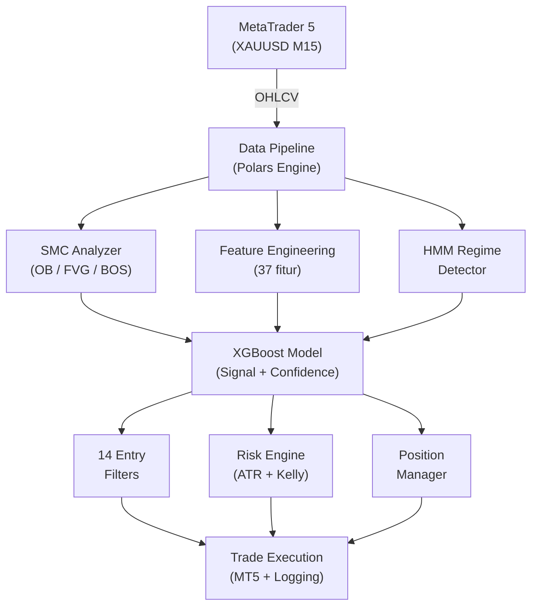

# XAUBot AI

**Bot trading XAUUSD (Emas) berbasis AI** dengan *XGBoost ML*, *Smart Money Concepts* (SMC), dan deteksi *regime* menggunakan *Hidden Markov Model* untuk *MetaTrader 5*.

[](https://www.python.org/downloads/)
[](LICENSE)
[](https://www.metatrader5.com/)

---

## Fitur

| Fitur | Deskripsi |
|-------|-----------|
| **Model *XGBoost ML*** | Model 37-fitur yang memprediksi BUY/SELL/HOLD dengan *confidence* terkalibrasi |
| ***Smart Money Concepts*** | *Order Block*, *Fair Value Gap*, *Break of Structure*, *Change of Character* |
| **Deteksi *Regime* HMM** | *Hidden Markov Model* 3-state yang mengklasifikasikan pasar *trending*/*ranging*/*volatile* |
| **Manajemen Risiko Dinamis** | *Stop Loss* berbasis ATR, *position sizing* dengan *Kelly criterion*, batas kerugian harian |
| **Kesadaran Sesi** | Dioptimalkan untuk sesi Sydney, London, dan New York |
| **Pelatihan Ulang Otomatis** | Model secara otomatis dilatih ulang saat kondisi pasar berubah |
| **Notifikasi Telegram** | Pemberitahuan *trade* secara *real-time* dan ringkasan harian |
| ***Dashboard* Web** | Antarmuka pemantauan *Next.js* untuk pelacakan *live* |

## Arsitektur



## Struktur Proyek

```
xaubot-ai/
├── main_live.py              # Orkestrator trading async utama
├── train_models.py           # Skrip pelatihan model
├── src/                      # Modul inti
│   ├── config.py             #   Konfigurasi trading & mode kapital
│   ├── mt5_connector.py      #   Layer koneksi MetaTrader 5
│   ├── smc_polars.py         #   Penganalisis Smart Money Concepts
│   ├── ml_model.py           #   Model trading XGBoost
│   ├── feature_eng.py        #   Feature engineering (37 fitur)
│   ├── regime_detector.py    #   Deteksi regime pasar HMM
│   ├── risk_engine.py        #   Kalkulasi & validasi risiko
│   ├── smart_risk_manager.py #   Manajemen risiko dinamis
│   ├── session_filter.py     #   Filter sesi (Sydney/London/NY)
│   ├── position_manager.py   #   Manajemen posisi terbuka
│   ├── dynamic_confidence.py #   Threshold confidence adaptif
│   ├── auto_trainer.py       #   Pipeline pelatihan ulang otomatis
│   ├── news_agent.py         #   Filter berita ekonomi
│   ├── telegram_notifier.py  #   Notifikasi Telegram
│   ├── trade_logger.py       #   Pencatatan trade ke DB
│   └── utils.py              #   Fungsi utilitas
├── backtests/                # Backtesting
│   ├── backtest_live_sync.py #   Backtest utama (sinkron dengan live)
│   └── archive/              #   Versi historis
├── scripts/                  # Skrip utilitas
│   ├── check_market.py       #   Analisis cepat pasar SMC
│   ├── check_positions.py    #   Lihat posisi terbuka
│   ├── check_status.py       #   Cek status akun
│   ├── close_positions.py    #   Tutup semua posisi darurat
│   ├── modify_tp.py          #   Modifikasi level take-profit
│   └── get_trade_history.py  #   Tarik riwayat trade
├── tests/                    # Pengujian
├── models/                   # Model terlatih (.pkl)
├── data/                     # Data pasar & catatan trade
├── docs/                     # Dokumentasi
│   ├── arsitektur-ai/        #   Dokumen arsitektur (23 komponen)
│   └── research/             #   Riset & analisis
├── web-dashboard/            # Dashboard pemantauan Next.js
├── docker/                   # Konfigurasi & skrip Docker
│   ├── scripts/              #   Skrip pembantu (.bat/.sh)
│   └── docs/                 #   Dokumentasi Docker
└── archive/                  # File usang (gitignored)
```

## Hasil *Backtest* (Jan 2025 - Feb 2026)

| Metrik | Nilai |
|--------|-------|
| Total *Trade* | 654 |
| *Win Rate* | 63.9% |
| *Net P/L* | $4,189.52 |
| *Profit Factor* | 2.64 |
| *Max Drawdown* | 2.2% |
| *Sharpe Ratio* | 4.83 |

## Instalasi

### Deployment *Docker* (Direkomendasikan)

**Mulai Cepat:**

```bash
# 1. Clone repositori
git clone https://github.com/GifariKemal/xaubot-ai.git
cd xaubot-ai

# 2. Konfigurasi environment
cp docker/.env.docker.example .env
# Edit .env dengan kredensial MT5 Anda

# 3. Jalankan semua layanan (Windows)
docker\scripts\docker-start.bat

# 3. Jalankan semua layanan (Linux/Mac)
./docker/scripts/docker-start.sh
```

**Layanan yang tersedia:**
- *Dashboard*: http://localhost:3000
- API: http://localhost:8000
- Dokumentasi API: http://localhost:8000/docs
- *Database*: localhost:5432

**Dokumentasi *Docker* lengkap:** Lihat [docker/docs/DOCKER.md](docker/docs/DOCKER.md)

---

### Instalasi Manual

**Prasyarat:**
- Python 3.11+
- Terminal *MetaTrader 5* (Windows)
- PostgreSQL (opsional, untuk pencatatan *trade*)

**Persiapan:**

```bash
# Clone repositori
git clone https://github.com/GifariKemal/xaubot-ai.git
cd xaubot-ai

# Instal dependensi
pip install -r requirements.txt

# Konfigurasi environment
cp .env.example .env
# Edit .env dengan kredensial MT5 dan token Telegram Anda
```

### Konfigurasi

Pengaturan utama di `.env`:

```env
# MetaTrader 5
MT5_LOGIN=your_login
MT5_PASSWORD=your_password
MT5_SERVER=your_server
MT5_PATH=C:/Program Files/MetaTrader 5/terminal64.exe

# Notifikasi Telegram
TELEGRAM_BOT_TOKEN=your_bot_token
TELEGRAM_CHAT_ID=your_chat_id

# Trading
CAPITAL=5000
SYMBOL=XAUUSD
```

### Menjalankan

```bash
# Latih model terlebih dahulu
python train_models.py

# Jalankan bot
python main_live.py

# Jalankan backtest
python backtests/backtest_live_sync.py --tune
```

## Manajemen Risiko

| Proteksi | Detail |
|----------|--------|
| ***Stop Loss* Berbasis ATR** | Jarak minimum 1.5x ATR |
| ***Stop Loss* Level Broker** | *Stop Loss* darurat diatur di level broker |
| ***Position Sizing*** | *Kelly criterion* dengan penyesuaian mode kapital |
| **Batas Kerugian Harian** | 5% dari kapital per hari |
| **Batas Kerugian Total** | 10% dari kapital |
| **Batas Posisi** | Maksimal 2 posisi bersamaan |
| ***Exit* Berbasis Waktu** | Maksimal 6 jam per *trade* |
| **Filter Sesi** | Hanya membuka *trade* saat sesi aktif |
| **Filter *Spread*** | Menolak *trade* saat *spread* tinggi |
| ***Cooldown*** | Waktu minimum antar *trade* |

## Teknologi

- **Polars** — Mesin pemrosesan data performa tinggi (bukan Pandas)
- ***XGBoost*** — Model *machine learning* berbasis *gradient boosting*
- **hmmlearn** — *Hidden Markov Model* untuk deteksi *regime* pasar
- ***MetaTrader5*** — API koneksi broker
- **asyncio** — *Event loop* asinkron untuk eksekusi latensi rendah
- **loguru** — *Logging* terstruktur
- **PostgreSQL** — *Database* pencatatan *trade*
- ***Next.js*** — *Dashboard* web

## Peringatan

> Perangkat lunak ini dibuat **hanya untuk tujuan edukasi dan riset**. Trading valuta asing (Forex) dan komoditas dengan margin memiliki tingkat risiko yang tinggi dan mungkin tidak cocok untuk semua investor. Kinerja masa lalu bukan indikasi hasil di masa depan. Anda dapat kehilangan sebagian atau seluruh investasi Anda. **Gunakan dengan risiko Anda sendiri.**

## Lisensi

[MIT License](LICENSE) - Hak Cipta (c) 2025-2026 Gifari Kemal
