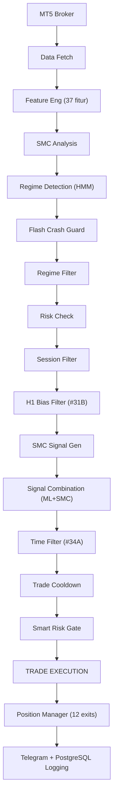

# XAUBot AI — Referensi Fitur

## Gambaran Umum

XAUBot AI adalah bot *trading* XAUUSD (Emas) otomatis yang menggabungkan **XGBoost *Machine Learning***, **Smart Money Concepts (SMC)**, dan **Hidden Markov Model (HMM)** untuk deteksi *regime*. Bot ini beroperasi di MetaTrader 5 melalui *loop* Python asinkron, mengeksekusi *trade* pada *timeframe* M15 (15 menit).

Bot mengikuti *pipeline* yang ketat: data diambil, fitur direkayasa, struktur pasar dianalisis, *regime* diklasifikasikan, prediksi ML dihasilkan, dan serangkaian 14 *filter* berurutan menentukan apakah *trade* dieksekusi. Setelah posisi terbuka, 12 kondisi *exit* dipantau setiap 5-10 detik.

---

## *Pipeline* 14 *Entry Filter*

Terdapat **14 *filter*** yang berjalan secara berurutan selama `_trading_iteration()`. Sebuah sinyal harus melewati **SEMUA** *filter* untuk mengeksekusi *trade*.

### 1. Pengambilan Data
- Mengambil **200 *bar* M15** dari MetaTrader 5.
- Data dikonversi ke **Polars *DataFrame*** (bukan Pandas).

### 2. Rekayasa Fitur (*Feature Engineering*)
- Menghitung **37 fitur teknikal** dari data OHLCV.
- Meliputi: *RSI*, *ATR*, *MACD*, *Bollinger Bands*, *EMA* (berbagai periode), *Stochastic*, indikator berbasis volume, dan lainnya.
- Semua komputasi menggunakan Polars untuk performa.

### 3. Analisis *SMC*
- Mendeteksi struktur institusional *Smart Money Concepts*:
  - ***Order Block* (OB)** — zona *supply/demand* dari aktivitas institusional.
  - ***Fair Value Gap* (FVG)** — ketidakseimbangan dalam *price action*.
  - ***Break of Structure* (BOS)** — sinyal kelanjutan tren.
  - ***Change of Character* (CHoCH)** — sinyal pembalikan arah.

### 4. Deteksi *Regime*
- ***HMM* (*Hidden Markov Model*)** mengklasifikasikan kondisi pasar saat ini:
  - `TRENDING` — pergerakan searah, kondusif untuk *entry*.
  - `RANGING` — konsolidasi menyamping, ukuran posisi dikurangi.
  - `HIGH_VOLATILITY` — pergerakan tidak menentu, butuh kehati-hatian.
  - `CRISIS` — kondisi ekstrem, *trading* diblokir.

### 5. Pelindung *Flash Crash*
- Proteksi darurat: jika pergerakan harga melebihi ambang persentase tertentu, **semua posisi langsung ditutup**.
- Mencegah kerugian katastropik saat dislokasi pasar mendadak.

### 6. *Filter Regime*
- Memblokir *trading* sepenuhnya jika rekomendasi *regime* adalah `SLEEP`.
- Mencegah *entry* saat kondisi pasar tidak menguntungkan yang teridentifikasi oleh *HMM*.

### 7. Pemeriksaan Risiko
- Memblokir *trading* jika:
  - **Batas kerugian harian** telah tercapai (5% dari kapital).
  - ***Equity*** terlalu rendah relatif terhadap *margin* yang dibutuhkan.
  - **Batas kerugian total** telah dilanggar (10% dari kapital).

### 8. *Filter* Sesi
- Memfilter berdasarkan sesi *trading* **WIB (Waktu Indonesia Barat)**.
- Setiap sesi menerapkan ***lot size multiplier*** untuk mengontrol eksposur:
  - **Sydney** (06:00-13:00 WIB) — *multiplier* 0.5x (volatilitas rendah).
  - **Tokyo** (07:00-16:00 WIB) — *multiplier* 0.7x (volatilitas sedang).
  - **London** (15:00-24:00 WIB) — *multiplier* 1.0x (volatilitas tinggi).
  - **New York** (20:00-24:00 WIB) — *multiplier* 1.0x (volatilitas ekstrem).
  - ***Off-Hours*** (00:00-06:00 WIB) — **diblokir sepenuhnya**.

### 9. *Filter Bias* H1 (#31B)
- Konfirmasi *multi-timeframe* menggunakan ***EMA20* pada *chart* H1**.
- Posisi harga relatif terhadap *EMA20* H1 menentukan bias arah:
  - **BULLISH** (harga di atas *EMA20*) — hanya sinyal *BUY* yang diizinkan.
  - **BEARISH** (harga di bawah *EMA20*) — hanya sinyal *SELL* yang diizinkan.
  - **NEUTRAL** (harga dekat *EMA20*) — **semua sinyal diblokir**.
- Hasil *backtest*: **+$343 peningkatan, *win rate* 81.8%, *Sharpe* 3.97**.

### 10. Generasi Sinyal *SMC*
- Menghasilkan sinyal ***BUY* atau *SELL*** berdasarkan analisis struktur *SMC*.
- Setiap sinyal memiliki ***confidence score*** yang berasal dari kualitas struktur yang terdeteksi (kedekatan *OB*, keselarasan *FVG*, konteks *BOS*/*CHoCH*).

### 11. Kombinasi Sinyal
- Menggabungkan **sinyal *SMC* + prediksi *ML* (*XGBoost*)**.
- Menerapkan ***dynamic confidence threshold*** yang beradaptasi berdasarkan:
  - Sesi *trading* saat ini.
  - *Regime* pasar.
  - Volatilitas terkini.
- Kedua sinyal harus sepakat arah; *confidence* gabungan harus melampaui *threshold*.

### 12. *Filter* Waktu (#34A)
- Melewatkan jam WIB tertentu yang dikenal berkondisi buruk:
  - **Jam 9 WIB** — akhir sesi *New York*, likuiditas rendah.
  - **Jam 21 WIB** — transisi *London*-*New York*, rawan *whipsaw*.
- Hasil *backtest*: **+$356 peningkatan**.

### 13. *Cooldown Trade*
- Memberlakukan jeda minimum **150 detik (2.5 menit)** antara *trade* berturut-turut.
- Mencegah *overtrading* dan *entry* bertubi-tubi dari sinyal yang noisy.

### 14. Gerbang Risiko Cerdas (*Smart Risk Gate*)
- Gerbang terakhir sebelum eksekusi. Memeriksa:
  - **Mode *trading***: `NORMAL`, `RECOVERY`, `PROTECTED`, atau `STOPPED`.
  - **Perhitungan *lot size***: Berdasarkan *ATR*, mode kapital, dan *multiplier* sesi.
  - **Batas posisi**: Maksimal **2 posisi bersamaan** diizinkan.
- Jika mode `STOPPED`, tidak ada *trade* yang dieksekusi terlepas dari kualitas sinyal.

---

## 12 Kondisi *Exit*

**12 kondisi *exit*** diperiksa setiap **5-10 detik** selama posisi terbuka.

### 1. *Take Profit* (TP Level Broker)
- *TP* dipasang di level broker saat *entry*.
- Dihitung menggunakan rasio *risk-reward* berbasis *ATR*.

### 2. *Trailing Stop* (#24B)
- ***Trailing stop* adaptif berbasis *ATR***:
  - Jarak aktivasi: ***ATR* x 4.0**.
  - Ukuran langkah: ***ATR* x 3.0**.
- Mengunci keuntungan seiring harga bergerak menguntungkan.

### 3. Perpindahan *Breakeven* (#24B)
- Memindahkan *stop loss* ke **harga *entry*** (*breakeven*) saat keuntungan belum direalisasi melampaui ***ATR* x 2.0**.
- Menghilangkan risiko pada *trade* setelah pergerakan menguntungkan.

### 4. *Exit* Pembalikan *ML*
- Menutup posisi jika *confidence* model *ML* **berbalik arah** dengan *confidence* melebihi **75%**.
- Merespons perubahan kondisi pasar yang terdeteksi oleh *XGBoost*.

### 5. Kerugian Maksimal Per *Trade*
- ***Stop loss* level perangkat lunak** sebesar **1% dari kapital**.
- Berfungsi sebagai jaring pengaman di samping *SL* broker.

### 6. Batas Kerugian Harian
- Jika kerugian kumulatif harian mencapai **5% dari kapital**, **semua posisi ditutup** dan *trading* dihentikan untuk hari itu.

### 7. Batas Kerugian Total
- Jika kerugian kumulatif total mencapai **10% dari kapital**, ***trading* dihentikan sepenuhnya** sampai intervensi manual.

### 8. Penanganan Penutupan Pasar
- Sebelum penutupan harian atau penutupan akhir pekan:
  - Mengambil keuntungan pada posisi dengan *unrealized profit* **> $5**.
  - Mencegah risiko *gap* dari posisi yang terbawa semalam/akhir pekan.

### 9. Darurat *Flash Crash*
- Dipicu oleh pergerakan harga ekstrem secara tiba-tiba.
- **Langsung menutup semua posisi terbuka** tanpa penundaan.

### 10. Proteksi *Drawdown*
- Memantau *drawdown* dari puncak *equity*.
- Menutup semua posisi jika *drawdown* melebihi **50%** dari puncak.

### 11. *Impulse Trail* (#33B)
- *Trailing stop* yang ditingkatkan menggunakan **deteksi *impulse candle***.
- Mengidentifikasi *candle* momentum kuat dan men-*trail* *stop* di belakangnya.
- Lebih responsif dibanding *trailing ATR* standar dalam kondisi tren.

### 12. *Smart Breakeven* (#28B)
- Logika *breakeven* yang ditingkatkan dengan **pemicu *ATR multiplier***:
  - Pemicu: keuntungan melampaui ***ATR* x 2.0**.
  - Memindahkan *SL* ke *entry* + *buffer* kecil.
- Lebih adaptif dibanding *breakeven* berbasis pip tetap.

---

## Riwayat Optimasi *Backtest*

Rangkuman optimasi utama yang diterapkan ke bot *live*, diuji dan divalidasi melalui *backtest*.

| # | Nama | Perubahan Utama | Hasil |
|---|------|-----------------|-------|
| #24B | *ATR-Adaptive Exit* | *Trailing* berbasis *ATR* (4.0x) dan *breakeven* (2.0x) *multiplier* | Optimasi dasar untuk logika *exit* |
| #28B | *Smart Breakeven* | *Breakeven* yang ditingkatkan dengan pemicu *ATR* x 2.0 | Peningkatan waktu *exit* pada *trade* yang menang |
| #31B | *Filter* H1 *EMA20* | *Filter multi-timeframe* harga H1 vs *EMA20* | +$343, WR 81.8%, *Sharpe* 3.97 |
| #33B | *Impulse Trail* | *Trail* menggunakan deteksi *impulse candle* | *Trailing* lebih baik di pasar tren |
| #34A | Lewati Jam Tertentu | Lewati jam WIB 9 dan 21 | +$356, pengurangan kerugian *whipsaw* |

---

## Manajemen Risiko

### Mode Kapital

Mode kapital dikonfigurasi otomatis berdasarkan saldo akun. Setiap mode mengatur parameter risiko yang sesuai untuk ukuran akun.

| Mode | Rentang Kapital | Risiko/*Trade* | *Lot* Maks |
|------|----------------|----------------|------------|
| MICRO | < $500 | 2% | 0.02 |
| SMALL | $500 - $10,000 | 1.5% | 0.05 |
| MEDIUM | $10,000 - $100,000 | 0.5% | 0.10 |
| LARGE | > $100,000 | 0.25% | 0.50 |

### Mode *Trading*

*Smart Risk Manager* secara dinamis menyesuaikan mode *trading* berdasarkan performa terkini.

| Mode | Pemicu | Penyesuaian *Lot* |
|------|--------|-------------------|
| NORMAL | Kondisi *default* | *Lot* dasar (0.01-0.03) |
| RECOVERY | Setelah *trade* rugi | *Lot* pemulihan (0.01) |
| PROTECTED | Mendekati batas kerugian harian | *Lot* minimum (0.01) |
| STOPPED | Batas kerugian harian atau total tercapai | *Trading* tidak diizinkan |

### Batas Risiko

| Batas | Nilai | Aksi |
|-------|-------|------|
| Kerugian harian maks | 5% dari kapital | Tutup semua posisi, hentikan *trading* untuk hari itu |
| Kerugian total maks | 10% dari kapital | Hentikan semua *trading* sampai *reset* manual |
| Kerugian maks per *trade* | 1% dari kapital | *Stop loss* perangkat lunak |
| *SL* darurat broker | 2% dari kapital | *Hard stop* level broker |
| Posisi bersamaan maks | 2 | Tolak *entry* baru jika sudah di batas |

---

## *Filter* Sesi (WIB)

Semua waktu sesi dalam **WIB (Waktu Indonesia Barat, UTC+7)**.

| Sesi | Jam (WIB) | Volatilitas | *Multiplier Lot* |
|------|-----------|-------------|-------------------|
| Sydney | 06:00 - 13:00 | Rendah | 0.5x |
| Tokyo | 07:00 - 16:00 | Sedang | 0.7x |
| London | 15:00 - 24:00 | Tinggi | 1.0x |
| New York | 20:00 - 24:00 | Ekstrem | 1.0x |
| *Off-Hours* | 00:00 - 06:00 | N/A | **Diblokir** |

### *Golden Hour*
- **19:00 - 23:00 WIB** (*London*-*New York Overlap*).
- Periode likuiditas dan volatilitas tertinggi untuk XAUUSD.
- Kondisi *trading* terbaik; *multiplier lot* penuh diterapkan.

### Jam yang Dilewati (#34A)
- **Jam 9 WIB** — Akhir sesi *New York*; likuiditas rendah menyebabkan *fill* yang tidak menentu.
- **Jam 21 WIB** — Transisi *London*-*New York*; rawan *whipsaw* dan *false breakout*.

---

## *Auto-Trainer*

Bot menyertakan *pipeline* pelatihan ulang model otomatis untuk menjaga model *ML* tetap mutakhir dengan kondisi pasar.

| Parameter | Nilai |
|-----------|-------|
| Interval pemeriksaan | Setiap 20 *candle* (~5 jam pada M15) |
| Pelatihan ulang harian | 05:00 WIB (saat pasar tutup) |
| Pelatihan akhir pekan | Pelatihan mendalam dengan jendela data yang diperluas |
| *Threshold AUC* minimum | 0.65 |
| Kebijakan *rollback* | Jika model baru berkinerja lebih buruk, kembali ke *backup* |

### Alur Pelatihan Ulang
1. Setiap 20 *candle*, *auto-trainer* memeriksa metrik performa model.
2. Jika *AUC* turun di bawah **0.65**, pelatihan ulang dipicu.
3. Pada **05:00 WIB setiap hari** (pasar tutup), pelatihan ulang terjadwal berjalan.
4. Pada **akhir pekan**, pelatihan mendalam menggunakan *dataset* historis yang lebih besar.
5. Setelah pelatihan, model baru divalidasi terhadap model sebelumnya.
6. Jika model baru berkinerja lebih buruk, sistem **melakukan *rollback*** ke model *backup*.

---

## Model *ML*

### Algoritma
- ***XGBoost* *gradient-boosted decision trees***.

### Fitur
- **37 indikator teknikal** dihitung oleh `src/feature_eng.py`:
  - Tren: *EMA* (berbagai periode), *MACD*, *ADX*.
  - Momentum: *RSI*, *Stochastic K/D*.
  - Volatilitas: *ATR*, *Bollinger Bands* (*width*, *%B*).
  - Volume: Indikator berbasis volume.
  - Kustom: Fitur turunan *SMC*, fitur *regime*.

### Keluaran
- **Sinyal**: *BUY*, *SELL*, atau *HOLD*.
- ***Confidence score***: 0.0 hingga 1.0, digunakan dalam kombinasi dengan *confidence SMC*.

### *Threshold* Dinamis
- *Threshold confidence* untuk eksekusi *trade* tidak tetap.
- Menyesuaikan berdasarkan:
  - **Sesi**: *Threshold* lebih tinggi saat sesi volatilitas rendah.
  - ***Regime***: *Threshold* lebih tinggi saat *regime ranging*/*volatile*.
  - **Performa terkini**: Diperketat setelah kerugian, dilonggarkan setelah kemenangan.

---

## Komponen Aktif

| Komponen | File | Status | Deskripsi |
|----------|------|--------|-----------|
| Penganalisis *SMC* | `src/smc_polars.py` | Aktif | Deteksi *Order Block*, *FVG*, *BOS*, *CHoCH* |
| *ML XGBoost* | `src/ml_model.py` | Aktif | Prediksi sinyal dengan *confidence* |
| *Regime HMM* | `src/regime_detector.py` | Aktif | Klasifikasi *regime* pasar |
| Mesin Fitur | `src/feature_eng.py` | Aktif | Komputasi 37 fitur teknikal |
| Mesin Risiko | `src/risk_engine.py` | Aktif | *SL*/*TP* berbasis *ATR*, *position sizing* |
| *Smart Risk Manager* | `src/smart_risk_manager.py` | Aktif | Manajemen mode dinamis |
| Manajer Posisi | `src/position_manager.py` | Aktif | Pemantauan kondisi *exit* |
| *Filter* Sesi | `src/session_filter.py` | Aktif | *Filtering* berbasis sesi WIB |
| *Confidence* Dinamis | `src/dynamic_confidence.py` | Aktif | Penyesuaian *threshold* adaptif |
| *Auto Trainer* | `src/auto_trainer.py` | Aktif | Pelatihan ulang model terjadwal |
| Notifikasi Telegram | `src/telegram_notifier.py` | Aktif | Peringatan *trade* via Telegram |
| Pencatat *Trade* | `src/trade_logger.py` | Aktif | Pencatatan *trade* ke PostgreSQL |
| Agen Berita | `src/news_agent.py` | **NONAKTIF** | *Filter* berita ekonomi (mengurangi $178 profit di *backtest*) |
| Detektor *Flash Crash* | `src/regime_detector.py` | Aktif | Penutupan posisi darurat |

---

## Diagram Arsitektur

