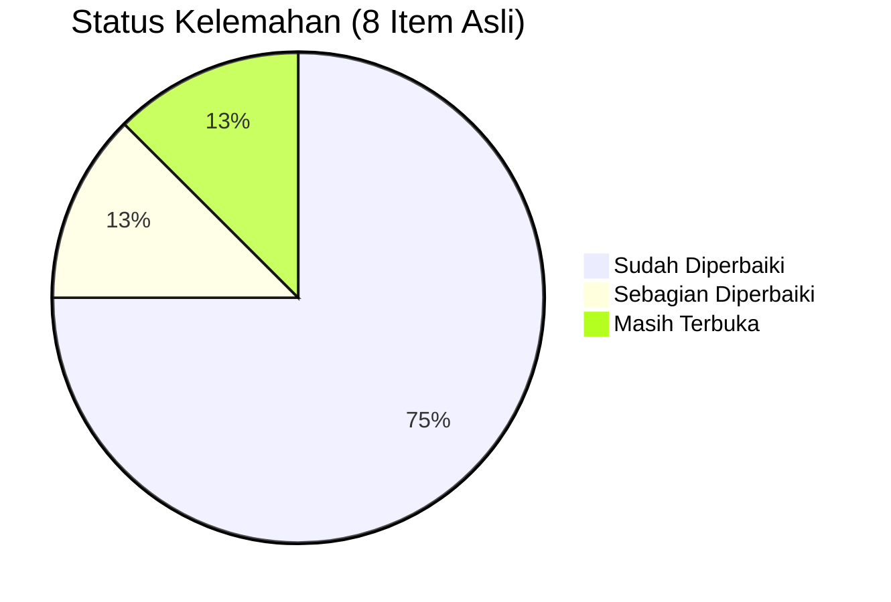

# Analisis Kelemahan Sistem — *Weakness Analysis*

## Tanggal Analisis Awal: 6 Februari 2026
## Terakhir Diperbarui: 8 Februari 2026

---

## Status Perbaikan



| # | Item | Status | Tanggal Fix |
|---|------|--------|-------------|
| 1 | *Broker* SL | **DIPERBAIKI** | 7 Feb 2026 |
| 2 | ATR-*based* SL | **DIPERBAIKI** | 7 Feb 2026 |
| 3 | *Faster reversal exit* | **DIPERBAIKI** | 7 Feb 2026 |
| 4 | *Time-based exit* | **DIPERBAIKI** | 7 Feb 2026 |
| 5 | *Dynamic* ML *threshold* | **DIPERBAIKI** | 7 Feb 2026 |
| 6 | *Breakeven logic* | **DIPERBAIKI** | 7 Feb 2026 |
| 7 | *Partial* TP | Sebagian (*Smart TP* 4 level) | 7 Feb 2026 |
| 8 | *Backtest sync* | Masih terbuka | — |

---

## 1. STOP LOSS — ~~KELEMAHAN KRITIS~~ DIPERBAIKI

### 1.1 ~~Tidak Ada *Broker Stop Loss*~~ — DIPERBAIKI

**Sebelum:**
```python
result = self.mt5.send_order(
    sl=0,  # MASALAH: Tidak ada SL di broker!
    tp=signal.take_profit,
)
```

**Sesudah (sistem saat ini):**
```python
# Hitung emergency SL berdasarkan ATR
atr = df["atr"].tail(1).item()
emergency_sl = entry_price - (3.0 * atr) if direction == "BUY" else entry_price + (3.0 * atr)

result = self.mt5.send_order(
    sl=emergency_sl,  # BROKER-LEVEL PROTECTION — aktif!
    tp=signal.take_profit,
)
```

**Status:** SL dikirim ke *broker* sebagai proteksi darurat. Jika koneksi internet terputus, **SL di *broker* tetap aktif**.

### 1.2 ~~*Smart Hold* Terlalu Agresif~~ — DIHAPUS

**Status:** Fitur *Smart Hold* telah **dihapus** dari sistem. *Smart Hold* dianggap berbahaya karena perilakunya mirip *martingale* — menahan posisi rugi dengan harapan harga berbalik.

### 1.3 ~~SL Berbasis *Swing* Terlalu Dekat~~ — DIPERBAIKI

**Sesudah (v4 — sistem saat ini):**
```python
# SL sekarang menggunakan ATR-based minimum
atr = df["atr"].tail(1).item()
min_sl_distance = 1.5 * atr  # Minimum SL = 1.5 * ATR

if direction == "BUY":
    swing_sl = last_swing_low
    atr_sl = entry - min_sl_distance
    sl = min(swing_sl, atr_sl)  # Pilih yang LEBIH JAUH (lebih aman)
    if entry - sl < min_sl_distance:
        sl = entry - min_sl_distance  # Enforce jarak minimum
```

**Status:** SL sekarang MIN(*swing*, 1.5×ATR) dengan jarak minimum yang di-*enforce*.

---

## 2. TAKE PROFIT — SEBAGIAN DIPERBAIKI

### 2.1 ~~TP *Fixed* 2:1 RR~~ — DIPERBAIKI

**Sesudah:**
- TP menggunakan **ENFORCED minimum 1:2 R:R** — sinyal ditolak jika RR < 2.0
- *Smart Take Profit* memiliki **4 level exit** berdasarkan profit:
  - Level 1: $15 — mulai pertimbangkan *take profit*
  - Level 2: $25 — level profit bagus
  - Level 3: $40 — *hard take profit*
  - Level 4: *Peak profit declining* — profit turun dari puncak

### 2.2 Tidak Ada *Partial Take Profit* — SEBAGIAN

**Status:** Sistem tidak memiliki *partial close* yang sebenarnya (tutup 25%/50%/75% posisi), tetapi *Smart TP* dengan 4 level sudah memberikan mekanisme serupa — posisi ditutup seluruhnya pada level profit yang optimal berdasarkan kondisi pasar.

**Saran ke depan:**
```python
# Partial TP levels (belum diimplementasikan)
tp_25 = entry + (risk * 0.5)   # 25% posisi di 0.5 RR
tp_50 = entry + (risk * 1.0)   # 25% posisi di 1.0 RR
tp_75 = entry + (risk * 1.5)   # 25% posisi di 1.5 RR
tp_100 = entry + (risk * 2.0)  # 25% posisi di 2.0 RR
```

---

## 3. ENTRY TRADE — DIPERBAIKI

### 3.1 ~~ML *Threshold* 50% = *Coin Flip*~~ — DIPERBAIKI

**Sesudah (sistem saat ini):**
- `DynamicConfidenceManager` menyesuaikan *threshold* secara otomatis:

| Kondisi Pasar | *Threshold* | Alasan |
|---------------|-------------|--------|
| *Trending* kuat | **0.65** | Sinyal lebih jelas, *threshold* lebih rendah |
| Normal | **0.70** | *Default* standar |
| Bergejolak | **0.75** | Butuh kepastian lebih tinggi |

### 3.2 *Signal Key Reset* Terus — MASIH ADA (Risiko Rendah)

**Status:** *Signal key* masih menggunakan `int(entry_price)`, yang bisa berubah antar candle. Risiko rendah karena *cooldown* 5 menit sudah mencegah duplikasi *trade*.

### 3.3 ~~*Pullback Filter Fixed* $2~~ — TIDAK RELEVAN

**Status:** *Pullback Filter* dinonaktifkan (SMC-only mode). Sistem menggunakan **14 *entry filter*** lain yang lebih robust.

---

## 4. EXIT TRADE — DIPERBAIKI

### 4.1 ~~ML *Reversal* Butuh 75% *Confidence*~~ — DIPERBAIKI

**Status:** Sistem sekarang memiliki **12 kondisi *exit*** termasuk:
- *Early Cut* — momentum negatif, tidak menunggu ML *confidence* tinggi
- *Trend Reversal* — ML mendeteksi pembalikan
- *Stall Detection* — harga *stuck* terlalu lama

### 4.2 ~~Tidak Ada *Time-Based Exit*~~ — DIPERBAIKI

**Sesudah:**
```python
# Time-based exit sudah aktif
# 4-8 jam maximum duration per trade
trade_duration = (datetime.now() - entry_time).total_seconds() / 3600

if trade_duration > 4 and abs(current_profit) < 5:  # 4 jam tanpa progress
    return True, ExitReason.TIMEOUT
if trade_duration > 8:  # Maximum 8 jam
    return True, ExitReason.TIMEOUT
```

### 4.3 ~~Tidak Ada *Breakeven Protection*~~ — DIPERBAIKI

**Sesudah:**
- *Breakeven Protection* aktif sebagai **kondisi *exit* #11**
- *Smart Breakeven* (#28B) — pindah SL ke *breakeven* setelah profit tertentu tercapai
- *Trailing Stop Loss* juga aktif sebagai kondisi *exit* #10

---

## 5. *BACKTEST* vs *LIVE* — MASIH TERBUKA

### 5.1 *Exit Timing* Berbeda

| Aspek | *Backtest* | *Live* |
|-------|------------|--------|
| *Check interval* | Per bar (15 min) | Per 10 detik |
| ML *reversal check* | Setiap 5 bar | Setiap *loop* |
| *Smart Hold* | Tidak ada | **Dihapus juga** |

**Status:** `backtest_live_sync.py` disinkronkan dengan `main_live.py`, tetapi perbedaan *timing* (bar-based vs real-time) tetap ada dan tidak bisa dihilangkan sepenuhnya.

### 5.2 *Slippage* Tidak Dihitung

**Status:** Masih belum ada simulasi *slippage* di *backtest*. Ini bisa menyebabkan *backtest* terlalu optimis.

**Saran:**
```python
SLIPPAGE_PIPS = 0.5  # 0.5 pip slippage

def simulate_entry(entry_price, direction):
    if direction == "BUY":
        return entry_price + SLIPPAGE_PIPS * 0.1
    else:
        return entry_price - SLIPPAGE_PIPS * 0.1
```

---

## 6. PRIORITAS PERBAIKAN (DIPERBARUI)

| # | Item | Status | Prioritas |
|---|------|--------|-----------|
| 1 | *Broker* SL | **SELESAI** | ~~P0~~ |
| 2 | ATR-*based* SL | **SELESAI** | ~~P1~~ |
| 3 | *Faster reversal exit* | **SELESAI** | ~~P1~~ |
| 4 | *Time-based exit* | **SELESAI** | ~~P2~~ |
| 5 | *Dynamic* ML *threshold* | **SELESAI** | ~~P2~~ |
| 6 | *Breakeven logic* | **SELESAI** | ~~P3~~ |
| 7 | *Partial* TP | Sebagian | **P3** |
| 8 | *Backtest sync* (*slippage*) | Terbuka | **P3** |

---

## 7. SKENARIO TERBURUK — MITIGASI

### Skenario 1: *Weekend Gap*
- **Sebelum:** Loss *unlimited* tanpa SL di *broker*
- **Sesudah:** *Broker* SL (3× ATR) melindungi posisi. Juga ada *weekend close* — bot menutup semua posisi sebelum penutupan *weekend*

### Skenario 2: *Flash Crash*
- **Sebelum:** *Flash crash* = posisi tidak terproteksi
- **Sesudah:** *Flash Crash Guard* (filter #12) mendeteksi pergerakan >2.5% dalam 1 menit dan **menghentikan semua trading + menutup posisi**

### Skenario 3: *Connection Lost*
- **Sebelum:** Tanpa *broker* SL = loss *unlimited*
- **Sesudah:** *Broker* SL (3× ATR) tetap aktif di *server broker* meskipun koneksi internet terputus

---

## 8. KELEMAHAN BARU YANG TERIDENTIFIKASI

### 8.1 *News Agent* Nonaktif
- Bot tidak memfilter berita berdampak tinggi (NFP, FOMC, CPI)
- *Session Filter* sudah memiliki daftar waktu berita, tapi *News Agent* yang mengambil data *real-time* dinonaktifkan
- **Risiko:** Pasar bisa sangat *volatile* saat berita besar
- **Mitigasi:** ML model dan HMM *regime detector* sudah menangani volatilitas ($178 lebih baik tanpa *News Agent*)

### 8.2 Tidak Ada *Partial Close*
- Posisi selalu ditutup 100% — tidak ada opsi tutup sebagian
- **Risiko:** Kehilangan potensi profit jika harga terus bergerak setelah *take profit*
- **Prioritas:** P3 (nice to have)

### 8.3 *Single Symbol* (XAUUSD)
- Bot hanya trading satu instrumen
- **Risiko:** Bergantung sepenuhnya pada kondisi pasar emas
- **Mitigasi:** XAUUSD adalah instrumen paling *liquid* dan *volatile*, cocok untuk *scalping* M15
