# Arsitektur Lengkap — Smart AI Trading Bot

> **Dokumen:** Arsitektur keseluruhan sistem dalam 1 file
> **Instrumen:** XAUUSD (Gold) M15
> **Platform:** MetaTrader 5
> **Bahasa:** Python 3.11+ (async, Polars, XGBoost, HMM)
> **Database:** PostgreSQL + CSV fallback
> **Notifikasi:** Telegram Bot API

---

## Daftar Isi

1. [Gambaran Umum](#1-gambaran-umum)
2. [Diagram Arsitektur](#2-diagram-arsitektur)
3. [23 Komponen](#3-23-komponen)
4. [Pipeline Data: Dari OHLCV ke Keputusan Trading](#4-pipeline-data)
5. [Alur Entry: 14 Filter](#5-alur-entry-14-filter)
6. [Alur Exit: 12 Kondisi](#6-alur-exit-12-kondisi)
7. [Sistem Proteksi Risiko 4 Lapis](#7-sistem-proteksi-risiko-4-lapis)
8. [AI/ML Engine](#8-aiml-engine)
9. [Smart Money Concepts (SMC)](#9-smart-money-concepts)
10. [Position Lifecycle](#10-position-lifecycle)
11. [Auto-Retraining & Model Management](#11-auto-retraining)
12. [Infrastruktur & Database](#12-infrastruktur--database)
13. [Konfigurasi & Parameter Kritis](#13-konfigurasi--parameter-kritis)
14. [Performa & Timing](#14-performa--timing)
15. [Error Handling & Fault Tolerance](#15-error-handling--fault-tolerance)
16. [Daftar File Source Code](#16-daftar-file-source-code)

---

## 1. Gambaran Umum

### Apa Ini?

Bot trading otomatis yang menggabungkan **3 otak kecerdasan buatan** untuk trading XAUUSD (Emas) di MetaTrader 5:

```
OTAK 1: Smart Money Concepts (SMC)
        → Membaca pola institusi besar (bank, hedge fund)
        → Menentukan DIMANA entry, SL, dan TP

OTAK 2: XGBoost Machine Learning
        → Memprediksi ARAH harga (naik/turun)
        → Memberikan tingkat keyakinan (confidence)

OTAK 3: Hidden Markov Model (HMM)
        → Membaca KONDISI pasar (tenang/volatile/krisis)
        → Menyesuaikan ukuran posisi dan agresivitas
```

### Filosofi Desain

```
1. KESELAMATAN MODAL NOMOR 1
   → 4 lapis proteksi stop loss
   → Lot ultra-kecil (0.01-0.02)
   → Circuit breaker otomatis

2. TIDAK PERNAH CRASH
   → Setiap error di-catch, bot terus jalan
   → Database gagal? CSV fallback
   → MT5 putus? Auto-reconnect

3. SELF-IMPROVING
   → Model AI dilatih ulang otomatis setiap hari
   → Rollback otomatis jika model baru lebih buruk
   → Threshold confidence menyesuaikan kondisi pasar

4. TRANSPARAN
   → Setiap keputusan dicatat ke database
   → Notifikasi Telegram real-time
   → Laporan harian, jam-an, dan per-trade
```

### Angka-Angka Kunci

| Parameter | Nilai | Penjelasan |
|-----------|-------|------------|
| Modal target | $5,000 | Small account mode |
| Risiko per trade | 1% ($50) | Maksimum kerugian per posisi |
| Lot size | 0.01 - 0.02 | Ultra-konservatif |
| Max daily loss | 3% ($150) | Circuit breaker harian |
| Max total loss | 10% ($500) | Stop total trading |
| Max posisi bersamaan | 2-3 | Menghindari overexposure |
| Cooldown antar trade | 5 menit | Mencegah overtrading |
| Loop speed | ~50ms | Cepat tapi efisien |
| Timeframe | M15 | 15 menit per candle |

---

## 2. Diagram Arsitektur

### Diagram Keseluruhan Sistem

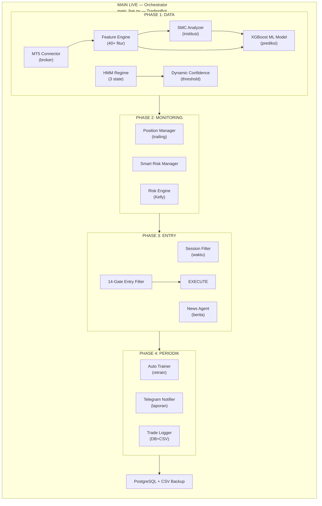

### Alur Data (Data Flow)

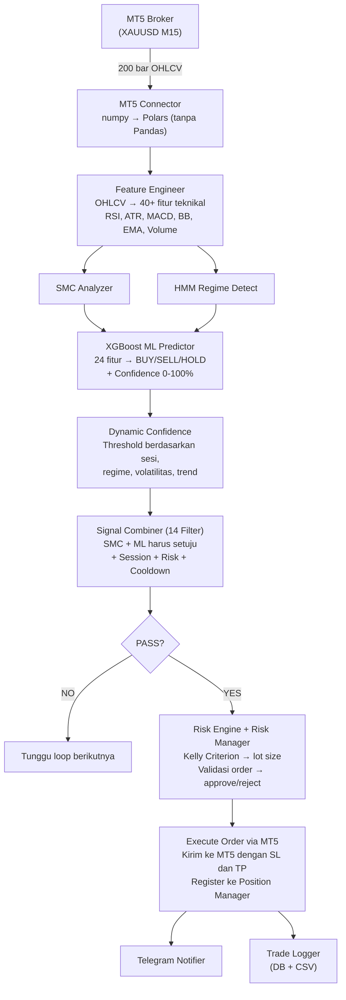

---

## 3. 23 Komponen

### Tabel Komponen Lengkap

| # | Komponen | File | Kategori | Fungsi Utama |
|---|----------|------|----------|-------------|
| 1 | HMM Regime Detector | `src/regime_detector.py` | AI/ML | Deteksi kondisi pasar (3 regime) |
| 2 | XGBoost Predictor | `src/ml_model.py` | AI/ML | Prediksi arah harga + confidence |
| 3 | SMC Analyzer | `src/smc_polars.py` | Analisis | Pola institusi: FVG, OB, BOS, CHoCH |
| 4 | Feature Engineering | `src/feature_eng.py` | Data | OHLCV → 40+ fitur numerik |
| 5 | Smart Risk Manager | `src/smart_risk_manager.py` | Risiko | 4 mode *trading*, 12 kondisi *exit* |
| 6 | Session Filter | `src/session_filter.py` | Filter | Waktu trading optimal (WIB) |
| 7 | Stop Loss (4 Lapis) | Multi-file | Proteksi | SMC → Software → Emergency → Circuit |
| 8 | Take Profit (6 Layer) | Multi-file | Proteksi | Hard → Momentum → Peak → Probability → Early → Broker |
| 9 | Entry Trade | `main_live.py` | Eksekusi | 14 *filter* berurutan |
| 10 | Exit Trade | `main_live.py` | Eksekusi | 12 kondisi *exit real-time* |
| 11 | News Agent | `src/news_agent.py` | Monitor | **NONAKTIF** — dikomentari di kode |
| 12 | Telegram Notifier | `src/telegram_notifier.py` | Notifikasi | 11 tipe notifikasi real-time |
| 13 | Auto Trainer | `src/auto_trainer.py` | ML Ops | Retraining harian otomatis |
| 14 | Backtest | `backtests/backtest_live_sync.py` | Validasi | Simulasi 100% sync dengan live |
| 15 | Dynamic Confidence | `src/dynamic_confidence.py` | Adaptif | Threshold ML adaptif (60-85%) |
| 16 | MT5 Connector | `src/mt5_connector.py` | Koneksi | Bridge ke broker, auto-reconnect |
| 17 | Configuration | `src/config.py` | Config | 6 sub-config, auto-adjust modal |
| 18 | Trade Logger | `src/trade_logger.py` | Logging | Dual storage DB + CSV |
| 19 | Position Manager | `src/position_manager.py` | Manajemen | Trailing SL, breakeven, market close |
| 20 | Risk Engine | `src/risk_engine.py` | Risiko | Kelly Criterion, circuit breaker |
| 21 | Database | `src/db/` | Storage | PostgreSQL, 6 repository |
| 22 | Train Models | `train_models.py` | Training | Script training awal |
| 23 | Main Live | `main_live.py` | Orchestrator | Koordinasi semua komponen |

### Hubungan Antar Komponen

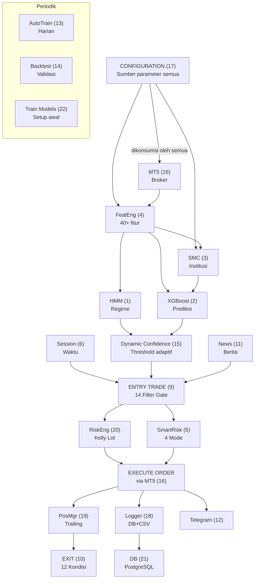

---

## 4. Pipeline Data

### Dari OHLCV Mentah ke Keputusan Trading

#### Tahap 1: Data Fetching (MT5 Connector)

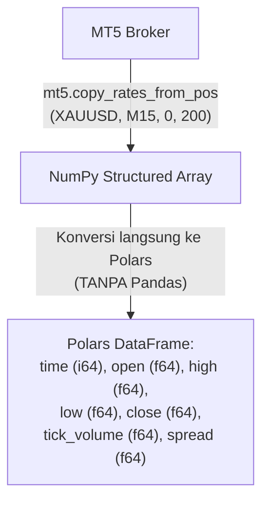

**Kenapa Polars, bukan Pandas?**
- 3-5x lebih cepat untuk operasi vectorized
- Memory-efficient (zero-copy)
- Native lazy evaluation
- Konsisten di seluruh codebase (tidak ada konversi bolak-balik)

#### Tahap 2: Feature Engineering (40+ Fitur)

```mermaid
flowchart TD
    INPUT["Input: Polars DataFrame<br/>(200 bar OHLCV)"] --> MOM["Momentum Indicators"]
    INPUT --> VOL["Volatility Indicators"]
    INPUT --> TREND["Trend Indicators"]
    INPUT --> PA["Price Action"]
    INPUT --> VOLF["Volume Features"]
    INPUT --> LAG["Lag Features"]
    INPUT --> TIME["Time Features"]

    MOM --> M1["RSI(14) - 0-100, overbought/oversold"]
    MOM --> M2["MACD(12,26,9) - trend strength and direction"]
    MOM --> M3["MACD Histogram - momentum acceleration"]

    VOL --> V1["ATR(14) - average true range (pips)"]
    VOL --> V2["Bollinger Bands(20,2.0) - upper, lower, width"]
    VOL --> V3["Volatility(20) - rolling std of returns"]

    TREND --> T1["EMA(9) / EMA(21) - fast/slow crossover"]
    TREND --> T2["EMA Cross Signal - 1 bullish / -1 bearish"]
    TREND --> T3["SMA(20) - simple moving average"]

    PA --> P1["Returns(1,5,20) - % perubahan harga"]
    PA --> P2["Log Returns - untuk distribusi normal"]
    PA --> P3["Price Position - posisi dalam range BB"]
    PA --> P4["Higher High/Lower Low count - trend structure"]

    VOLF --> VF1["Volume SMA(20) - rata-rata volume"]
    VOLF --> VF2["Volume Ratio - current / average"]

    LAG --> L1["close_lag_1..5 - harga sebelumnya"]
    LAG --> L2["returns_lag_1..3 - return sebelumnya"]

    TIME --> TI1["Hour, Weekday - waktu candle"]
    TIME --> TI2["Session flags - london, ny, overlap"]

    M1 & M2 & M3 & V1 & V2 & V3 & T1 & T2 & T3 & P1 & P2 & P3 & P4 & VF1 & VF2 & L1 & L2 & TI1 & TI2 --> OUTPUT["Output: DataFrame + 40 kolom baru<br/>(semua numerik, siap ML)"]
```

**Minimum data:** 26 bar untuk semua indikator stabil

#### Tahap 3: SMC Analysis (Pola Institusi)

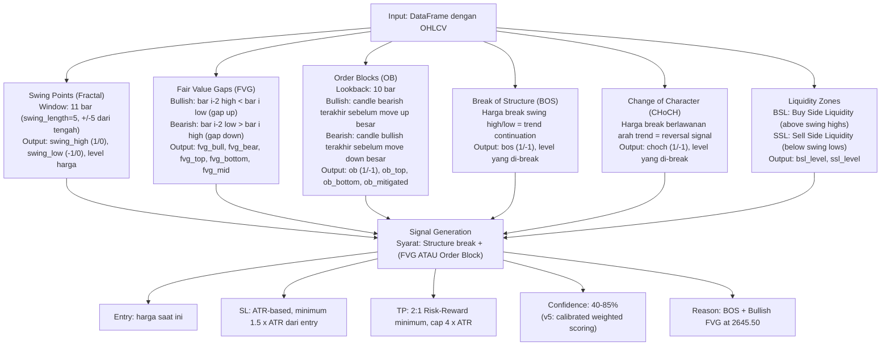

#### Tahap 4: Regime Detection (HMM)

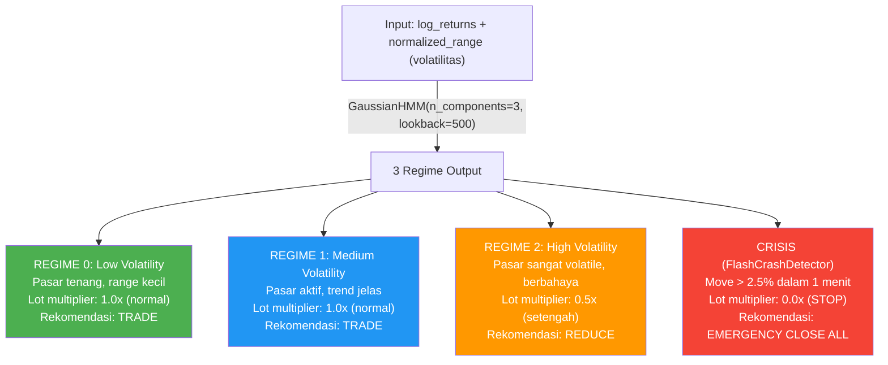

#### Tahap 5: ML Prediction (XGBoost)

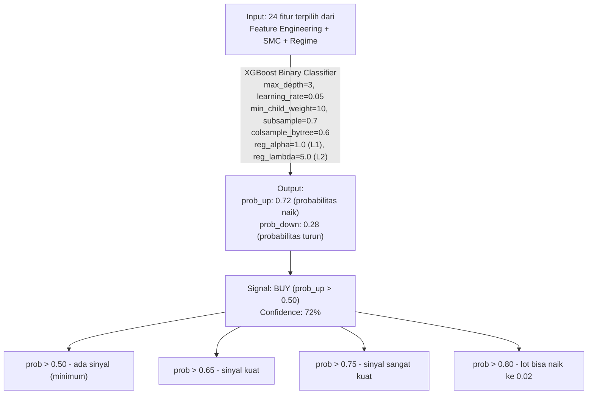

#### Tahap 6: Dynamic Confidence (Threshold Adaptif)

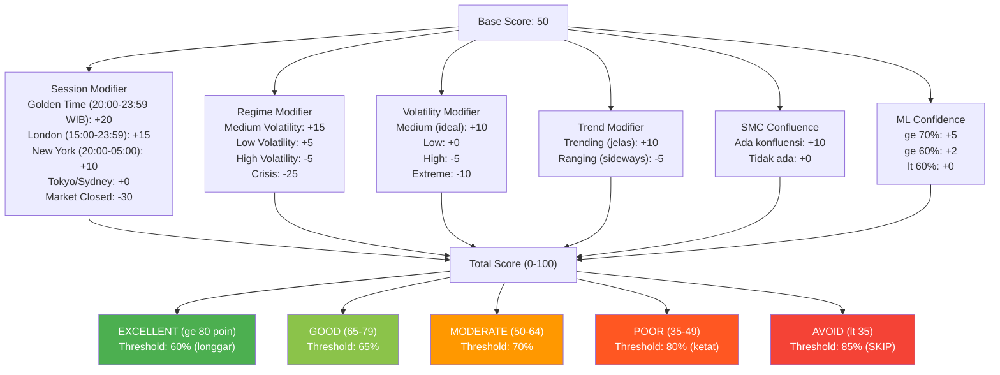

Contoh: Golden Time + Medium Vol + Trending + SMC + ML 72%
= 50 + 20 + 15 + 10 + 10 + 10 + 5 = 120 (cap 100)
= EXCELLENT -> Threshold 60% -> ML 72% PASS

---

## 5. Alur Entry: 14 Filter

Setiap sinyal harus melewati **14 gerbang berurutan**. Satu saja gagal = TIDAK trading.

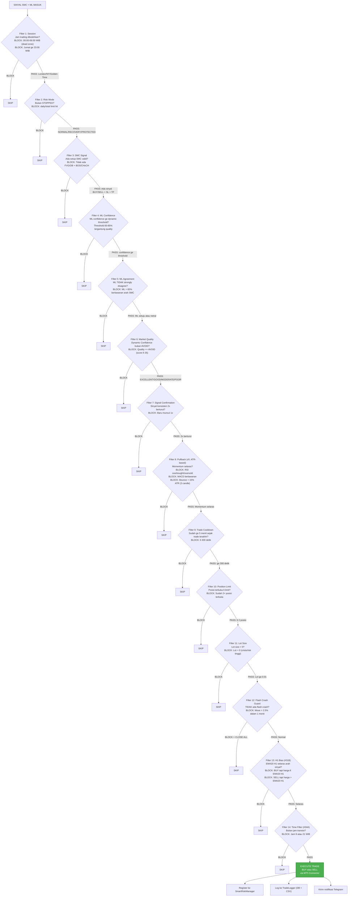

---

## 6. Alur Exit: 12 Kondisi

Setiap posisi terbuka dievaluasi **setiap ~10 detik** (di antara candle) atau **setiap candle baru** (full analysis) terhadap 12 kondisi exit:

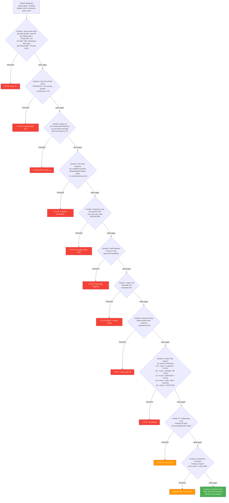

### *Position Manager* (Tambahan per Posisi)

Selain 12 kondisi di atas, *Position Manager* juga menjalankan:

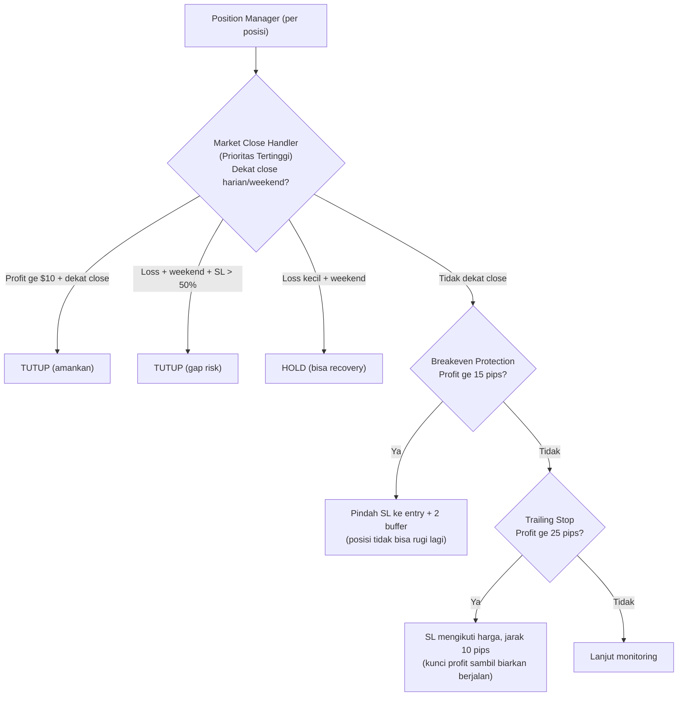

---

## 7. Sistem Proteksi Risiko 4 Lapis

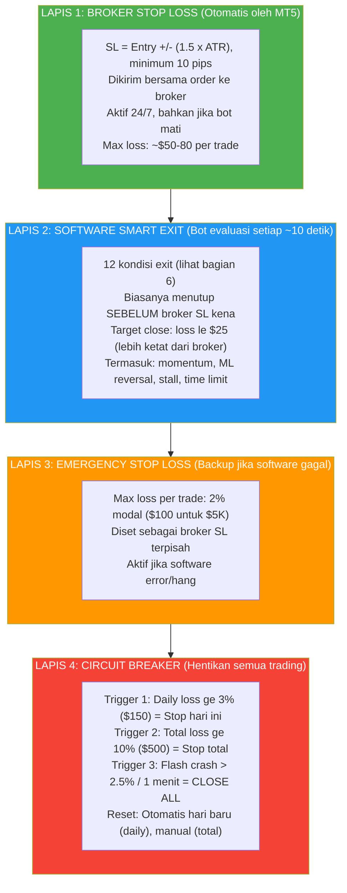

### 4 Mode Trading (Smart Risk Manager)

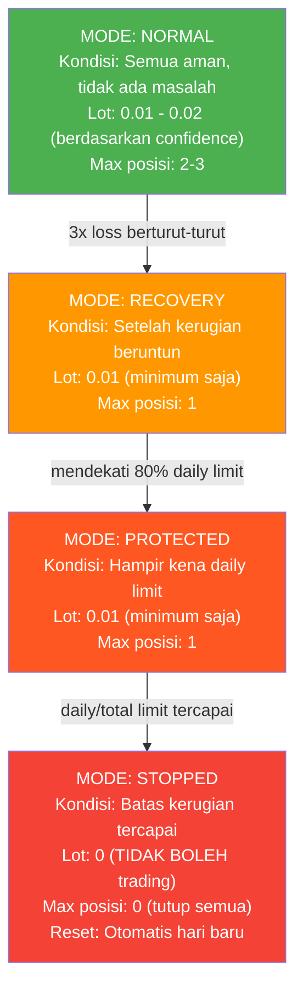

### Lot Sizing: Risk-Constrained Half-Kelly

```
Langkah 1: Hitung Kelly Fraction
    f* = (win_rate × avg_rr - (1 - win_rate)) / avg_rr

    Contoh: win_rate=55%, avg_rr=2.0
    f* = (0.55 × 2.0 - 0.45) / 2.0 = 0.325 (32.5%)

Langkah 2: Cap Kelly (max 25%)
    f* = min(0.325, 0.25) = 0.25

Langkah 3: Half-Kelly (safety)
    f* = 0.25 × 0.5 = 0.125 (12.5%)

Langkah 4: Apply regime multiplier
    High volatility: × 0.5 = 0.0625
    Normal: × 1.0 = 0.125

Langkah 5: Cap di config limit
    config risk_per_trade = 1%
    actual_risk = min(0.125, 0.01) = 0.01 (1%)

Langkah 6: Hitung lot
    risk_amount = $5000 × 1% = $50
    SL distance = 50 pips → pip_value ~$1/pip/0.01lot
    lot = $50 / (50 × $1) = 0.01 lot

Langkah 7: ML Confidence boost
    ML ≥ 80% → lot × 2 = 0.02 lot (maximum)
    ML < 65% → lot = 0.01 (minimum)

Langkah 8: Session multiplier
    Golden Time: × 1.2
    Sydney: × 0.5

    Final lot: 0.01 - 0.02 (ultra-konservatif)
```

---

## 8. AI/ML Engine

### Hidden Markov Model (HMM) — Otak Regime

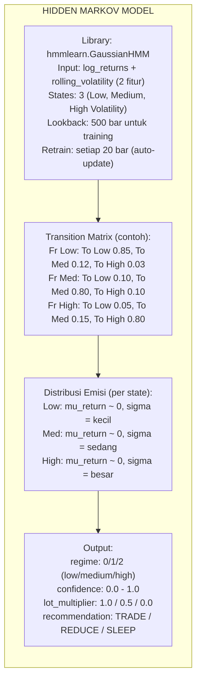

### XGBoost — Otak Prediksi

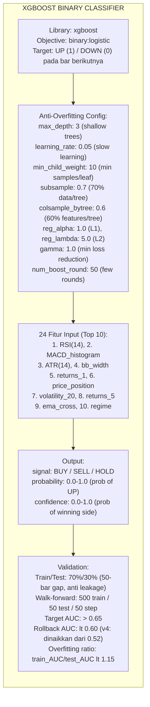

### Kombinasi Sinyal (SMC + ML)

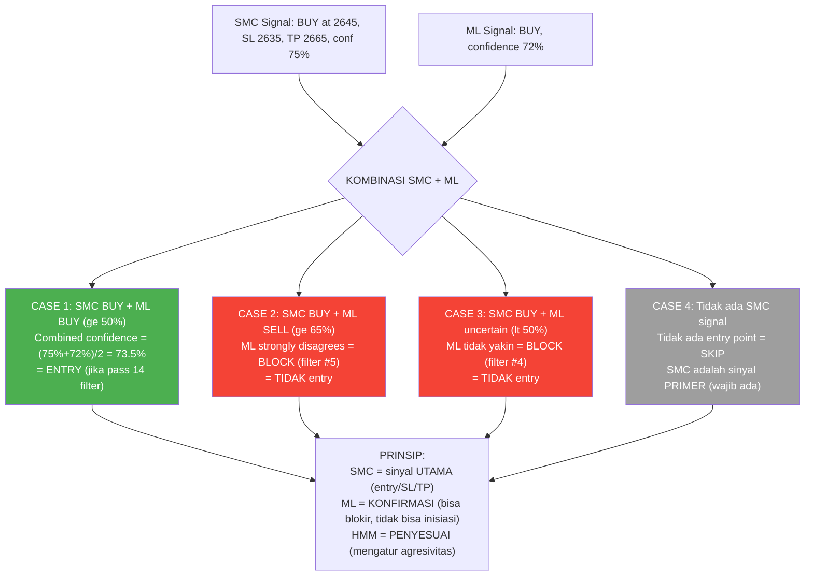

---

## 9. Smart Money Concepts (SMC)

### 6 Konsep yang Dianalisis

```mermaid
flowchart TD
    subgraph SP["1. SWING POINTS (Fractal High/Low)"]
        SP_D["Swing High: titik tertinggi dalam window 11 bar<br/>5 bar kiri lebih rendah, 5 bar kanan lebih rendah<br/><br/>Swing Low: titik terendah dalam window 11 bar<br/>5 bar kiri lebih tinggi, 5 bar kanan lebih tinggi"]
    end
    subgraph FVG2["2. FAIR VALUE GAP (FVG) - Ketidakseimbangan Harga"]
        FVG_D["Bullish FVG (gap up): Bar i-2 high lt Bar i low (ada gap)<br/>Bearish FVG (gap down): Bar i-2 low > Bar i high<br/>Harga cenderung kembali mengisi FVG = entry zone"]
    end
    subgraph OB2["3. ORDER BLOCK (OB) - Zona Institusi"]
        OB_D["Bullish OB: candle bearish terakhir sebelum rally<br/>(zona dimana institusi menempatkan buy order besar)<br/>Lookback: 10 bar untuk deteksi<br/>Mitigated: true jika harga sudah revisit"]
    end
    subgraph BOS2["4. BREAK OF STRUCTURE (BOS) - Kelanjutan Trend"]
        BOS_D["Uptrend BOS: harga break di ATAS swing high sebelumnya<br/>= Trend bullish berlanjut<br/>Downtrend BOS: harga break di BAWAH swing low<br/>= Trend bearish berlanjut"]
    end
    subgraph CHOCH2["5. CHANGE OF CHARACTER (CHoCH) - Perubahan Trend"]
        CHOCH_D["Uptrend ke Downtrend:<br/>Harga break di BAWAH swing low terakhir<br/>= Trend berubah dari bullish ke bearish<br/>(sinyal reversal)"]
    end
    subgraph LIQ2["6. LIQUIDITY ZONES - Target Likuiditas"]
        LIQ_D["BSL (Buy Side Liquidity): di atas swing highs<br/>(stop loss para seller berkumpul)<br/>SSL (Sell Side Liquidity): di bawah swing lows<br/>(stop loss para buyer berkumpul)<br/>Institusi sering hunt liquidity zone ini"]
    end
```

### Signal Generation

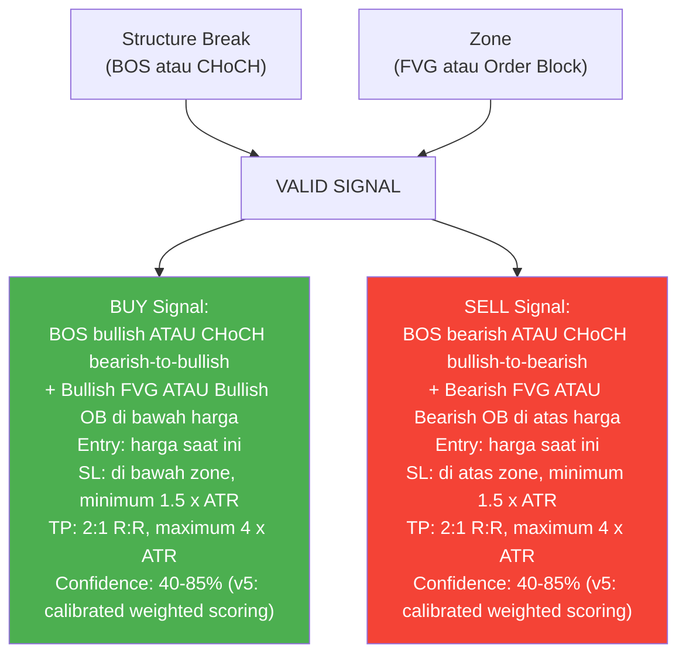

---

## 10. Position Lifecycle

### Dari Lahir Sampai Mati (Siklus Hidup Posisi)

```mermaid
flowchart TD
    T1["TAHAP 1: SINYAL TERDETEKSI<br/>SMC menemukan setup + ML konfirmasi + 14 filter PASS<br/>Keputusan: BUKA POSISI"]
    T1 --> T2["TAHAP 2: LOT SIZE CALCULATION<br/>Risk Engine (Kelly): Balance $5000 x 1% = $50 max loss<br/>SL distance 50 pips = lot 0.01<br/>ML ge 80% = 0.02 lot, ML lt 65% = 0.01 lot<br/>Session: Golden x1.2, Sydney x0.5<br/>Regime: Normal x1.0, High Vol x0.5, Crisis x0.0"]
    T2 --> T3["TAHAP 3: ORDER VALIDATION<br/>SL di sisi benar (BUY: SL lt entry)<br/>TP di sisi benar (BUY: TP > entry)<br/>Lot dalam range (0.01 - 0.05)<br/>Entry dekat harga saat ini (lt 0.1%)<br/>Risk% le 1.5x config limit<br/>Circuit breaker TIDAK aktif"]
    T3 --> T4["TAHAP 4: ORDER EXECUTION<br/>MT5 Connector mengirim order:<br/>Symbol: XAUUSD, Type: BUY/SELL<br/>Lot: 0.01-0.02, SL: ATR-based<br/>TP: 2:1 R:R, Deviation: 20 points<br/>Retry: max 3 attempts"]
    T4 --> T4B["TAHAP 4b: POST-EXECUTION VALIDATION (v5)<br/>Slippage Validation: max 0.15% (~$4 XAUUSD)<br/>Log WARNING jika melebihi batas<br/>Gunakan harga AKTUAL untuk tracking<br/>Partial Fill: cek volume, update lot aktual"]
    T4B --> T5["TAHAP 5: POSITION REGISTERED<br/>Smart Risk Manager: catat entry AKTUAL, peak=0<br/>Trade Logger: insert PostgreSQL (30+ field) + CSV<br/>Telegram: notifikasi trade open<br/>(entry, SL, TP, R:R, confidence, regime)"]
    T5 --> T6["TAHAP 6: ACTIVE MONITORING<br/>(setiap ~10 detik + candle baru)<br/>Update profit/loss, peak profit, momentum<br/>Hitung TP probability<br/>Cek 12 kondisi exit<br/>Cek Position Manager (trailing, breakeven)<br/>Cek Market Close Handler"]
    T6 -->|"trigger close"| T7["TAHAP 7: POSITION CLOSED<br/>MT5: Close via market order<br/>Risk Manager: record P/L, update counters,<br/>check mode transition<br/>Logger: update exit price, profit, duration, reason<br/>Telegram: notifikasi trade close"]
    T6 -->|"HOLD"| T6

    style T1 fill:#1565C0,color:#fff
    style T7 fill:#C62828,color:#fff
```

---

## 11. Auto-Retraining & Model Management

### Lifecycle Model AI

```mermaid
flowchart TD
    INIT["INITIAL TRAINING (train_models.py)<br/>Dijalankan 1x saat setup"]
    INIT --> I1["1. Fetch 10,000 bar M15 dari MT5 (~104 hari)"]
    I1 --> I2["2. Feature Engineering = 40+ fitur"]
    I2 --> I3["3. SMC Analysis = struktur pasar"]
    I3 --> I4["4. Create target UP/DOWN (lookahead=1)<br/>4b. Split 70/30, 50-bar gap (anti leakage)"]
    I4 --> I5["5. Train HMM (3 regime, lookback=500)"]
    I5 --> I6["6. Train XGBoost (50 rounds, early_stop=5)"]
    I6 --> I7["7. Walk-forward validation (500/50/50)"]
    I7 --> I8["8. Save: hmm_regime.pkl + xgboost_model.pkl"]

    I8 --> DAILY["DAILY AUTO-RETRAINING (Auto Trainer)<br/>Otomatis setiap hari 05:00 WIB"]

    DAILY --> SCHED["Schedule:<br/>Harian (05:00 WIB): 8,000 bar, 50 rounds<br/>Weekend (Sabtu): 15,000 bar, 80 rounds (deep)<br/>Emergency: jika AUC lt 0.65"]

    SCHED --> D1["1. Backup model saat ini"]
    D1 --> D2["2. Fetch data baru dari MT5"]
    D2 --> D3["3. Feature Engineering + SMC"]
    D3 --> D4["4. Train HMM baru + XGBoost baru"]
    D4 --> D5{"5. Validasi: test AUC ge 0.60?"}
    D5 -->|"Ya"| SAVE["Save model baru, reload di memory"]
    D5 -->|"Tidak"| ROLLBACK["ROLLBACK ke model sebelumnya"]
    SAVE --> D6["6. Log hasil ke PostgreSQL"]
    ROLLBACK --> D6
    D6 --> D7["7. Kirim laporan via Telegram"]

    D7 --> SAFETY["Safety:<br/>Max 5 backup (rotasi)<br/>Min 20 jam antar retrain (cooldown)<br/>Auto-rollback jika AUC lt 0.60<br/>Model lama selalu tersedia"]
```

### Perbandingan Initial vs Auto Training

| Aspek | train_models.py | Auto Trainer |
|-------|-----------------|-------------|
| Kapan | Manual, 1x setup | Otomatis, harian |
| Data | 10,000 bar | 8K (harian) / 15K (weekend) |
| Boost rounds | 50 | 50 (harian) / 80 (weekend) |
| Walk-forward | Ya | Tidak |
| Backup | Tidak | Ya (5 terakhir) |
| Rollback | Tidak | Ya (AUC < 0.60) |
| Database | Tidak | Ya (PostgreSQL) |
| Tujuan | Setup awal | Maintenance rutin |

---

## 12. Infrastruktur & Database

### PostgreSQL Schema

```mermaid
flowchart TD
    DB["trading_db"] --> T["trades<br/>Semua trade: open, close, profit, SMC, ML, features"]
    DB --> TR["training_runs<br/>Log setiap training: AUC, akurasi, durasi, rollback"]
    DB --> SG["signals<br/>Setiap sinyal yang dihasilkan: executed atau tidak"]
    DB --> MS["market_snapshots<br/>Snapshot periodik: harga, regime, volatilitas"]
    DB --> BS["bot_status<br/>Status bot: uptime, loop count, balance, risk mode"]
    DB --> DS["daily_summaries<br/>Ringkasan harian: win rate, profit factor, per sesi"]
```

### Tabel `trades` (Detail)

```sql
-- Identifikasi
ticket, symbol, direction (BUY/SELL)

-- Harga
entry_price, exit_price, stop_loss, take_profit

-- Hasil
lot_size, profit_usd, profit_pips
opened_at, closed_at, duration_seconds

-- Konteks Entry
entry_regime, entry_volatility, entry_session
smc_signal, smc_confidence, smc_reason
smc_fvg_detected, smc_ob_detected, smc_bos_detected, smc_choch_detected
ml_signal, ml_confidence
market_quality, market_score, dynamic_threshold

-- Konteks Exit
exit_reason, exit_regime, exit_ml_signal

-- Keuangan
balance_before, balance_after, equity_at_entry

-- Data Lengkap
features_entry (JSON), features_exit (JSON)
bot_version, trade_mode
```

### Connection Architecture

```mermaid
flowchart TD
    TL["TradeLogger"] -->|"TradeRepository, SignalRepository,<br/>MarketSnapshotRepository"| DBC["DatabaseConnection (Singleton)"]
    AT2["AutoTrainer"] -->|"TrainingRepository"| DBC
    ML["main_live.py"] -->|"BotStatusRepository,<br/>DailySummaryRepository"| DBC
    DASH["Dashboard"] -->|"Semua repository (READ)"| DBC

    DBC --> POOL["ThreadedConnectionPool (1-10 koneksi)"]
    POOL --> PG["PostgreSQL Server"]
```

### Graceful Degradation

```mermaid
flowchart TD
    CHECK{"PostgreSQL tersedia?"}
    CHECK -->|"Ya"| DUAL["Gunakan DB + CSV backup (dual write)"]
    CHECK -->|"Tidak"| CSV["CSV saja (bot tetap berjalan 100%)"]
    DUAL --> NOTE["Bot TIDAK PERNAH crash karena database.<br/>Semua operasi DB dibungkus try-except."]
    CSV --> NOTE
```

---

## 13. Konfigurasi & Parameter Kritis

### Configuration System

```mermaid
flowchart TD
    ENV[".env file"] --> TC["TradingConfig.from_env()"]

    TC --> RC["RiskConfig<br/>risk_per_trade: 1.0% (SMALL) / 0.5% (MEDIUM)<br/>max_daily_loss: 3.0% (SMALL) / 2.0% (MEDIUM)<br/>max_total_loss: 10.0%<br/>max_positions: 3 (SMALL) / 5 (MEDIUM)<br/>min_lot: 0.01<br/>max_lot: 0.05 (SMALL) / 2.0 (MEDIUM)<br/>max_leverage: 1:100 (SMALL) / 1:30 (MEDIUM)"]

    TC --> SC["SMCConfig<br/>swing_length: 5<br/>fvg_min_gap_pips: 2.0<br/>ob_lookback: 10<br/>bos_close_break: true"]

    TC --> MLC2["MLConfig<br/>confidence_threshold: 0.65<br/>entry_confidence: 0.70<br/>high_confidence: 0.75<br/>very_high_confidence: 0.80<br/>retrain_frequency_days: 7"]

    TC --> THC["ThresholdsConfig<br/>ml_min_confidence: 0.65<br/>ml_high_confidence: 0.75<br/>trade_cooldown_seconds: 300<br/>min_profit_to_secure: $15<br/>good_profit: $25, great_profit: $40<br/>flash_crash_threshold: 2.5%<br/>sydney_lot_multiplier: 0.5"]

    TC --> RGC["RegimeConfig<br/>n_regimes: 3<br/>lookback: 500<br/>retrain_frequency: 20"]
```

### Capital Mode Auto-Detection

```mermaid
flowchart TD
    BAL{"Balance?"}
    BAL -->|"le $10,000"| SMALL["SMALL MODE<br/>Risk: 1% per trade ($50 pada $5K)<br/>Daily limit: 3% ($150)<br/>Lot: 0.01-0.05<br/>Leverage: 1:100<br/>Timeframe: M15<br/>Max posisi: 3"]
    BAL -->|"> $10,000"| MEDIUM["MEDIUM MODE<br/>Risk: 0.5% per trade<br/>Daily limit: 2%<br/>Lot: 0.01-2.0<br/>Leverage: 1:30<br/>Timeframe: H1<br/>Max posisi: 5"]
```

### Session Schedule (WIB = GMT+7)

```mermaid
flowchart LR
    subgraph SESSION["Session Schedule (WIB = GMT+7)"]
        direction TB
        DZ["00:00-04:00 DEAD ZONE<br/>BLOCKED - Likuiditas rendah"]
        RO["04:00-06:00 ROLLOVER<br/>BLOCKED - Spread melebar"]
        SY["06:00-07:00 Sydney<br/>0.5x - Pasar baru buka"]
        TK["07:00-13:00 Tokyo+Sydney<br/>0.7x - Asia aktif"]
        TA["13:00-15:00 Tokyo akhir<br/>0.7x - Transisi"]
        LD["15:00-20:00 London<br/>1.0x - Volatilitas naik"]
        GT["20:00-23:59 GOLDEN TIME<br/>1.2x - London+NY overlap"]
        WR["Jumat ge 23:00 WEEKEND RISK<br/>BLOCKED - Gap risk"]
    end

    style DZ fill:#F44336,color:#fff
    style RO fill:#F44336,color:#fff
    style SY fill:#FF9800,color:#fff
    style TK fill:#FFC107,color:#000
    style TA fill:#FFC107,color:#000
    style LD fill:#2196F3,color:#fff
    style GT fill:#4CAF50,color:#fff
    style WR fill:#F44336,color:#fff
```

Golden Time (20:00-23:59 WIB) = waktu paling optimal
- Spread ketat, likuiditas maksimal, volatilitas ideal
- Lot multiplier 1.2x (bonus)
- v4: Smart Hold dihapus -- tidak ada lagi hold losers menunggu sesi tertentu

---

## 14. Performa & Timing

### Main Loop Breakdown

Target: < 50ms per iterasi analisis

**FULL ANALYSIS (saat candle baru M15):**

| Komponen | Waktu | Keterangan |
|----------|-------|------------|
| MT5 data fetch | ~10ms | 200 bar M15 via API |
| Feature engineering | ~5ms | 40+ fitur, Polars |
| SMC analysis | ~5ms | 6 konsep, Polars native |
| HMM predict | ~2ms | 2 fitur -> 1 regime |
| XGBoost predict | ~3ms | 24 fitur -> 1 signal |
| Position monitoring | ~5ms | Per posisi terbuka |
| Entry logic | ~5ms | 14 filter check |
| Overhead | ~15ms | Logging, state update |
| **TOTAL** | **~50ms** | |

**POSITION CHECK ONLY (di antara candle, setiap ~10 detik):**

| Komponen | Waktu | Keterangan |
|----------|-------|------------|
| MT5 data fetch | ~5ms | 50 bar saja |
| Feature engineering | ~3ms | Minimal fitur |
| ML prediction | ~3ms | Untuk exit evaluation |
| Position evaluation | ~5ms | 12 kondisi exit |
| Overhead | ~5ms | Logging |
| **TOTAL** | **~21ms** | |

### Timer Periodik

| Event | Interval | Cara Trigger |
|-------|----------|--------------|
| Full analysis + entry | Candle baru M15 | Deteksi candle |
| Position monitoring | ~10 detik | Di antara candle |
| Performance logging | 4 candle (~1j) | candle_count % 4 |
| Auto-retrain check | 20 candle (~5j) | candle_count % 20 |
| Market update Telegram | 30 menit | Timer |
| Hourly analysis | 1 jam | Timer |
| Daily summary + reset | Ganti hari | Date check |

---

## 15. Error Handling & Fault Tolerance

### Prinsip: Bot TIDAK PERNAH Crash

```mermaid
flowchart TD
    subgraph LV1["LEVEL 1: Per-Loop Error Handling"]
        LV1D["try: Fetch data, analyze, trade<br/>except ConnectionError: reconnect()<br/>except Exception: Log error, lanjut loop berikutnya<br/>Bot TIDAK crash dari error tunggal"]
    end
    subgraph LV2["LEVEL 2: MT5 Auto-Reconnect"]
        LV2D["MT5 putus?<br/>Attempt 1: reconnect (tunggu 2 detik)<br/>Attempt 2: reconnect (tunggu 4 detik)<br/>Attempt 3: reconnect (tunggu 8 detik)<br/>Cooldown 60 detik, Retry cycle (max 5/cooldown)<br/>Selama disconnected: monitoring PAUSE,<br/>entry DITUNDA, posisi dilindungi broker SL"]
    end
    subgraph LV3["LEVEL 3: Database Graceful Degradation"]
        LV3D["PostgreSQL down?<br/>Switch ke CSV-only mode<br/>Semua data tetap dicatat<br/>Trading tetap berjalan normal<br/>Retry DB connection periodik"]
    end
    subgraph LV4["LEVEL 4: Telegram Failure"]
        LV4D["Telegram API error?<br/>Log error secara silent<br/>Trading tetap jalan 100%<br/>Retry di notifikasi berikutnya"]
    end
    subgraph LV5["LEVEL 5: Model File Missing"]
        LV5D[".pkl file tidak ditemukan?<br/>Log warning<br/>Skip prediksi (ML/HMM)<br/>Trading bisa jalan tanpa ML (SMC only)<br/>Trigger: jalankan train_models.py"]
    end
    subgraph LV6["LEVEL 6: Flash Crash Protection"]
        LV6D["Harga bergerak > 2.5% dalam 1 menit?<br/>EMERGENCY: Close ALL positions<br/>Circuit breaker AKTIF<br/>Kirim alert KRITIS via Telegram<br/>Bot masuk mode STOPPED"]
    end

    LV1 --> LV2 --> LV3 --> LV4 --> LV5 --> LV6
```

### Startup & Shutdown

```mermaid
flowchart TD
    subgraph STARTUP["STARTUP SEQUENCE"]
        direction TB
        S1["1. Load konfigurasi dari .env"] --> S2["2. Connect ke MT5 (max 3 retry)"]
        S2 --> S3["3. Load model HMM dari models/hmm_regime.pkl"]
        S3 --> S4["4. Load model XGBoost dari models/xgboost_model.pkl"]
        S4 --> S5["5. Initialize SmartRiskManager (set balance, limits)"]
        S5 --> S6["6. Initialize SessionFilter (WIB timezone)"]
        S6 --> S7["7. Initialize TelegramNotifier"]
        S7 --> S8["8. Initialize TradeLogger (connect DB)"]
        S8 --> S9["9. Initialize AutoTrainer"]
        S9 --> S10["10. Send Telegram: BOT STARTED"]
        S10 --> S11["11. Mulai main loop"]
    end

    subgraph SHUTDOWN["SHUTDOWN SEQUENCE (SIGINT/SIGTERM)"]
        direction TB
        D1["1. Signal diterima"] --> D2["2. Hentikan loop utama"]
        D2 --> D3["3. Kirim Telegram: BOT STOPPED"]
        D3 --> D4["4. Disconnect MT5"]
        D4 --> D5["5. Close database connections"]
        D5 --> D6["6. Exit"]
    end
```

---

## 16. Daftar File Source Code

```mermaid
flowchart TD
    ROOT["Smart Automatic Trading BOT + AI/"]
    ROOT --> MAIN["main_live.py - Orchestrator utama"]
    ROOT --> TRAIN["train_models.py - Script training awal"]
    ROOT --> ENVF[".env - Environment variables"]

    ROOT --> SRC["src/"]
    SRC --> CFG["config.py - Konfigurasi terpusat (6 sub-config)"]
    SRC --> MT5F["mt5_connector.py - Bridge ke MetaTrader 5"]
    SRC --> FEF["feature_eng.py - Feature Engineering (40+ fitur)"]
    SRC --> RDF["regime_detector.py - HMM Regime Detection"]
    SRC --> MLF["ml_model.py - XGBoost Signal Predictor"]
    SRC --> SMCF["smc_polars.py - Smart Money Concepts (6 konsep)"]
    SRC --> SRMF["smart_risk_manager.py - 4-Mode Risk Manager"]
    SRC --> REF["risk_engine.py - Kelly Criterion + Circuit Breaker"]
    SRC --> SFF["session_filter.py - Session Time Filter (WIB)"]
    SRC --> DCF["dynamic_confidence.py - Dynamic Threshold Manager"]
    SRC --> NAF["news_agent.py - News Event Monitor"]
    SRC --> TNF["telegram_notifier.py - Telegram Push Notifications"]
    SRC --> ATF["auto_trainer.py - Daily Auto-Retraining"]
    SRC --> TLF["trade_logger.py - Dual Storage Logger (DB+CSV)"]
    SRC --> PMF["position_manager.py - Position Manager + Market Close"]
    SRC --> DBD["db/"]
    DBD --> DBINIT["__init__.py - DB exports"]
    DBD --> DBCONN["connection.py - PostgreSQL Singleton + Pool"]
    DBD --> DBREPO["repository.py - 6 Repository classes"]

    ROOT --> MODELS["models/"]
    MODELS --> XGBM["xgboost_model.pkl - Trained XGBoost model"]
    MODELS --> HMMM["hmm_regime.pkl - Trained HMM model"]
    MODELS --> BKUP["backup/ - Auto-backup (5 terakhir)"]

    ROOT --> DATA["data/"]
    DATA --> TDATA["training_data.parquet"]
    DATA --> TLOGS["trade_logs/ - CSV backup (per bulan)"]

    ROOT --> BTESTS["backtests/"]
    BTESTS --> BTSYNC["backtest_live_sync.py - 100% sync live"]

    ROOT --> LOGS["logs/"]
    LOGS --> LOGF["training_YYYY-MM-DD.log"]

    ROOT --> DOCS["docs/arsitektur-ai/"]
    DOCS --> DOC0["00-ARSITEKTUR-LENGKAP.md - Dokumen ini"]
    DOCS --> DOCR["README.md - Index komponen"]
    DOCS --> DOC1["01-23 (per komponen) - Detail per modul"]
```

---

## Ringkasan Eksekutif

**Smart AI Trading Bot** adalah sistem trading otomatis yang menggabungkan:

1. **Smart Money Concepts (SMC)** sebagai sinyal UTAMA — mendeteksi zona institusi (FVG, Order Block, BOS, CHoCH) untuk menentukan entry, SL, dan TP yang presisi.

2. **XGBoost Machine Learning** sebagai KONFIRMASI — memprediksi arah harga dengan 24 fitur teknikal, memblokir trade jika tidak setuju dengan SMC.

3. **Hidden Markov Model (HMM)** sebagai PENYESUAI — mendeteksi kondisi pasar (tenang/volatile/krisis) untuk menyesuaikan agresivitas.

4. **4-Lapis Proteksi Risiko** — dari broker SL, software smart exit, emergency stop, hingga circuit breaker. Lot ultra-kecil (0.01-0.02) memastikan kerugian per trade maximum $50 (1%).

5. **Self-Improving** — model AI dilatih ulang otomatis setiap hari dengan auto-rollback jika model baru lebih buruk.

6. **Fault-Tolerant** — bot tidak pernah crash. MT5 putus? Auto-reconnect. Database mati? CSV fallback. Error? Log dan lanjut.

Semua ini dikoordinasikan oleh **Main Live Orchestrator** yang menjalankan loop **candle-based** — analisis penuh hanya saat candle M15 baru terbentuk (~50ms per iterasi), dengan pengecekan posisi setiap ~10 detik di antara candle (~21ms). Mengevaluasi 14 *filter entry* dan 12 kondisi *exit* secara *real-time*, dengan notifikasi Telegram untuk setiap kejadian penting.

```
TARGET: Trading XAUUSD M15 yang KONSISTEN dan AMAN
        dengan kerugian terkontrol dan profit teroptimasi.
```
