# HMM (*Hidden Markov Model*) — *Regime Detector*

> **File:** `src/regime_detector.py`
> **Model:** `models/hmm_regime.pkl`
> **Library:** `hmmlearn.GaussianHMM`

---

## Apa Itu HMM?

*Hidden Markov Model* (HMM) adalah model statistik yang mengidentifikasi **kondisi tersembunyi** (*hidden states*) dari data yang dapat diamati. Dalam konteks *trading*, HMM mendeteksi **3 kondisi pasar** (*regime*) yang tidak terlihat langsung dari harga:

```mermaid
graph LR
    A["Data Pasar<br/>Return, Volatilitas, Volume"] --> B["HMM<br/>GaussianHMM 3-state"]
    B --> C["Low Volatility<br/>🟢 TRADE"]
    B --> D["Medium Volatility<br/>🟡 REDUCE"]
    B --> E["High Volatility<br/>🔴 SLEEP"]
```



---

## 3 *State* Pasar

| *State* | Label | Rekomendasi | Efek pada *Trading* |
|---------|-------|-------------|---------------------|
| **0** | *Low Volatility* | **TRADE** | *Lot* normal, semua filter aktif |
| **1** | *Medium Volatility* | **REDUCE** | *Lot* dikurangi, *entry* lebih ketat |
| **2** | *High Volatility* / Krisis | **SLEEP** | **Tidak boleh *trading*** — terlalu berisiko |

---

## Cara Kerja

### *Input Features* (3 fitur)

```python
features = [
    "returns",      # Perubahan harga (%)
    "volatility",   # Volatilitas rolling (standar deviasi)
    "volume_change" # Perubahan volume (%)
]
```

### Proses *Training*

```python
class MarketRegimeDetector:
    def __init__(self,
        n_regimes=3,           # 3 state
        lookback_periods=500,  # 500 bar untuk training
        retrain_frequency=20,  # Retrain setiap 20 bar baru
        covariance_type="full",
        random_state=42,
    ):
        self.hmm = GaussianHMM(
            n_components=3,
            covariance_type="full",
            n_iter=100,
            random_state=42,
        )
```

### Proses Deteksi

```python
# 1. Siapkan data 500 bar terakhir
X = df[["returns", "volatility", "volume_change"]].to_numpy()

# 2. Fit model (atau load dari .pkl)
self.hmm.fit(X)

# 3. Prediksi state saat ini
state = self.hmm.predict(X)[-1]  # State terakhir

# 4. Hitung probabilitas tiap state
probs = self.hmm.predict_proba(X)[-1]
# Contoh: [0.85, 0.10, 0.05] = 85% low vol
```

---

## Output: `RegimeState`

```python
@dataclass
class RegimeState:
    regime: MarketRegime       # LOW/MEDIUM/HIGH_VOLATILITY atau CRISIS
    confidence: float          # Probabilitas state terpilih (0-1)
    probabilities: Dict        # Probabilitas semua state
    volatility: float          # Level volatilitas saat ini
    recommendation: str        # "TRADE", "REDUCE", atau "SLEEP"
```

---

## Integrasi dengan Sistem

```mermaid
graph TD
    A["HMM Regime Detector"] --> B{"Regime?"}
    B -->|LOW VOL| C["✅ TRADE<br/>Lot normal, semua filter aktif"]
    B -->|MEDIUM VOL| D["⚠️ REDUCE<br/>Lot dikurangi, entry lebih ketat"]
    B -->|HIGH VOL| E["🛑 SLEEP<br/>Blokir semua entry baru"]
    C --> F["Entry Filter #2"]
    D --> F
    E -->|Blokir| G["Skip — tidak boleh trading"]
```



**Penggunaan dalam *main_live.py*:**
- *Regime* **SLEEP** → blokir semua *entry* baru (Filter #2)
- *Regime* memengaruhi *lot sizing* — `SmartRiskManager` mengurangi *lot* pada *medium volatility*
- *Regime* dicatat di setiap *trade log* untuk analisis historis

---

## Penyimpanan Model

- **Format:** `.pkl` (*pickle*)
- **Lokasi:** `models/hmm_regime.pkl`
- **Ukuran:** ~50-100 KB
- ***Retrain*:** Otomatis setiap 20 bar baru ATAU melalui `AutoTrainer` setiap 7 hari
- ***Auto-retrain* dipicu juga saat:** Akurasi deteksi turun atau distribusi *return* berubah signifikan

---

## Konfigurasi

Dari `src/config.py` → `RegimeConfig`:

| Parameter | Nilai | Keterangan |
|-----------|-------|------------|
| `n_regimes` | **3** | Jumlah *state* HMM |
| `lookback_periods` | **500** | Bar untuk *training* HMM |
| `retrain_frequency` | **20** | *Retrain* setiap 20 bar baru |
