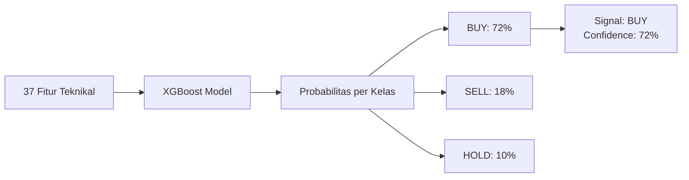

# XGBoost — *Signal Predictor*

> **File:** `src/ml_model.py`
> **Model:** `models/xgboost_model.pkl`
> **Library:** `xgboost`

---

## Apa Itu XGBoost *Signal Predictor*?

XGBoost (*Extreme Gradient Boosting*) adalah model *machine learning* yang memprediksi **sinyal *trading*** — BUY, SELL, atau HOLD — berdasarkan **37 fitur teknikal**. Model ini berfungsi sebagai **konfirmasi kedua** setelah analisis SMC.

---

## Alur Prediksi



---

## 37 *Features* (Fitur *Input*)

Model menerima 37 fitur yang dihitung oleh `FeatureEngineer`:

| Grup | Fitur | Jumlah |
|------|-------|--------|
| **Momentum** | RSI 14, RSI 7, MACD, *MACD Signal*, *MACD Histogram* | 5 |
| **Volatilitas** | ATR 14, *Bollinger Upper/Lower/Width*, *Keltner Channel* | 5 |
| **Trend** | EMA 9/20/50, SMA 20/50, *EMA Crossover* | 6 |
| **Volume** | *Volume Ratio*, *Volume MA*, *OBV*, *Volume Change* | 4 |
| ***Price Action*** | *Body Size*, *Shadow Ratio*, *Candle Pattern*, Jarak dari EMA | 5 |
| **Struktur** | *Higher High/Lower Low*, *Swing Detection*, BOS/CHoCH | 4 |
| ***Derived*** | *Returns* (1/3/5 bar), *Volatility Ratio*, *Momentum Score* | 5 |
| ***Lagged*** | Fitur-fitur di atas dengan *lag* 1-3 bar | 3 |

---

## *Output*: Prediksi

```python
@dataclass
class MLPrediction:
    signal: str          # "BUY", "SELL", atau "HOLD"
    confidence: float    # 0.0 - 1.0
    probabilities: Dict  # {"BUY": 0.72, "SELL": 0.18, "HOLD": 0.10}
```

---

## Peran dalam Sistem

XGBoost **bukan pembuat keputusan utama** — fungsinya adalah **konfirmasi dan filter**:

```mermaid
graph TD
    SMC["SMC Analyzer<br/>Sinyal Utama"] --> COMBINE["Kombinasi Sinyal"]
    ML["XGBoost<br/>Konfirmasi"] --> COMBINE
    COMBINE --> CHECK{"ML setuju?"}
    CHECK -->|"Ya (≥50%)"| PASS["✅ Lanjut ke filter berikutnya"]
    CHECK -->|"Sangat tidak setuju (>65%)"| VETO["🛑 VETO — blokir entry"]
    CHECK -->|"Ragu (<50%)"| SKIP["⚠️ Skip — confidence terlalu rendah"]
```



### Aturan Kombinasi:

| Kondisi | Aksi |
|---------|------|
| SMC = BUY, ML = BUY (≥50%) | ✅ **Konfirmasi** — lanjut |
| SMC = BUY, ML = HOLD | ⚠️ *Skip* — ML tidak yakin |
| SMC = BUY, ML = SELL (≥65%) | 🛑 **VETO** — ML *strongly disagree* |
| SMC = BUY, ML = SELL (<65%) | ✅ *Pass* — ML kurang yakin untuk veto |

---

## *Confidence Threshold*

| Level | Nilai | Penggunaan |
|-------|-------|------------|
| **Minimum** | **0.50** | Batas paling rendah untuk diterima |
| ***Entry*** | **0.65-0.70** | *Default* dari `DynamicConfidence` |
| ***High*** | **0.75** | Sinyal kuat — *lot multiplier* aktif |
| ***Very High*** | **0.80** | Sangat yakin — batas atas |

*Threshold* disesuaikan secara dinamis oleh `DynamicConfidenceManager` berdasarkan kondisi pasar.

---

## *Training*

```python
# train_models.py
model = XGBClassifier(
    n_estimators=500,
    max_depth=6,
    learning_rate=0.01,
    subsample=0.8,
    colsample_bytree=0.8,
    min_child_weight=3,
    reg_alpha=0.1,    # L1 regularization
    reg_lambda=1.0,   # L2 regularization
)

# Training data: 1000+ bar XAUUSD M15
# Label: Pergerakan harga setelah N bar
# Validasi: Walk-forward dengan 80/20 split
```

### ***Auto-Retrain***

Model otomatis di-*retrain* oleh `AutoTrainer` setiap **7 hari** atau saat:
- Akurasi prediksi turun signifikan
- Distribusi pasar berubah
- *Confidence calibration* menyimpang

---

## Penyimpanan Model

| Properti | Nilai |
|----------|-------|
| **Format** | `.pkl` (*pickle*) via `xgboost` |
| **Lokasi** | `models/xgboost_model.pkl` |
| **Ukuran** | ~1-5 MB |
| **Fitur** | 37 kolom (harus identik saat *training* dan *inference*) |
| ***Retrain*** | Otomatis tiap 7 hari |
