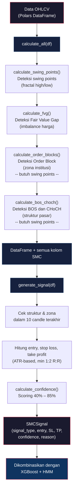
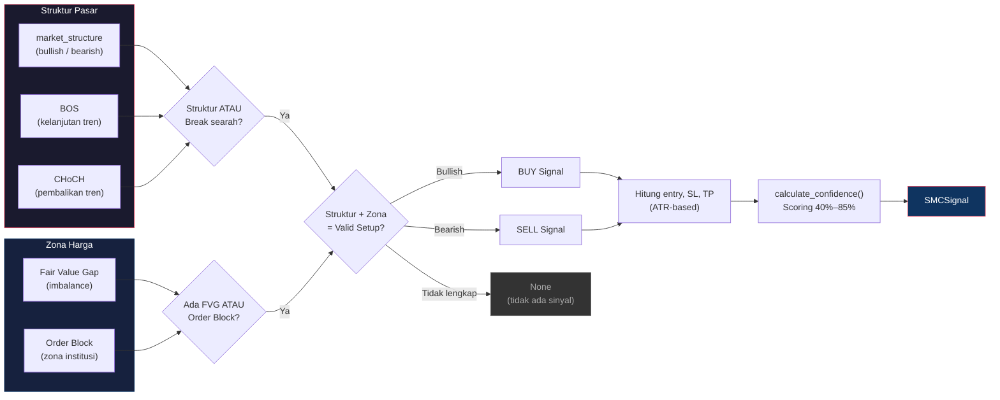
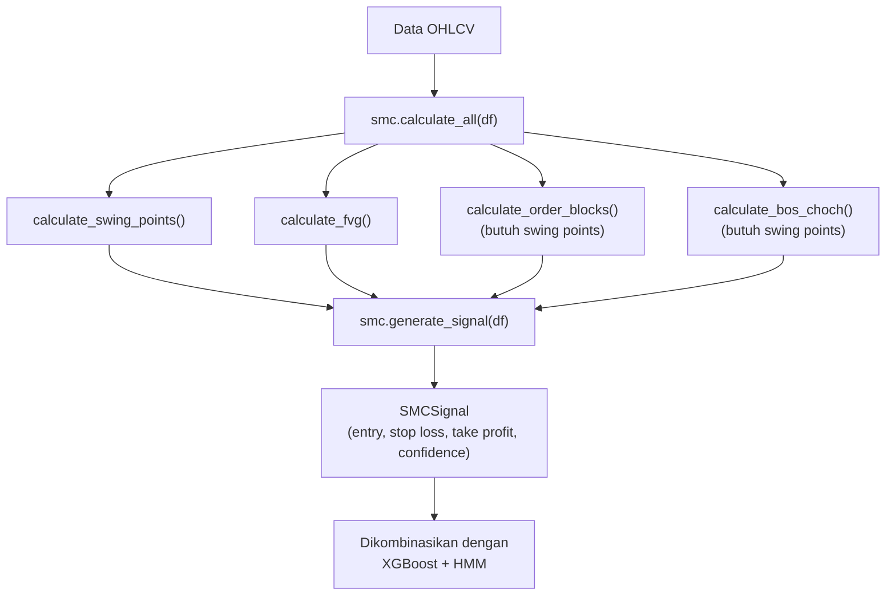

# SMC Analyzer (*Smart Money Concepts*)

> **File:** `src/smc_polars.py`
> **Framework:** Pure Polars (vectorized, tanpa loop)

---

## Pipeline Analisis SMC

Berikut adalah alur lengkap pipeline analisis *Smart Money Concepts*, dari data OHLCV mentah hingga menghasilkan sinyal trading:



---

## Apa Itu SMC?

*Smart Money Concepts* adalah metode analisis berdasarkan **cara institusi besar (bank, hedge fund) trading**. SMC membaca **struktur pasar** dan **jejak uang besar** untuk menemukan zona *entry* yang presisi.

**Analogi:** SMC adalah **peta jalan** — menunjukkan zona penting, rambu lalu lintas, dan rute terbaik.

---

## 6 Konsep yang Diimplementasikan

| # | Konsep | Fungsi | Lines |
|---|--------|--------|-------|
| 1 | *Swing Points* | Puncak & lembah penting | 185-261 |
| 2 | *Fair Value Gap* (FVG) | Imbalance/gap harga | 84-183 |
| 3 | *Order Block* (OB) | Zona order institusi | 263-368 |
| 4 | *Break of Structure* (BOS) | Kelanjutan tren | 370-457 |
| 5 | *Change of Character* (CHoCH) | Pembalikan tren | 370-457 |
| 6 | *Liquidity Zones* | Kumpulan *stop loss* | 459-551 |

---

## 1. *Swing Points* (Fractal High/Low)

**Fungsi:** Mendeteksi puncak dan lembah penting di chart.

### Algoritma

```
Window: 2 x swing_length + 1 = 11 candle (default swing_length=5)

Deteksi TANPA LOOKAHEAD (no future data):
  - Rolling max/min menggunakan center=False (hanya data masa lalu)
  - Swing point dikonfirmasi swing_length bar SETELAH terjadi
  - Menggunakan shift(swing_length) untuk melihat "center" point

Swing High: High di center point = Maximum dalam window 11 bar ke belakang
Swing Low:  Low di center point = Minimum dalam window 11 bar ke belakang

Catatan: Deteksi terlambat swing_length bar (5 bar), tapi
         TIDAK menggunakan data masa depan (zero *lookback*).
```

### Visualisasi

```
         /\ <- Swing High (high = max 11 candle)
        /  \
       /    \
      /      \
     /        \/ <- Swing Low (low = min 11 candle)
    /
```

### Output
| Kolom | Nilai | Keterangan |
|-------|-------|-----------|
| `swing_high` | 1 / 0 | 1 jika *swing high* |
| `swing_low` | -1 / 0 | -1 jika *swing low* |
| `swing_high_level` | float | Harga di *swing high* |
| `swing_low_level` | float | Harga di *swing low* |
| `last_swing_high` | float | *Swing high* terakhir (forward fill) |
| `last_swing_low` | float | *Swing low* terakhir (forward fill) |

---

## 2. *Fair Value Gap* (FVG)

**Fungsi:** Mendeteksi **imbalance/gap** di harga — zona yang belum "diisi" oleh pasar.

### Algoritma

```
TANPA LOOKAHEAD — Deteksi pada candle KETIGA (setelah pola selesai):

Bullish FVG:                    Bearish FVG:
Candle T-2: ████ high           Candle T-2: ████ low
                  |                           |
Candle T-1:    (middle)         Candle T-1:    (middle)
                  |                           |
Candle T:   ████ low (SAAT INI) Candle T:   ████ high (SAAT INI)

Syarat Bullish: high[T-2] < low[T]   (gap antara candle pertama & ketiga)
Syarat Bearish: low[T-2]  > high[T]  (gap antara candle pertama & ketiga)

Catatan: TIDAK menggunakan shift(-1) / data masa depan.
         FVG dideteksi pada candle saat ini (T) setelah pola terkonfirmasi.
```

### Zona FVG

```
Bullish FVG Zone:
  Top    = low[T]      (low candle saat ini = batas atas gap)
  Bottom = high[T-2]   (high candle pertama = batas bawah gap)
  Mid    = (top + bottom) / 2  (50% retracement)
```

### Output
| Kolom | Nilai | Keterangan |
|-------|-------|-----------|
| `fvg_signal` | 1 / -1 / 0 | Bullish / Bearish / Tidak ada |
| `fvg_top` | float | Batas atas gap |
| `fvg_bottom` | float | Batas bawah gap |
| `fvg_mid` | float | Titik tengah (target retracement) |

**Peran:** Zona *entry* ideal — harga cenderung **kembali mengisi gap** sebelum melanjutkan.

---

## 3. *Order Block* (OB)

**Fungsi:** Mendeteksi candle terakhir sebelum pergerakan besar — zona dimana institusi menaruh order.

### Algoritma

```
TANPA LOOKAHEAD — Validasi menggunakan candle SAAT INI:

Bullish OB:
  1. Temukan swing low
  2. Lihat 10 candle ke belakang
  3. Cari candle bearish terakhir (close < open)
  4. Jika candle SAAT INI close di atas high candle tersebut:
     -> Candle itu = Bullish Order Block
     (validasi di bar saat ini, BUKAN bar berikutnya)

Bearish OB:
  1. Temukan swing high
  2. Lihat 10 candle ke belakang
  3. Cari candle bullish terakhir (close > open)
  4. Jika candle SAAT INI close di bawah low candle tersebut:
     -> Candle itu = Bearish Order Block
     (validasi di bar saat ini, BUKAN bar berikutnya)
```

### Visualisasi

```
Bullish OB:                     Bearish OB:
                                ████ <- Bullish candle terakhir
████ <- Bearish candle terakhir        sebelum jatuh
        sebelum naik           ═══════════════
═══════════════                     ||| turun
     ||| naik
```

### Output
| Kolom | Nilai | Keterangan |
|-------|-------|-----------|
| `ob` | 1 / -1 / 0 | Bullish / Bearish / Tidak ada |
| `ob_top` | float | Batas atas zona OB |
| `ob_bottom` | float | Batas bawah zona OB |
| `ob_mitigated` | bool | True jika OB sudah dikunjungi ulang |

**Peran:** Zona support/resistance berdasarkan aksi institusi besar.

---

## 4. *Break of Structure* (BOS)

**Fungsi:** Mendeteksi **kelanjutan tren** — harga menembus *swing point* searah tren.

### Algoritma

```python
# Tren sudah BULLISH, lalu:
if close > last_swing_high:
    bos = 1  # Bullish BOS — tren naik BERLANJUT

# Tren sudah BEARISH, lalu:
if close < last_swing_low:
    bos = -1  # Bearish BOS — tren turun BERLANJUT
```

### Visualisasi

```
Bullish BOS:
     SH1        SH2 (baru ditembus!)
    /    \      / close >>>
   /      \    /
  /        SL1           -> BOS! Tren naik lanjut

Bearish BOS:
  \        SH1
   \      /    \
    \    /      \ close <<<
     SL1        SL2 (baru ditembus!)  -> BOS! Tren turun lanjut
```

### Output
| Kolom | Nilai | Keterangan |
|-------|-------|-----------|
| `bos` | 1 / -1 / 0 | Bullish / Bearish / Tidak ada |

**Peran:** Konfirmasi bahwa **tren masih kuat** dan lanjut.

---

## 5. *Change of Character* (CHoCH)

**Fungsi:** Mendeteksi **pembalikan tren** — harga menembus *swing point* berlawanan tren.

### Algoritma

```python
# Tren sedang BEARISH, lalu:
if close > last_swing_high:
    choch = 1  # Bullish CHoCH — REVERSAL naik!

# Tren sedang BULLISH, lalu:
if close < last_swing_low:
    choch = -1  # Bearish CHoCH — REVERSAL turun!
```

### Visualisasi

```
Bearish CHoCH (tren naik -> balik turun):
     SH <- gagal naik
    /  \
   /    \
  /      close menembus SL >>> CHoCH! Reversal turun!
 SL

Bullish CHoCH (tren turun -> balik naik):
 SH
  \      close menembus SH >>> CHoCH! Reversal naik!
   \    /
    \  /
     SL <- gagal turun
```

### Output
| Kolom | Nilai | Keterangan |
|-------|-------|-----------|
| `choch` | 1 / -1 / 0 | Bullish / Bearish / Tidak ada |
| `market_structure` | 1 / -1 / 0 | Bullish / Bearish / Netral |

**Peran:** **Early warning** perubahan arah tren.

---

## 6. *Liquidity Zones*

**Fungsi:** Mendeteksi kumpulan *stop loss* (equal highs/lows) yang bisa "disapu" oleh institusi.

### Algoritma

```
1. Hitung rolling std & mean dari highs dan lows (window=20)
2. Coefficient of Variation = std / mean
3. Jika CV < 0.001 (0.1%):
   -> Harga sangat mirip = cluster likuiditas
   -> BSL (Buy Side Liquidity) = level high
   -> SSL (Sell Side Liquidity) = level low
4. Deteksi sweep:
   -> BSL sweep: High > BSL lalu close < BSL
   -> SSL sweep: Low < SSL lalu close > SSL
```

### Visualisasi

```
Buy Side Liquidity (BSL):        Sell Side Liquidity (SSL):
═══════ equal highs ═══════
████ ████ ████ ████              ████ ████ ████ ████
                                 ═══════ equal lows ═══════
^ Stop loss short sellers        ^ Stop loss long traders
^ Institusi sweep ke atas        ^ Institusi sweep ke bawah
```

### Output
| Kolom | Nilai | Keterangan |
|-------|-------|-----------|
| `bsl_level` | float | Level buy side liquidity |
| `ssl_level` | float | Level sell side liquidity |
| `liquidity_sweep` | "BSL" / "SSL" / None | Sweep terdeteksi |

---

## Signal Generation

### Logika Pembentukan Sinyal

Sinyal trading dihasilkan dari kombinasi **struktur pasar** dan **zona harga**. Diagram berikut menunjukkan bagaimana komponen SMC digabungkan menjadi sinyal akhir:



### ATR-Based Dynamic SL/TP (v4 Update)

Sebelum menghitung *stop loss* dan *take profit*, sistem mengambil nilai ATR untuk kalkulasi dinamis:

```python
atr = latest["atr"]              # Dari Feature Engineering

# Sanity check ATR (v4: validasi ketat)
if atr is None or atr <= 0 or atr > current_close * 0.05:
    atr = 12.0                   # Default realistis untuk XAUUSD (~$12-15 tipikal)

min_sl_distance = 1.5 * atr      # Minimum jarak SL = 1.5 ATR
min_rr_ratio    = 2.0            # ENFORCED: Minimum Risk:Reward 1:2
```

### Kondisi Bullish Signal

```
IF (market_structure == BULLISH ATAU ada BOS/CHoCH bullish)
AND (ada FVG bullish ATAU Order Block bullish):

  Entry  = current_close  (v4: SELALU harga saat ini, bukan harga zone lama)

  SL (v4 - ATR-based, lebih protektif):
    swing_sl  = last_swing_low (jika ada & di bawah entry)
    atr_sl    = entry - 1.5 * ATR
    SL        = MIN(swing_sl, atr_sl)  <- pilih yang LEBIH JAUH
    IF entry - SL < min_sl_distance:
       SL = entry - min_sl_distance    <- enforce jarak minimum

  TP (v4 - ENFORCED minimum 1:2 RR):
    risk = entry - SL
    tp   = entry + (risk * 2.0)        <- TEPAT 2:1 R:R
    IF actual_rr < 2.0:
       -> SKIP sinyal (tidak valid)    <- sinyal ditolak jika RR terlalu kecil
```

### Kondisi Bearish Signal

```
IF (market_structure == BEARISH ATAU ada BOS/CHoCH bearish)
AND (ada FVG bearish ATAU Order Block bearish):

  Entry  = current_close  (v4: SELALU harga saat ini, bukan harga zone lama)

  SL (v4 - ATR-based, lebih protektif):
    swing_sl  = last_swing_high (jika ada & di atas entry)
    atr_sl    = entry + 1.5 * ATR
    SL        = MAX(swing_sl, atr_sl)  <- pilih yang LEBIH JAUH
    IF SL - entry < min_sl_distance:
       SL = entry + min_sl_distance    <- enforce jarak minimum

  TP (v4 - ENFORCED minimum 1:2 RR):
    risk = SL - entry
    tp   = entry - (risk * 2.0)        <- TEPAT 2:1 R:R
    IF actual_rr < 2.0:
       -> SKIP sinyal (tidak valid)    <- sinyal ditolak jika RR terlalu kecil
```

### Perbandingan Evolusi SL/TP

| Komponen | v2 (lama) | v3 | v4 (sekarang) |
|----------|-----------|-----|---------------|
| *Entry* | Zone price (FVG/OB) | Zone price (FVG/OB) | **SELALU** current_close |
| *SL* (BUY) | entry × 0.995 (bisa terlalu dekat) | MIN(swing, 1.5 ATR) | MIN(swing, 1.5 ATR) + enforce min distance |
| *TP* | risk × 2 (tanpa batas) | MIN(risk×2, 4×ATR) (dibatasi) | risk × 2.0 (**ENFORCED**), SKIP jika RR < 2.0 |
| ATR *default* | close × 1% | close × 1% | $12 (realistis XAUUSD) |
| *Lookahead* | Ada (shift -1) | Ada (shift -1) | **TIDAK ADA** (zero future) |

### Sistem *Confidence* (v5: Calibrated Weighted Scoring)

```
Sebelum (v4):                     Sesudah (v5):
  Base: 55%                         Base: 40%
  + BOS/CHoCH: +10%                 + Structure aligned: +15%
  + FVG: +10%                       + BOS/CHoCH: +12%
  + OB: +10%                        + FVG: +8%
  Max: 85%                          + Order Block: +10%
                                    + Trend strength: +10%
                                    + Fresh level: +5%
                                    Max: 85%

Kalkulasi confidence sekarang menggunakan metode calculate_confidence():
  1. Base = 40% (minimum, selalu ada)
  2. Structure aligned = +15% (market_structure searah sinyal)
  3. BOS/CHoCH = +12% (ada *Break of Structure* / *Change of Character*)
  4. FVG = +8% (ada *Fair Value Gap*)
  5. Order Block = +10% (ada *Order Block*)
  6. Trend strength = +10% (ada >=2 BOS searah dalam 20 bar terakhir)
  7. Fresh level = +5% (first touch of key level)
  8. Cap di 85% (tidak pernah 100% yakin)

Contoh:
  BUY signal, structure bullish, ada BOS + FVG + OB, trend kuat:
  = 40% + 15% + 12% + 8% + 10% + 10% = 95% -> cap 85%

  BUY signal, structure bearish, ada CHoCH + FVG saja:
  = 40% + 0% + 12% + 8% + 0% + 0% = 60%
```

### Output Signal

```python
SMCSignal:
  signal_type: "BUY" / "SELL"
  entry_price: float
  stop_loss: float        # ATR-based (min 1.5 ATR dari entry)
  take_profit: float      # 2:1 RR, capped di 4 ATR
  confidence: 0.40 - 0.85  # v5: base diturunkan ke 40% (calibrated)
  reason: "Bullish BOS + FVG + OB"
  risk_reward: float      # Minimum 2.0
```

---

## Konfigurasi

```python
SMCConfig:
  swing_length: 5          # Window untuk deteksi swing (11 bar total)
  fvg_min_gap_pips: 2.0    # Minimum ukuran FVG
  ob_lookback: 10          # Berapa jauh cari OB ke belakang
  bos_close_break: True    # Harus close (bukan wick) yang break
```

---

## Integrasi dalam Pipeline


