# Manajemen Risiko — *Smart Risk Manager*

> **File utama:** `src/smart_risk_manager.py`
> **File pendukung:** `src/risk_engine.py`, `src/position_manager.py`
> **Konfigurasi:** `src/config.py`

---

## Gambaran Umum

Manajemen risiko adalah **fondasi terpenting** dari sistem *trading*. Bot menggunakan pendekatan berlapis — dari kalkulasi ukuran posisi hingga perlindungan otomatis saat kondisi pasar memburuk.

---

## 4 Mode *Trading*

```mermaid
graph LR
    A["NORMAL<br/>🟢 Trading normal"] -->|"Kerugian > 50% batas harian"| B["PROTECTED<br/>🟡 Lot dikurangi 50%"]
    B -->|"Kerugian > 80% batas harian"| C["RECOVERY<br/>🟠 Lot minimal, sangat ketat"]
    C -->|"Kerugian = batas harian"| D["COOLDOWN/STOPPED<br/>🔴 Berhenti total"]
    D -->|"Hari baru (reset)"| A
    B -->|"Profit pulih"| A
```



| Mode | Kondisi | Efek |
|------|---------|------|
| **NORMAL** | Kerugian < 50% batas harian | *Lot* normal, semua filter standar |
| **PROTECTED** | Kerugian 50-80% batas harian | *Lot* dikurangi 50%, *entry* lebih ketat |
| **RECOVERY** | Kerugian 80-100% batas harian | *Lot* minimal, hanya sinyal sangat kuat |
| **COOLDOWN / STOPPED** | Kerugian = batas harian | **Berhenti total** — tidak boleh *trading* |

---

## Batas Risiko (Akun *Small* $5.000)

| Batas | Nilai | Kalkulasi |
|-------|-------|-----------|
| **Risiko per *trade*** | 1.0% | $50 |
| **Kerugian harian** | 3.0% | $150 |
| **Posisi bersamaan** | Max 3 | Terbatas oleh risiko |
| **Max *lot*** | 0.05 | Batas keras |
| **Min *lot*** | 0.01 | *Lot* paling kecil |
| ***Cooldown*** | 5 menit | Antar *trade* |

---

## Kalkulasi Ukuran Posisi

Bot menggunakan **metode *Half-Kelly Criterion***:

```python
# 1. Hitung jumlah risiko
risk_amount = balance * risk_per_trade / 100
# $5.000 * 1% = $50

# 2. Hitung jarak SL
sl_distance = abs(entry - stop_loss)
sl_pips = sl_distance / 0.1  # XAUUSD

# 3. Hitung lot
lot = risk_amount / (sl_pips * pip_value)

# 4. Half-Kelly (keamanan)
lot *= 0.5

# 5. Apply multiplier
lot *= session_multiplier  # 0.5x - 1.2x
lot *= regime_multiplier   # Dikurangi saat volatile

# 6. Batasi
lot = max(0.01, min(lot, 0.05))
```

---

## Proteksi Berlapis

### Lapis 1: *Entry Filter* (Sebelum *Trade*)

14 filter *entry* harus lolos — termasuk *session filter*, *regime check*, dan *smart risk gate*.

### Lapis 2: *Position Monitoring* (Saat *Trade* Aktif)

12 kondisi *exit* diperiksa setiap ~10 detik:
- *Smart Take Profit* (4 sub-kondisi)
- *Early Cut* (momentum negatif)
- *Trend Reversal* (ML sinyal balik)
- *Max Loss* per *trade*
- *Stall Detection*
- Batas harian
- *Weekend close*
- *Time-based exit* (4-8 jam)
- *Trailing SL* + *Breakeven*

### Lapis 3: *Broker-Level SL*

```python
# SL dikirim ke broker sebagai proteksi darurat
result = mt5.send_order(
    sl=emergency_sl,  # Berbasis ATR — proteksi server-side
    tp=signal.take_profit,
)
```

Jika koneksi internet terputus, **SL di *broker* tetap aktif**.

### Lapis 4: *Circuit Breaker*

```python
# Flash crash detection — hentikan semua trading
flash_crash_threshold = 2.5  # Pergerakan 2.5% dalam 1 menit
if move_percent > threshold:
    HALT_ALL_TRADING
```

---

## 7 Alasan *Exit* (*ExitReason*)

| Kode | Deskripsi |
|------|-----------|
| `TAKE_PROFIT` | Target profit tercapai atau profit diamankan |
| `TREND_REVERSAL` | ML mendeteksi pembalikan *trend* |
| `DAILY_LIMIT` | Batas kerugian harian tercapai |
| `POSITION_LIMIT` | Batas kerugian per posisi (S/L) |
| `TOTAL_LIMIT` | Batas kerugian total tercapai |
| `WEEKEND_CLOSE` | Mendekati penutupan *weekend* |
| `MANUAL` | Penutupan manual oleh pengguna |

---

## *State* Risiko Harian

```python
@dataclass
class RiskState:
    mode: TradingMode        # NORMAL/PROTECTED/RECOVERY/COOLDOWN
    daily_profit: float      # Total profit hari ini ($)
    daily_loss: float        # Total kerugian hari ini ($)
    daily_trades: int        # Jumlah trade hari ini
    consecutive_losses: int  # Kerugian berturut-turut
    last_loss_amount: float  # Kerugian terakhir ($)
    can_trade: bool          # Boleh trading atau tidak
```

*State* **di-reset setiap hari baru** (00:00 WIB) — hari baru, kesempatan baru.

---

## *Position Guard* (Per Posisi)

Setiap posisi yang terbuka memiliki *guard* sendiri yang melacak:

| Properti | Keterangan |
|----------|------------|
| `entry_price` | Harga masuk |
| `peak_profit` | Profit tertinggi yang pernah dicapai |
| `profit_history` | Riwayat profit (untuk *stall detection*) |
| `reversal_warnings` | Jumlah peringatan *reversal* dari ML |
| `stall_count` | Berapa kali harga *stuck* |
| `entry_time` | Waktu masuk (untuk *time-based exit*) |
