# *Session Filter* — Filter Sesi Perdagangan

> **File:** `src/session_filter.py`
> **Class:** `SessionFilter`
> **Zona Waktu:** WIB (Waktu Indonesia Barat / GMT+7)

---

## Apa Itu *Session Filter*?

*Session Filter* mengontrol **kapan bot boleh *trading*** berdasarkan sesi pasar global. Setiap sesi memiliki karakteristik volatilitas yang berbeda — bot memilih **sesi terbaik** untuk memaksimalkan peluang.

---

## Peta Sesi *Trading* (WIB)

```mermaid
gantt
    title Sesi Trading dalam WIB (GMT+7)
    dateFormat HH:mm
    axisFormat %H:%M

    section Sesi
    Sydney (Low Vol)        :06:00, 13:00
    Tokyo (Medium Vol)      :07:00, 16:00
    London (High Vol)       :15:00, 23:59
    New York (Extreme Vol)  :20:00, 23:59

    section Overlap
    Tokyo-London DIBLOKIR   :crit, 15:00, 16:00
    London-NY GOLDEN        :active, 20:00, 23:59

    section Bahaya
    Dead Zone               :crit, 00:00, 04:00
    Rollover                :crit, 04:00, 06:00
```



---

## Konfigurasi Sesi (Terkini)

| Sesi | Jam WIB | Volatilitas | *Trading* | *Lot Multiplier* | Catatan |
|------|---------|-------------|-----------|-------------------|---------|
| **Sydney** | 06:00 - 13:00 | *Low* | **Ya** | 0.5x | *Backtest* membuktikan profit $5.934 |
| **Tokyo** | 07:00 - 16:00 | *Medium* | **Ya** | 0.7x | Volume cukup |
| **Tokyo-London *Overlap*** | 15:00 - 16:00 | *High* | **Tidak** | 0.0x | #24B: *Backtest* +$345 tanpa sesi ini |
| **London** | 15:00 - 23:59 | *High* | **Ya** | 1.0x | Sesi utama Eropa |
| **London-NY *Overlap*** | 20:00 - 23:59 | *Extreme* | **Ya** | **1.2x** | **Waktu emas** — volatilitas tertinggi |
| **New York** | 20:00 - 23:59 | *Extreme* | **Ya** | 1.0x | Sesi utama AS |
| ***Off Hours*** | Lainnya | *Low* | **Tidak** | 0.0x | Di luar semua sesi |

---

## Zona Bahaya

| Zona | Jam WIB | Alasan | Aksi |
|------|---------|--------|------|
| ***Dead Zone*** | 00:00 - 04:00 | Likuiditas rendah, *spread* tinggi | **Blokir *trading*** |
| ***Rollover*** | 04:00 - 06:00 | *Spread* sangat lebar saat *rollover* | **Blokir *trading*** |
| **Jumat *Close*** | Sabtu 04:30+ | Mendekati tutup *weekend* | **Blokir *entry* baru** |
| ***Weekend*** | Sabtu - Minggu | Pasar tutup | **Blokir sepenuhnya** |

---

## Jam *Skip* Khusus (#34A)

Selain filter sesi, ada filter waktu tambahan dari optimasi *backtest*:

```python
# main_live.py — Filter #34A
# Skip jam 9 dan 21 WIB — backtest menambah +$356 profit
wib_hour = datetime.now(ZoneInfo("Asia/Jakarta")).hour
if wib_hour in (9, 21):
    return  # Jam transisi — volatilitas tidak optimal
```

---

## Cara Kerja

```python
def can_trade(self) -> Tuple[bool, str, float]:
    """
    Returns:
        can_trade: Boleh trading atau tidak
        reason: Alasan dalam bahasa Indonesia
        multiplier: Pengali lot size (0.0 - 1.2)
    """
    # 1. Cek weekend
    if self.is_weekend():
        return False, "Market tutup (weekend)", 0.0

    # 2. Cek Friday close
    if self.is_friday_close():
        return False, "Mendekati penutupan Jumat", 0.0

    # 3. Cek zona bahaya
    if self.is_danger_zone():
        return False, "Zona bahaya: spread melebar", 0.0

    # 4. Cek sesi saat ini
    session, config = self.get_current_session()
    if not config.allow_trading:
        return False, f"Trading tidak diizinkan saat {config.name}", 0.0

    return True, f"Trading OK - {config.name}", config.position_size_multiplier
```

---

## Pengaruh pada *Position Sizing*

*Session multiplier* langsung mengubah ukuran *lot*:

```python
# main_live.py
safe_lot = smart_risk.calculate_lot_size(...)
safe_lot = max(0.01, safe_lot * session_multiplier)

# Contoh (akun $5.000):
# London-NY Overlap: 0.02 * 1.2 = 0.024 → 0.02 lot (setelah rounding)
# Sydney:           0.02 * 0.5 = 0.010 → 0.01 lot (half size)
# Tokyo:            0.02 * 0.7 = 0.014 → 0.01 lot
```

---

## Waktu Berita Dampak Tinggi

Bot juga memiliki daftar waktu berita ekonomi penting:

| Berita | Jam WIB | *Buffer* Sebelum | *Buffer* Setelah |
|--------|---------|------------------|------------------|
| NFP (*Non-Farm Payrolls*) | 19:30 | 15 menit | 30 menit |
| FOMC (*Federal Reserve*) | 01:00 | 15 menit | 45 menit |
| CPI (*Consumer Price Index*) | 19:30 | 15 menit | 30 menit |

> **Catatan:** *News Agent* saat ini **nonaktif** (`main_live.py` baris 64). Filter berita direncanakan untuk diaktifkan kembali di versi mendatang.
