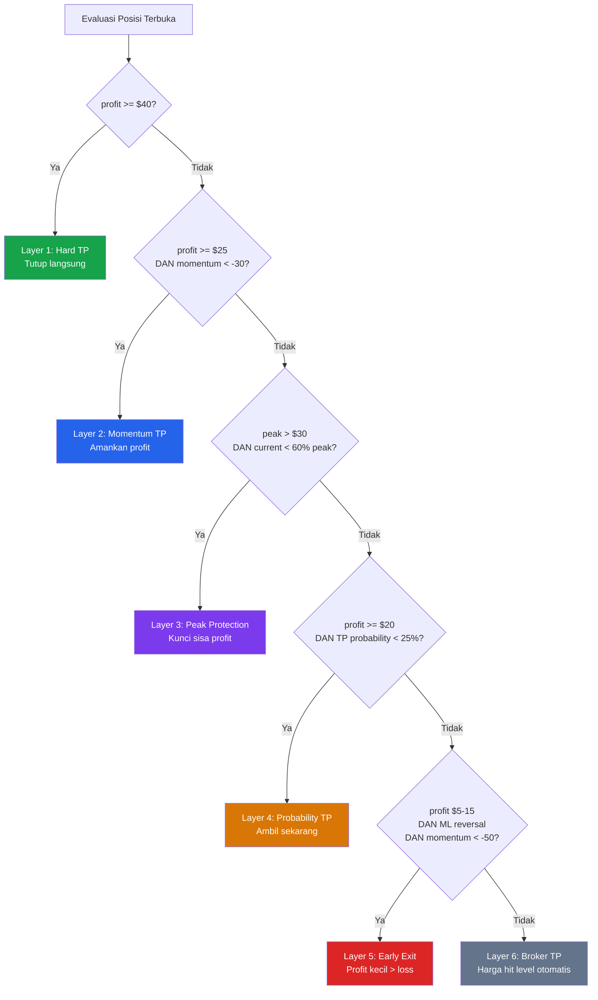

# *Take Profit* (T/P) — Sistem Pengambilan Profit Cerdas

> **File terkait:** `src/smc_polars.py`, `main_live.py`, `src/smart_risk_manager.py`

---

## Flowchart Prioritas *Take Profit*



---

## Apa Itu *Take Profit* di Bot Ini?

*Take Profit* bukan hanya satu target harga — ini adalah **sistem multi-layer** yang secara cerdas memutuskan kapan mengambil profit berdasarkan *momentum*, *probability*, dan *peak protection*.

**Analogi:** TP di bot ini seperti **pemanen buah pintar** — tahu kapan buah sudah matang (*Hard TP*), kapan cuaca akan buruk (*momentum* drop), dan kapan panen sebelum busuk (*Peak Protection*).

---

## Layer *Take Profit*

```
Layer 1: Broker TP           <- Target harga dikirim ke broker (SMC-generated)
Layer 2: Hard TP             <- Software tutup jika profit >= $40
Layer 3: Momentum TP         <- Tutup jika profit bagus tapi momentum turun
Layer 4: Peak Protection     <- Tutup jika profit turun dari peak
Layer 5: Probability TP      <- Tutup jika probabilitas capai TP rendah
Layer 6: Early Exit          <- Tutup profit kecil jika reversal terdeteksi
```

---

## Layer 1: Broker TP (SMC-Generated)

**Sumber:** `smc_polars.py` (Lines 654-659, 704-709)
**Dikirim ke:** Broker MT5 sebagai TP order aktif

### Perhitungan

```python
# ATR-based TP cap
atr = latest["atr"]                    # Contoh: ATR = $8.50
max_tp_distance = 4.0 * atr            # 4 * 8.50 = $34.00

# Untuk BUY:
risk = entry - sl                      # $4950 - $4937 = $13
tp   = entry + (risk * 2)              # $4950 + $26 = $4976 (2:1 RR)
if tp > entry + max_tp_distance:       # $4976 vs $4950 + $34 = $4984
    tp = entry + max_tp_distance       # Tidak kena cap, tetap $4976

# Untuk SELL:
risk = sl - entry                      # $4963 - $4950 = $13
tp   = entry - (risk * 2)              # $4950 - $26 = $4924 (2:1 RR)
if tp < entry - max_tp_distance:       # $4924 vs $4950 - $34 = $4916
    tp = entry - max_tp_distance       # Tidak kena cap, tetap $4924
```

### Kenapa TP Di-cap 4 ATR?

```
Sebelum (v2): TP = risk * 2 (tanpa batas)
  -> Bisa sangat jauh ($50+ dari entry)
  -> Jarang tercapai, posisi terbuka terlalu lama

Sesudah (v3): TP = MIN(risk * 2, 4 * ATR)
  -> Dibatasi maksimal 4x ATR
  -> Target lebih realistis, lebih sering tercapai
```

### Dikirim ke Broker

```python
# main_live.py
result = mt5.send_order(
    sl=broker_sl,
    tp=signal.take_profit,    # <- TP dari SMC (ATR-capped)
    ...
)
```

Jika harga mencapai TP level, broker otomatis menutup posisi — tidak perlu bot online.

---

## Layer 2: *Hard Take Profit* ($40)

**Sumber:** `smart_risk_manager.py` (Lines 595-599)

```python
# Profit mencapai $40+ -> langsung tutup
if current_profit >= 40:
    return True, ExitReason.TAKE_PROFIT,
           "[TP] Target profit reached: $40.00"
```

**Kenapa $40?** Ini threshold profit yang cukup besar untuk diamankan, terlepas dari kondisi pasar.

---

## Layer 3: *Momentum*-Based TP ($25+)

**Sumber:** `smart_risk_manager.py` (Lines 601-603)

```python
# Profit $25+ tapi momentum turun -> amankan profit
if current_profit >= 25 and momentum < -30:
    return True, ExitReason.TAKE_PROFIT,
           "[SECURE] Securing $25.00 (momentum dropping)"
```

### Bagaimana *Momentum* Dihitung

```python
# PositionGuard.calculate_momentum() (Lines 113-131)
# Melihat 5 profit history terakhir

recent_profits = profit_history[-5:]
profit_change = recent_profits[-1] - recent_profits[0]

# Normalisasi: $10 change = 50 poin
momentum = (profit_change / 10) * 50
# Range: -100 sampai +100

# momentum < -30 artinya profit sedang TURUN cukup cepat
```

**Visualisasi:**

```
Profit ($)
  40 |
  35 |        /\
  30 |       /  \  <- Momentum mulai negatif
  25 |------/----\------ Layer 3 trigger: amankan!
  20 |     /      \
  15 |    /        \
  10 |   /          \
   5 |  /
   0 |_/________________________> waktu
```

---

## Layer 4: *Peak Protection* ($30+ peak)

**Sumber:** `smart_risk_manager.py` (Lines 605-607)

```python
# Profit pernah $30+ tapi sekarang turun ke 60% dari peak
if guard.peak_profit > 30 and current_profit < guard.peak_profit * 0.6:
    return True, ExitReason.TAKE_PROFIT,
           "[LOCK] Securing profit (was $35 peak)"
```

### Cara Kerja Peak Tracking

```python
# Setiap evaluasi, update peak profit
guard.peak_profit = max(guard.peak_profit, current_profit)

# Contoh:
# Peak: $35 -> 60% = $21
# Current: $18 (turun dari $35)
# $18 < $21 -> TUTUP, lindungi sisa profit
```

**Visualisasi:**

```
Profit ($)
  35 |    * <- peak_profit = $35
  30 |   / \
  25 |  /   \
  21 |./.....\....... 60% threshold ($21)
  18 |        \* <- current = $18, TUTUP!
  15 |         \
  10 |          (kehilangan lebih banyak dihindari)
```

---

## Layer 5: *Probability*-Based TP ($20+)

**Sumber:** `smart_risk_manager.py` (Lines 609-611)

```python
# Probabilitas capai TP rendah + profit cukup -> ambil sekarang
if tp_probability < 25 and current_profit >= 20:
    return True, ExitReason.TAKE_PROFIT,
           "[PROB] Taking profit $20 (TP prob: 15%)"
```

### Cara Hitung TP *Probability*

```python
# PositionGuard.get_tp_probability() (Lines 133-168)
# Score 0-100% berdasarkan 4 faktor:

Factor 1: Progress ke TP (0-40 poin)
  progress = (current_profit / target_tp_profit) * 100
  -> Makin dekat ke TP = skor tinggi

Factor 2: Momentum (0-30 poin)
  -> *Momentum* positif = skor tinggi

Factor 3: ML *Confidence* Trend (0-20 poin)
  -> ML *confidence* naik = skor tinggi

Factor 4: Time Penalty (0-10 poin DIKURANGI)
  -> 2 poin per jam (makin lama = makin rendah)

probability = factor1 + factor2 + factor3 - time_penalty
```

---

## Layer 6: *Early Exit* (Profit Kecil + Reversal)

**Sumber:** `smart_risk_manager.py` (Lines 617-627)

```python
# Profit $5-$15 + momentum sangat buruk + ML reversal
if 5 <= current_profit < 15:
    if momentum < -50 and ml_confidence >= 0.65:
        if ml_signal berlawanan dengan posisi:
            return True, ExitReason.TAKE_PROFIT,
                   "Early exit - reversal detected"
```

**Logika:** Lebih baik ambil profit kecil ($5-$15) daripada menunggu profit hilang karena reversal.

---

## Prioritas Exit (Urutan Pengecekan)

```
1. Hard TP ($40+)              <- Paling prioritas
2. Momentum TP ($25+, mom<-30)
3. Peak Protection ($30+ peak, <60%)
4. Probability TP ($20+, prob<25%)
5. Early Exit ($5-15, reversal)
6. Broker TP (harga hit level)  <- Independen dari software
```

**Catatan:** Broker TP berjalan independen — jika harga hit TP level di broker, posisi tertutup otomatis meskipun bot offline.

---

## Contoh Skenario

### Skenario 1: TP Broker Hit

```
Entry BUY @ $4950, TP broker @ $4976
  -> Harga naik ke $4976
  -> BROKER TP HIT -> Tutup otomatis
  -> Profit: ~$26 (0.01 lot = $2.60)
```

### Skenario 2: Software TP Lebih Cepat

```
Entry BUY @ $4950, TP broker @ $4990
  -> Harga naik ke $4990 (profit $40)
  -> Software: profit >= $40 -> HARD TP
  -> Tutup sebelum broker TP level
```

### Skenario 3: *Momentum* Drop

```
Entry BUY @ $4950
  -> Profit naik: $10 -> $20 -> $28 -> $25
  -> momentum = -35 (turun)
  -> Software: profit $25 + momentum < -30
  -> MOMENTUM TP: amankan $25
```

### Skenario 4: *Peak Protection*

```
Entry BUY @ $4950
  -> Profit naik: $15 -> $25 -> $35 (peak!)
  -> Profit turun: $35 -> $30 -> $22 -> $19
  -> 60% dari $35 = $21
  -> $19 < $21 -> PEAK PROTECTION: amankan $19
  (tanpa ini, profit bisa turun ke $0 atau bahkan loss)
```

---

## Tabel Ringkasan Layer TP

| Layer | Trigger | Profit Min | Kondisi Tambahan |
|-------|---------|-----------|------------------|
| **1. Broker TP** | Harga hit level | - | Otomatis, independen |
| **2. *Hard TP*** | profit >= $40 | $40 | Tidak ada |
| **3. *Momentum* TP** | profit >= $25 | $25 | *momentum* < -30 |
| **4. *Peak Protection*** | peak > $30 | ~$18+ | current < 60% peak |
| **5. *Probability* TP** | profit >= $20 | $20 | TP *probability* < 25% |
| **6. *Early Exit*** | profit $5-15 | $5 | ML reversal + *momentum* < -50 |
