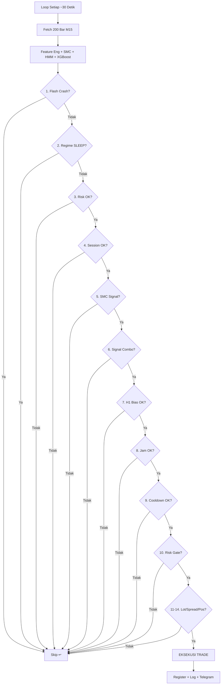

# *Entry Trade* — Proses Masuk Posisi

> **File utama:** `main_live.py`
> **File pendukung:** `src/smc_polars.py`, `src/ml_model.py`, `src/smart_risk_manager.py`, `src/session_filter.py`

---

## Apa Itu *Entry Trade*?

*Entry Trade* adalah keseluruhan proses dari **mendeteksi peluang** hingga **mengirim *order* ke *broker***. Bot menggunakan **14 filter** yang harus **SEMUA lolos** sebelum satu *trade* dieksekusi.

**Analogi:** *Entry Trade* seperti **proses *boarding* pesawat** — harus punya tiket (*signal*), *passport* valid (*confirmation*), lulus *security check* (risiko), tepat waktu (sesi), dan *gate* terbuka (*position limit*).

---

## Daftar *Checklist Entry* (Semua Harus PASS)

| # | Filter | Keterangan | Status |
|---|--------|------------|--------|
| 1 | ***Flash Crash Guard*** | Apakah ada pergerakan harga ekstrem? | **Aktif** |
| 2 | ***Regime Filter*** | Apakah *regime* HMM bukan SLEEP? | **Aktif** |
| 3 | ***Risk Check*** | Apakah `risk_metrics.can_trade` = `true`? | **Aktif** |
| 4 | ***Session Filter*** | Apakah sesi perdagangan mengizinkan *trading*? | **Aktif** |
| 5 | ***SMC Signal*** | Apakah ada sinyal valid dari SMC *Analyzer*? | **Aktif** |
| 6 | ***Signal Combination*** | Apakah kombinasi SMC + ML menghasilkan sinyal akhir? | **Aktif** |
| 7 | **H1 *Bias* (#31B)** | Apakah *bias* H1 EMA20 sejalan dengan sinyal? | **Aktif** |
| 8 | **Filter Waktu (#34A)** | Apakah bukan jam 9 atau 21 WIB? | **Aktif** |
| 9 | ***Trade Cooldown*** | Sudah 5 menit sejak *trade* terakhir? | **Aktif** |
| 10 | ***Pullback Filter*** | Apakah bukan sedang *pullback/retrace*? | **Nonaktif** |
| 11 | ***Smart Risk Gate*** | Mode *trading* bukan STOPPED/COOLDOWN? | **Aktif** |
| 12 | **Kalkulasi *Lot*** | Apakah *lot size* > 0 setelah semua *adjustment*? | **Aktif** |
| 13 | ***Spread* Validasi** | Apakah *spread* tidak terlalu lebar? | **Aktif** |
| 14 | **Batas Posisi** | Posisi terbuka < 2? | **Aktif** |

> **Semua PASS** → Eksekusi *Trade*
> **Satu GAGAL** → *Skip*, tunggu *loop* berikutnya

---

## *Step-by-Step Flow*

### Filter 1: *Flash Crash Guard*

```python
# main_live.py
is_flash, move_pct = self.flash_crash.detect(df.tail(5))
if is_flash:
    return  # Pergerakan harga ekstrem terdeteksi
```

**Bisa *block*:** Pergerakan harga > 2.5% dalam 1 menit (*flash crash threshold* dari `config.py`).

---

### Filter 2: *Regime Filter*

```python
regime_sleep = regime_state and regime_state.recommendation == "SLEEP"
if regime_sleep:
    return  # HMM mendeteksi kondisi krisis
```

**Bisa *block*:** *Regime* HIGH_VOLATILITY / CRISIS — pasar terlalu bergejolak.

---

### Filter 3: *Risk Check*

```python
if not risk_metrics.can_trade:
    return  # Risiko di luar batas
```

---

### Filter 4: *Session Filter*

```python
session_ok, session_reason, session_multiplier = self.session_filter.can_trade()
if not session_ok:
    return  # Bukan waktu trading
```

**Bisa *block*:** *Weekend*, Jumat > 23:00, zona bahaya (00:00-06:00), sesi *low volatility*.
**Tokyo-London *overlap*** (15:00-16:00 WIB) **diblokir** — hasil optimasi *backtest* #24B.

---

### Filter 5: *SMC Signal*

```python
smc_signal = self.smc.generate_signal(df)
if smc_signal is None:
    return  # Tidak ada setup SMC yang valid
```

**SMC membutuhkan:**
- Struktur pasar (*bullish/bearish*) ATAU BOS/CHoCH
- DAN (FVG ATAU *Order Block*)
- Minimum 2:1 *risk/reward*

**Output:** *Entry price*, SL, TP, *confidence* (55-85%), alasan.

---

### Filter 6: *Signal Combination*

```python
final_signal = self._combine_signals(smc_signal, ml_prediction, regime_state)
if final_signal is None:
    return  # Sinyal terfilter
```

Menggabungkan **SMC + ML + *Regime*** menjadi satu sinyal akhir. ML harus *agree* atau minimal tidak *strongly disagree* (> 65% *confidence* berlawanan).

---

### Filter 7: H1 *Bias* (#31B)

```python
# Backtest #31B: H1 EMA20 filter menambah +$345 profit
if h1_bias == "BULLISH" and final_signal.signal_type == "SELL":
    return  # BUY signal vs H1 bullish = blokir
if h1_bias == "BEARISH" and final_signal.signal_type == "BUY":
    return  # SELL signal vs H1 bearish = blokir
if h1_bias == "NEUTRAL":
    return  # Tidak ada bias jelas = blokir
```

**Tujuan:** Hanya masuk posisi yang sejalan dengan *trend* H1.

---

### Filter 8: Filter Waktu (#34A)

```python
# Backtest #34A: skip jam 9 dan 21 WIB menambah +$356 profit
wib_hour = datetime.now(ZoneInfo("Asia/Jakarta")).hour
if wib_hour in (9, 21):
    return  # Jam transisi — volatilitas tidak optimal
```

**Tujuan:** Menghindari jam transisi sesi yang berpotensi *whipsaw*.

---

### Filter 9: *Trade Cooldown*

```python
trade_cooldown = 300  # 5 menit
if last_trade_time and (now - last_trade_time).total_seconds() < 300:
    return  # Tunggu cooldown selesai
```

**Tujuan:** Mencegah *overtrading* — minimal 5 menit antar *trade*.

---

### Filter 10: *Pullback Filter* (NONAKTIF)

```python
# DISABLED — mode SMC-only
# Struktur SMC sudah memvalidasi zona entry
```

> Filter ini dinonaktifkan karena analisis SMC sudah mencakup validasi *pullback* dalam logika *Order Block* dan FVG.

---

### Filter 11: *Smart Risk Gate*

```python
risk_rec = self.smart_risk.get_trading_recommendation()
if not risk_rec["can_trade"]:
    return  # Mode STOPPED/COOLDOWN
```

**4 mode** *Smart Risk*: NORMAL → PROTECTED → RECOVERY → COOLDOWN/STOPPED.

---

### Filter 12-14: *Lot*, *Spread*, dan Batas Posisi

```python
# Kalkulasi lot
safe_lot = self.smart_risk.calculate_lot_size(...)
safe_lot = max(0.01, safe_lot * session_multiplier)
if safe_lot <= 0:
    return  # Lot 0 = tidak boleh trade

# Validasi spread
if spread > max_allowed:
    return  # Spread terlalu lebar

# Batas posisi (max 2)
can_open, limit_reason = self.smart_risk.can_open_position()
if not can_open:
    return  # Sudah 2 posisi terbuka
```

---

## Eksekusi *Order*

Setelah semua **14 filter** lolos:

```python
# Step A: Ambil harga real-time
tick = mt5.get_tick(symbol)
current_price = tick.ask if BUY else tick.bid

# Step B: Validasi broker SL (min 10 pips)
broker_sl = signal.stop_loss
if jarak_terlalu_dekat:
    broker_sl = paksa_lebih_lebar

# Step C: Kirim order
result = mt5.send_order(
    symbol="XAUUSD",
    order_type="BUY" / "SELL",
    volume=0.01 - 0.05,
    sl=broker_sl,             # SL berbasis ATR
    tp=signal.take_profit,    # TP dari SMC (ATR-capped)
    magic=123456,
    comment="AI Safe v3",
)

# Step D: Fallback jika broker reject SL
if gagal dan error 10016:
    result = mt5.send_order(sl=0, ...)

# Step E: Validasi slippage
if result.success:
    slippage = abs(result.price - signal.entry_price)
    max_slippage = signal.entry_price * 0.0015  # 0.15%
    if slippage > max_slippage:
        log WARNING "HIGH SLIPPAGE"

# Step F: Register posisi (gunakan nilai AKTUAL)
    smart_risk.register_position(
        ticket=result.order_id,
        entry_price=result.price,      # Harga aktual
        lot_size=result.volume,        # Volume aktual
        direction=signal.signal_type,
    )
```

---

## *Post-Entry*

```python
# Log trade detail ke PostgreSQL
trade_logger.log_trade_open(signal, ml_prediction, regime, market_quality, ...)

# Kirim notifikasi Telegram
await telegram.send_trade_open(trade_info)

# Update cooldown timer
last_trade_time = now
```

---

## Diagram *Flow* Lengkap



---

## Statistik Filter

Dalam kondisi normal, dari ratusan *loop* per jam:

| Sumber *Block* | Persentase | Keterangan |
|-----------------|-----------|------------|
| Tidak ada sinyal SMC | **~95%** | Pasar *sideways*, tidak ada *setup* |
| ML *disagreement* / *low confidence* | **~3%** | ML tidak yakin atau berlawanan |
| *Pullback*, sesi, H1 *bias* | **~1%** | Filter waktu dan arah |
| **Lolos semua → *Trade*** | **< 1%** | Sangat selektif |

**Rata-rata:** 3-8 *trade* per hari.
