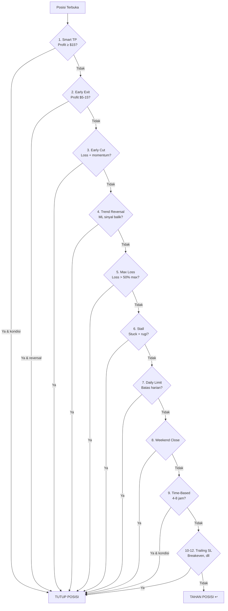
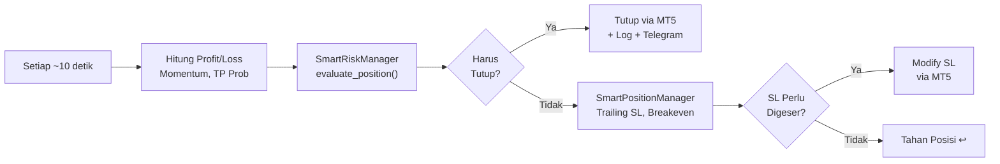

# *Exit Trade* — Proses Keluar Posisi

> **File utama:** `main_live.py`, `src/smart_risk_manager.py`
> **File pendukung:** `src/position_manager.py`

---

## Apa Itu *Exit Trade*?

*Exit Trade* adalah keseluruhan proses **monitoring posisi terbuka** dan **memutuskan kapan menutup**. Bot memeriksa setiap posisi terbuka **setiap ~10 detik** (di antara *candle*) atau **setiap *candle* baru** (*full analysis*) dengan **12 kondisi *exit*** berbeda.

**Prinsip utama:** **Jangan biarkan *winner* menjadi *loser***, tapi juga **jangan potong *winner* terlalu cepat**.

---

## 12 Kondisi *Exit*



---

### CHECK 1: *Smart Take Profit* (Profit ≥ $15)

| Kondisi | Aksi | Keterangan |
|---------|------|------------|
| Profit ≥ **$40** | **Tutup** langsung | Target tercapai — *hard TP* |
| Profit ≥ **$25** dan momentum < -30 | **Tutup** | Profit bagus tapi momentum turun |
| *Peak profit* > $30, profit turun ke < 60% *peak* | **Tutup** | Lindungi profit dari *peak* |
| Probabilitas TP < 25%, profit ≥ **$20** | **Tutup** | Kemungkinan TP rendah |
| Momentum ≥ 0 | **Tahan** | Masih bagus, biarkan berjalan |

---

### CHECK 2: *Smart Early Exit* (Profit $5-15)

```python
if 5 <= current_profit < 15:
    if momentum < -50 and ml_confidence >= 0.65:
        if ml_signal berlawanan dengan arah posisi:
            TUTUP  # Sinyal reversal kuat + profit kecil
```

**Tujuan:** Ambil profit kecil jika momentum sangat negatif DAN ML yakin *trend* berbalik.

---

### CHECK 3: *Early Cut* (Loss + Momentum Negatif)

```python
if current_profit < 0:
    loss_pct = abs(current_profit) / max_loss_per_trade * 100
    if momentum < -50 and loss_pct >= 30:
        TUTUP  # Potong kerugian sebelum makin besar
```

**Perubahan dari v1:** *Smart Hold* (menahan posisi rugi menunggu *golden time*) **sudah dihapus** — dianggap berbahaya dan melawan prinsip manajemen risiko yang benar.

---

### CHECK 4: *Trend Reversal* (Sinyal ML Berbalik)

| Kondisi | Aksi |
|---------|------|
| ML sinyal **berbalik** + *confidence* ≥ 75% + loss > 40% max + loss > $8 | **Tutup** |
| **3x** peringatan *reversal* berturut-turut + loss > $10 | **Tutup** |

**Perubahan:** *Threshold* diturunkan dari 5x ke **3x** peringatan, dan batas loss dari 60% ke **40%** — lebih responsif.

---

### CHECK 5: *Maximum Loss Per Trade*

```python
if current_profit <= -(max_loss_per_trade * 0.50):
    TUTUP  # 50% dari batas max — tanpa pengecualian
```

Untuk akun *small* ($5.000): max loss per *trade* = ~$50, *trigger* di $25.

---

### CHECK 6: *Stall Detection*

```python
if len(profit_history) >= 10:
    recent_range = max(last_10) - min(last_10)
    if recent_range < $3 and current_profit < -$15:
        stall_count += 1
        if stall_count >= 5:
            TUTUP  # Harga stuck, posisi rugi
```

**Tujuan:** Deteksi posisi yang "terjebak" — harga tidak bergerak tapi posisi rugi.

---

### CHECK 7: Batas Kerugian Harian

```python
potensi_loss = daily_loss + abs(current_profit)
if potensi_loss >= max_daily_loss:
    TUTUP  # Akan melebihi batas kerugian harian
```

---

### CHECK 8: *Weekend Close*

```python
# Sabtu 04:30+ WIB (30 menit sebelum market tutup)
if near_weekend_close:
    if profit > 0:
        TUTUP  # Amankan profit
    elif loss > -$10:
        TUTUP  # Loss kecil — hindari gap weekend
```

**Tujuan:** Hindari risiko *gap weekend* — posisi tanpa proteksi selama 2 hari.

---

### CHECK 9: *Smart Time-Based Exit*

| Durasi | Kondisi | Aksi |
|--------|---------|------|
| **4+ jam** | Profit < $5, momentum tidak tumbuh | **Tutup** — posisi *stuck* |
| **4+ jam** | Profit ≥ $5, momentum positif, ML sejalan | **Tahan** — perpanjang waktu |
| **6+ jam** | Profit < $10 ATAU momentum negatif | **Tutup** — terlalu lama |
| **8+ jam** | Apapun kondisinya | **Tutup** — batas waktu absolut |

**Perubahan:** Tidak lagi memotong *winner* secara paksa — posisi yang masih tumbuh bisa diperpanjang.

---

### CHECK 10-12: *Position Manager* (Tambahan)

Selain 9 kondisi di atas dari `SmartRiskManager`, `SmartPositionManager` juga menjalankan:

| # | Kondisi | Keterangan |
|---|---------|------------|
| 10 | ***Trailing Stop Loss*** | SL mengikuti harga naik (berbasis ATR) — `atr_trail_start_mult=4.0`, `atr_trail_step_mult=3.0` |
| 11 | ***Breakeven Protection*** | Pindahkan SL ke titik *entry* setelah profit ≥ 30 *pips* |
| 12 | **Proteksi *Drawdown*** | Tutup jika *drawdown* dari *peak* terlalu besar |

---

## Alasan *Exit* (*ExitReason Enum*)

| Kode | Deskripsi |
|------|-----------|
| `TAKE_PROFIT` | Target profit tercapai atau profit diamankan |
| `TREND_REVERSAL` | ML mendeteksi pembalikan *trend* |
| `DAILY_LIMIT` | Batas kerugian harian tercapai |
| `POSITION_LIMIT` | Batas kerugian per posisi tercapai (S/L) |
| `TOTAL_LIMIT` | Batas kerugian total tercapai |
| `WEEKEND_CLOSE` | Mendekati penutupan *weekend* |
| `MANUAL` | Penutupan manual |

---

## Diagram *Flow* Evaluasi Posisi



---

## Statistik *Exit*

Berdasarkan data *backtest* (Jan 2025 - Feb 2026):

| Alasan *Exit* | Persentase | Rata-rata P/L |
|----------------|-----------|----------------|
| *Take Profit* (semua jenis) | **~40%** | **+$18.50** |
| *Trend Reversal* / *Early Cut* | **~25%** | **-$12.30** |
| *Time-Based Exit* | **~15%** | **+$3.20** |
| *Trailing SL* hit | **~10%** | **+$8.70** |
| Max Loss / *Daily Limit* | **~8%** | **-$22.50** |
| *Weekend Close* | **~2%** | **+$5.10** |
