# *News Agent* — Monitoring Berita Ekonomi

> **File:** `src/news_agent.py`
> **Class:** `NewsAgent`
> **Status: NONAKTIF** — dikomentari di `main_live.py` baris 64

---

## Status Saat Ini

> **PENTING:** Modul *News Agent* saat ini **tidak aktif** dalam sistem *live*. *Import* dikomentari di `main_live.py`:
>
> ```python
> # from src.news_agent import NewsAgent, create_news_agent, MarketCondition  # DISABLED
> ```
>
> Modul ini tersedia dalam *codebase* untuk aktivasi di masa mendatang.

---

## Apa Itu *News Agent*?

*News Agent* adalah modul yang **memonitor berita ekonomi** berdampak tinggi dan menilai potensi dampaknya terhadap perdagangan XAUUSD. Ketika aktif, modul ini dapat:

1. **Mengambil kalender ekonomi** dari sumber eksternal
2. **Menilai dampak berita** terhadap pasar emas
3. **Memberi peringatan** atau **memblokir *trading*** saat berita berdampak tinggi

---

## *Design* Modul

```mermaid
graph TD
    A["Sumber Berita<br/>API Kalender Ekonomi"] --> B["NewsAgent"]
    B --> C{"Dampak?"}
    C -->|"Rendah"| D["✅ Trading normal"]
    C -->|"Sedang"| E["⚠️ Kurangi lot"]
    C -->|"Tinggi"| F["🛑 Blokir trading"]
    F --> G["NFP, FOMC, CPI<br/>Buffer 15-45 menit"]
```



---

## Berita Berdampak Tinggi (Tersimpan di `session_filter.py`)

Meskipun *News Agent* nonaktif, daftar waktu berita sudah tersimpan di *Session Filter*:

| Berita | Jam WIB | *Buffer* Sebelum | *Buffer* Setelah |
|--------|---------|------------------|------------------|
| **NFP** (*Non-Farm Payrolls*) | 19:30 | 15 menit | 30 menit |
| **FOMC** (*Federal Reserve*) | 01:00 | 15 menit | 45 menit |
| **CPI** (*Consumer Price Index*) | 19:30 | 15 menit | 30 menit |

---

## Rencana Aktivasi

Langkah-langkah untuk mengaktifkan kembali *News Agent*:

1. Hapus komentar di `main_live.py` baris 64
2. Konfigurasi sumber data berita di `.env`
3. Integrasikan pengecekan berita ke *entry filter pipeline*
4. Uji coba dengan mode *monitoring only* (tidak memblokir, hanya *log*)
5. Aktifkan *blocking* setelah validasi

---

## Mengapa Dinonaktifkan?

- **Ketergantungan API eksternal** — memerlukan *API key* dan koneksi internet stabil
- **Latensi tambahan** — setiap pengecekan berita menambah waktu *loop*
- **Hasil *backtest* tanpa *News Agent* sudah baik** — sistem sudah terproteksi oleh *session filter* dan *regime detector*
