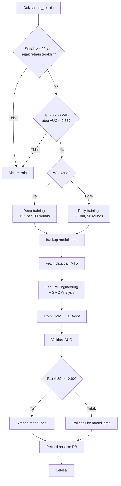
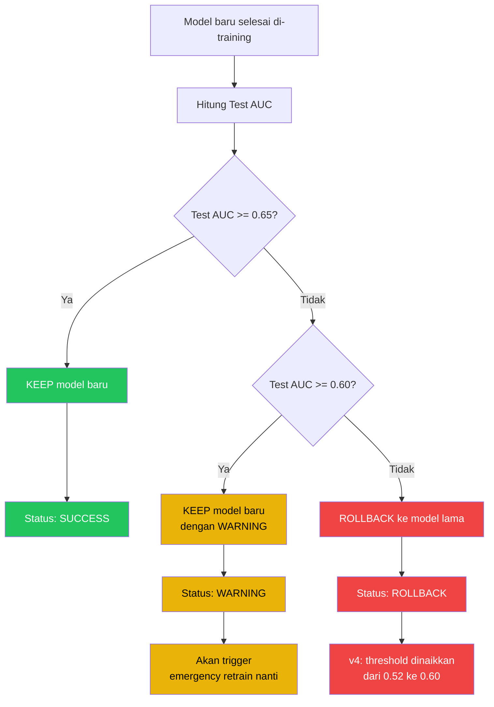

# *Auto Trainer* --- Sistem *Retraining* Otomatis

> **File:** `src/auto_trainer.py`
> **Class:** `AutoTrainer`
> **Database:** PostgreSQL (opsional, fallback ke file)

---

## Apa Itu *Auto Trainer*?

*Auto Trainer* adalah sistem yang **melatih ulang model AI secara otomatis** agar tetap up-to-date dengan kondisi pasar terbaru. *Retraining* dilakukan saat market tutup (05:00 WIB) untuk menghindari gangguan saat trading aktif.

**Analogi:** *Auto Trainer* seperti **pelatih yang membuat atlet berlatih setiap malam** --- setelah pertandingan selesai, atlet (model AI) dilatih dengan data terbaru agar siap menghadapi tantangan esok hari.

---

## Jadwal *Retraining*

| Tipe | Waktu | Data | Boost Rounds | Kondisi |
|------|-------|------|-------------|---------|
| **Daily** | 05:00 WIB (market close) | 8.000 bar | 50 | Senin--Jumat |
| **Weekend** | 05:00 WIB Sabtu/Minggu | 15.000 bar | 80 | *Deep training* |
| **Emergency** | Kapan saja | 8.000 bar | 50 | *AUC* < 0.65 |
| **Initial** | Pertama kali | 8.000 bar | 50 | Belum pernah training |

```
Visualisasi Jadwal (WIB):

Sen  Sel  Rab  Kam  Jum  Sab  Min
 |    |    |    |    |    |    |
05:00 05:00 05:00 05:00 05:00 05:00 05:00
Daily Daily Daily Daily Daily DEEP  DEEP
8K    8K    8K    8K    8K    15K   15K
```

---

## Konfigurasi

```python
AutoTrainer(
    models_dir="models",                  # Folder simpan model
    data_dir="data",                      # Folder data training
    daily_retrain_hour_wib=5,             # Jam retrain: 05:00 WIB
    weekend_retrain=True,                 # Deep training weekend
    min_hours_between_retrain=20,         # Min 20 jam antar retrain
    backup_models=True,                   # Backup model lama
    use_db=True,                          # Simpan history ke PostgreSQL
    min_auc_threshold=0.65,               # Alert jika AUC < 0.65
    auto_retrain_on_low_auc=True,         # Auto retrain saat AUC rendah
)
```

---

## Proses *Retraining* (Step-by-Step)

### Flowchart Keputusan *Retraining*



### Detail Langkah-Langkah

```
1. SHOULD RETRAIN CHECK
   +-- Sudah >= 20 jam sejak retrain terakhir?
   +-- Sekarang jam 05:00 WIB (+-30 menit)?
   +-- Weekend? -> Deep training (15K bar)
   +-- AUC < 0.65? -> Emergency retrain

2. BACKUP MODEL LAMA
   +-- Copy xgboost_model.pkl -> backups/YYYYMMDD_HHMMSS/
   +-- Copy hmm_regime.pkl -> backups/YYYYMMDD_HHMMSS/
   +-- Bersihkan backup lama (simpan 5 terakhir)

3. FETCH DATA TERBARU
   +-- Ambil 8K bar (daily) atau 15K bar (weekend) dari MT5
   +-- Symbol: XAUUSD, Timeframe: M15
   +-- Validasi: minimal 1000 bar

4. FEATURE ENGINEERING
   +-- FeatureEngineer.calculate_all() -> 40+ fitur
   +-- SMCAnalyzer.calculate_all() -> struktur pasar
   +-- create_target(lookahead=1) -> label UP/DOWN

5. TRAINING HMM
   +-- MarketRegimeDetector(n_regimes=3, lookback=500)
   +-- hmm.fit(df)
   +-- Save -> models/hmm_regime.pkl

6. TRAINING XGBOOST
   +-- TradingModel(confidence_threshold=0.60)
   +-- xgb.fit(train_ratio=0.7, num_boost_round=50/80)
   +-- Early stopping: 5 rounds
   +-- Save -> models/xgboost_model.pkl

7. VALIDASI
   +-- Cek Train AUC & Test AUC
   +-- Test AUC < 0.60? -> ROLLBACK ke model lama (v4: dinaikkan dari 0.52)
   +-- Test AUC < 0.65? -> WARNING (alert)
   +-- Test AUC >= 0.65? -> SUCCESS

8. RECORD HASIL
   +-- Simpan ke PostgreSQL (training_runs table)
   +-- Backup ke file (retrain_history.txt)
   +-- Log: durasi, AUC, accuracy, status
```

---

## *Backup* & *Rollback*

### Sistem *Backup*

```
models/
+-- xgboost_model.pkl          # Model aktif
+-- hmm_regime.pkl             # Model aktif
+-- backups/
    +-- 20250206_050015/       # Backup terbaru
    |   +-- xgboost_model.pkl
    |   +-- hmm_regime.pkl
    +-- 20250205_050012/       # Backup kemarin
    |   +-- xgboost_model.pkl
    |   +-- hmm_regime.pkl
    +-- ... (max 5 backup)
```

### Kapan *Rollback*?

#### Diagram Validasi *AUC*



#### Ringkasan Keputusan

| Kondisi | Aksi | Status |
|---------|------|--------|
| *AUC* >= 0.65 | KEEP model baru | SUCCESS |
| *AUC* 0.60--0.65 | KEEP tapi WARNING (akan trigger *emergency* retrain nanti) | WARNING |
| *AUC* < 0.60 | *ROLLBACK* ke model lama (v4: dinaikkan dari 0.52, karena 0.52 hampir = acak) | ROLLBACK |

### Method *Rollback*

```python
def rollback_models(reason="Manual rollback"):
    """
    1. Ambil backup terbaru dari models/backups/
    2. Copy xgboost_model.pkl kembali ke models/
    3. Copy hmm_regime.pkl kembali ke models/
    4. Record rollback di database
    """
```

---

## *AUC* Monitoring

### Apa Itu *AUC*?

*AUC* (*Area Under Curve*) mengukur **seberapa baik model membedakan sinyal BUY vs SELL**:

| *AUC* | Arti | Aksi |
|-----|------|------|
| 0.80+ | Sangat bagus | Model dalam kondisi prima |
| 0.65-0.80 | Bagus | Normal, lanjut trading |
| 0.60-0.65 | Minimum | Warning, pertimbangkan *retraining* |
| < 0.60 | Buruk | **ROLLBACK** + *retraining* segera (v4 threshold) |
| 0.50 | Sama dengan tebak koin | Model tidak berguna |

### Auto-Retrain on Low *AUC*

```python
def should_retrain_due_to_low_auc():
    """
    Cek AUC saat ini:
      AUC < 0.65? -> Perlu retrain
      Tapi: sudah retrain < 4 jam lalu? -> Tunggu
      (mencegah retrain loop)
    """
```

---

## Database Storage

### PostgreSQL (Primary)

```
Table: training_runs
+-- id                 # Auto-increment
+-- training_type      # "daily" / "weekend"
+-- bars_used          # 8000 / 15000
+-- num_boost_rounds   # 50 / 80
+-- started_at         # Timestamp mulai
+-- completed_at       # Timestamp selesai
+-- duration_seconds   # Durasi training
+-- hmm_trained        # Boolean
+-- xgb_trained        # Boolean
+-- train_auc          # AUC di data training
+-- test_auc           # AUC di data test
+-- train_accuracy     # Akurasi training
+-- test_accuracy      # Akurasi test
+-- model_path         # Path model disimpan
+-- backup_path        # Path backup model lama
+-- success            # Boolean
+-- error_message      # Pesan error (jika gagal)
```

### File Fallback

Jika PostgreSQL tidak tersedia:
```
data/retrain_history.txt
+-- 2025-02-06T05:00:15+07:00
+-- 2025-02-05T05:00:12+07:00
+-- ... (append per retrain)
```

---

## Integrasi di Main Loop

```python
# main_live.py — dicek setiap 20 candle M15 (~5 jam)
# v4: candle-based, bukan time-based (sebelumnya: loop_count % 300)

if candle_count % 20 == 0:  # Setiap 20 candle baru
    should_train, reason = auto_trainer.should_retrain()

    if should_train:
        logger.info(f"Auto-retraining: {reason}")

        # Retrain (blocking — tapi hanya di jam 05:00 saat market tutup)
        results = auto_trainer.retrain(
            connector=mt5,
            symbol="XAUUSD",
            timeframe="M15",
            is_weekend=(now.weekday() >= 5),
        )

        if results["success"]:
            # Reload model di memory
            ml_model.load()
            regime_detector.load()
            logger.info("Models reloaded after retraining")
        else:
            logger.error(f"Retraining failed: {results['error']}")
```

---

## Parameter Training

### Daily Training (Senin-Jumat)

| Parameter | Nilai |
|-----------|-------|
| Data | 8.000 bar M15 (~83 hari) |
| Train/Test Split | 70% / 30% |
| XGBoost Rounds | 50 |
| *Early Stopping* | 5 rounds |
| HMM Regimes | 3 |
| HMM Lookback | 500 bar |

### Weekend *Deep Training* (Sabtu-Minggu)

| Parameter | Nilai |
|-----------|-------|
| Data | 15.000 bar M15 (~156 hari) |
| Train/Test Split | 70% / 30% |
| XGBoost Rounds | 80 |
| *Early Stopping* | 5 rounds |
| HMM Regimes | 3 |
| HMM Lookback | 500 bar |

---

## Safety Guards

```
1. MIN 20 JAM ANTAR RETRAIN
   -> Mencegah retrain terlalu sering
   -> Exception: emergency retrain (min 4 jam)

2. VALIDASI DATA MINIMUM
   -> Butuh minimal 1000 bar
   -> Kurang dari itu? Skip retrain

3. BACKUP SEBELUM RETRAIN
   -> Model lama selalu di-backup
   -> Bisa rollback kapan saja

4. AUTO-ROLLBACK
   -> AUC < 0.60? Otomatis rollback (v4: dinaikkan dari 0.52)
   -> Model buruk tidak akan dipakai

5. CLEANUP BACKUP
   -> Hanya simpan 5 backup terakhir
   -> Mencegah disk penuh

6. GRACEFUL DEGRADATION
   -> DB tidak tersedia? Pakai file
   -> Retrain gagal? Model lama tetap aktif
```

---

## Contoh Output Log

```
[05:00] ==================================================
[05:00] AUTO-RETRAINING STARTED
[05:00] Type: daily, Bars: 8000, Boost Rounds: 50
[05:00] ==================================================
[05:00] Models backed up to models/backups/20250206_050015
[05:00] Fetching 8000 bars of XAUUSD M15 data...
[05:01] Received 8000 bars
[05:01] Date range: 2024-11-15 to 2025-02-06
[05:01] Applying feature engineering...
[05:01] Training HMM Regime Model...
[05:01] HMM model trained and saved
[05:02] Training XGBoost Model...
[05:02] XGBoost trained: Train AUC=0.7234, Test AUC=0.6891
[05:02] Training data saved to data/training_data.parquet
[05:02] ==================================================
[05:02] AUTO-RETRAINING COMPLETED SUCCESSFULLY
[05:02] Duration: 125s
[05:02] ==================================================
```
