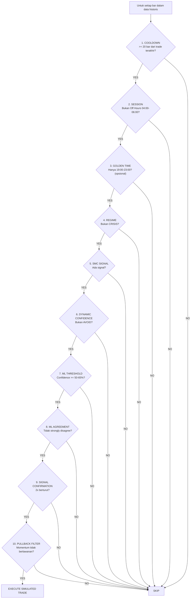
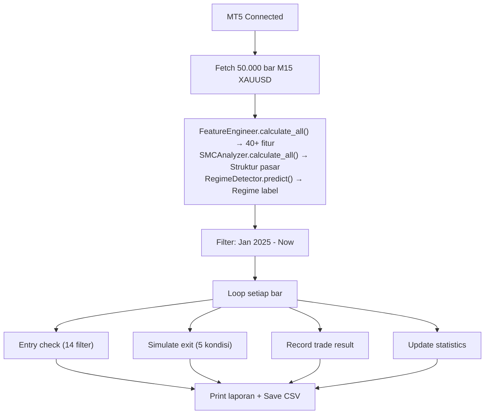

# Backtest — Engine Simulasi Live-Sync

> **File:** `backtests/backtest_live_sync.py`
> **Class:** `LiveSyncBacktest`
> **Prinsip:** 100% identik dengan `main_live.py`

---

## Apa Itu Backtest?

Backtest adalah sistem **simulasi trading pada data historis** yang logikanya 100% disinkronkan dengan trading live. Tujuannya menguji strategi sebelum dipakai uang sungguhan dan memvalidasi perubahan kode.

**Analogi:** Backtest seperti **simulator penerbangan** — pilot (bot) berlatih di kondisi realistis tanpa risiko jatuh. Setiap instrumen, prosedur, dan respons sama persis dengan pesawat asli.

---

## Prinsip Sinkronisasi

```
ATURAN UTAMA: Backtest HARUS identik dengan live.

Setiap perubahan di main_live.py → HARUS di-mirror di backtest_live_sync.py

Yang disinkronkan:
├── ML Model: XGBoost dengan fitur yang sama
├── SMC Analyzer: Swing length & OB lookback sama
├── Regime Detection: HMM MarketRegimeDetector
├── Session Filter: Golden Time 19:00-23:00 WIB
├── Signal Logic: Semua filter entry
├── Position Sizing: Berdasarkan ML confidence tier
├── Trade Cooldown: 300 detik (5 menit)
└── Exit Logic: TP, ML reversal, max loss, time-based
```

---

## Komponen yang Dimuat

```python
# Sama persis dengan main_live.py
self.smc = SMCAnalyzer(swing_length=config.smc.swing_length, ob_lookback=config.smc.ob_lookback)
self.features = FeatureEngineer()
self.regime_detector = MarketRegimeDetector(model_path="models/hmm_regime.pkl")
self.ml_model = TradingModel(model_path="models/xgboost_model.pkl")
self.dynamic_confidence = create_dynamic_confidence()
```

---

## Entry Logic (Sama dengan Live)

Semua filter entry di-replikasi:



---

## Session Mapping

```python
# Sama dengan session_filter.py
if 6 <= hour < 15:     # Sydney-Tokyo        → lot 0.5x
if 15 <= hour < 16:    # Tokyo-London Overlap → lot 0.75x
if 16 <= hour < 19:    # London Early         → lot 0.8x
if 19 <= hour < 24:    # London-NY (Golden)   → lot 1.0x  ← TERBAIK
if 0 <= hour < 4:      # NY Session           → lot 0.9x
if 4 <= hour < 6:      # Off Hours            → SKIP
```

---

## Exit Logic (5 Kondisi)

Untuk setiap bar setelah entry (max 100 bar):

### EXIT 1: Take Profit

```
IF harga hit TP level:
  BUY: high >= take_profit
  SELL: low <= take_profit
  -> EXIT dengan profit penuh
```

### EXIT 2: Maximum Loss

```
IF current_profit < -$50 (max_loss_per_trade):
  -> EXIT, potong kerugian
```

### EXIT 3: Time-Based (Synced dengan Live v3)

```
IF 16+ bar (4 jam) DAN profit < $5:
  a) profit >= $0 → EXIT (breakeven setelah 4 jam)
  b) profit > -$15 → EXIT (loss kecil, daripada stuck)

IF 24+ bar (6 jam):
  -> FORCE EXIT (apapun profitnya)
```

**Visualisasi:**

```
Bar:  0     5    10    15    16   20    24
      |-----|-----|-----|-----|-----|-----|
    entry                   |           |
                            |           |
                      4h check:    6h FORCE EXIT
                      profit<$5?
                      Ya -> exit
```

### EXIT 4: ML Reversal

```
Setiap 5 bar, cek prediksi ML:

IF direction BUY DAN ML bilang SELL dengan confidence > 65%:
  -> EXIT (ML mendeteksi reversal)

IF direction SELL DAN ML bilang BUY dengan confidence > 65%:
  -> EXIT (ML mendeteksi reversal)
```

### EXIT 5: Trend Reversal (Momentum)

```
Setelah 10+ bar, cek momentum 5 bar terakhir:

IF BUY DAN momentum < -$5 DAN current_profit < -$10:
  -> EXIT (tren berbalik + sudah rugi)

IF SELL DAN momentum > +$5 DAN current_profit < -$10:
  -> EXIT (tren berbalik + sudah rugi)
```

---

## Lot Sizing

```python
# Berdasarkan ML confidence tier (sama dengan live)
if ml_confidence >= 0.65:
    lot_size = 0.02        # High confidence → lot lebih besar
elif ml_confidence >= 0.55:
    lot_size = 0.01        # Medium confidence → lot standar
else:
    lot_size = 0.01        # Low confidence → lot minimum

# Apply session multiplier
lot_size = max(0.01, lot_size * session_lot_multiplier)
```

---

## Pullback Filter

```
Sama persis dengan main_live.py:

Untuk signal SELL, block jika:
  - Harga naik > $2 dalam 3 candle terakhir
  - MACD histogram rising + harga naik
  - Harga di atas EMA9 dan masih naik

Untuk signal BUY, block jika:
  - Harga turun > $2 dalam 3 candle terakhir
  - MACD histogram falling + harga turun
  - Harga di bawah EMA9 dan masih turun

Exception (tetap boleh entry):
  - Konsolidasi (pergerakan < $1.50)
  - Momentum searah signal
```

---

## Metrik Performa

| Metrik | Rumus | Keterangan |
|--------|-------|------------|
| **Win Rate** | Wins / Total × 100% | Persentase trade profit |
| **Profit Factor** | Gross Profit / Gross Loss | > 1.0 = profitable |
| **Expectancy** | (WR × Avg Win) - (LR × Avg Loss) | Rata-rata per trade |
| **Max Drawdown** | (Peak - Trough) / Peak × 100% | Penurunan terbesar |
| **Sharpe Ratio** | (Avg Return / Std Dev) × √252 | Risk-adjusted return |
| **Net P/L** | Total Profit - Total Loss | Keuntungan bersih |

---

## Threshold Tuning

Mode `--tune` menguji beberapa ML threshold secara otomatis:

```python
ml_thresholds = [0.50, 0.52, 0.55, 0.58, 0.60, 0.65]

# Untuk setiap threshold:
#   1. Jalankan full backtest
#   2. Catat: trades, win rate, net P/L, profit factor, drawdown
#   3. Ranking berdasarkan net P/L

# Output:
# ML Thresh  Trades  Win Rate    Net P/L       PF      DD
# --------------------------------------------------------
#       55%     145     64.8%    $1,250.00     1.85    3.2%
#       52%     178     62.1%    $1,100.00     1.72    4.1%
#       60%     112     67.0%    $  980.00     1.95    2.8%
#       ...
```

---

## Cara Penggunaan

```bash
# Backtest standar dengan threshold default (55%)
python backtests/backtest_live_sync.py

# Backtest dengan threshold custom
python backtests/backtest_live_sync.py --threshold 0.60

# Hanya golden time
python backtests/backtest_live_sync.py --golden-only

# Threshold tuning (cari optimal)
python backtests/backtest_live_sync.py --tune

# Simpan hasil ke CSV
python backtests/backtest_live_sync.py --save
```

---

## Output Backtest

### Laporan Performa

```
==================================================================
BACKTEST RESULTS
==================================================================

Configuration:
  ML Threshold: 55%
  Signal Confirmation: 2 consecutive
  Pullback Filter: Enabled
  Golden Time Only: False

Performance:
  Total Trades: 145
  Wins: 94
  Losses: 51
  Win Rate: 64.8%

Profit/Loss:
  Total Profit: $2,850.00
  Total Loss: $1,600.00
  Net P/L: $1,250.00
  Profit Factor: 1.78

Risk Metrics:
  Max Drawdown: 3.2% ($160.00)
  Avg Win: $30.32
  Avg Loss: $31.37
  Expectancy: $8.62
  Sharpe Ratio: 1.45
```

### Breakdown Exit Reason

```
Exit Reasons:
  take_profit: 72 (49.7%)
  timeout: 35 (24.1%)
  ml_reversal: 18 (12.4%)
  max_loss: 12 (8.3%)
  trend_reversal: 8 (5.5%)
```

### Breakdown Session

```
Session Performance:
  London-NY Overlap (Golden): 65 trades, 69.2% WR, $820.00
  NY Session: 32 trades, 62.5% WR, $280.00
  London Early: 28 trades, 60.7% WR, $120.00
  Sydney-Tokyo: 20 trades, 55.0% WR, $30.00
```

---

## File Output

```
backtests/results/
├── backtest_20250206_143000.csv          # Detail semua trade
│   ├── ticket, entry_time, exit_time
│   ├── direction, entry_price, exit_price
│   ├── stop_loss, take_profit, lot_size
│   ├── profit_usd, profit_pips, result
│   ├── exit_reason, ml_confidence, smc_confidence
│   └── regime, session, signal_reason
│
└── backtest_20250206_143000_summary.csv  # Ringkasan metrik
    ├── total_trades, wins, losses, win_rate
    ├── total_profit, total_loss, net_pnl
    ├── profit_factor, avg_win, avg_loss
    └── max_drawdown, expectancy, sharpe_ratio
```

---

## Data Flow


