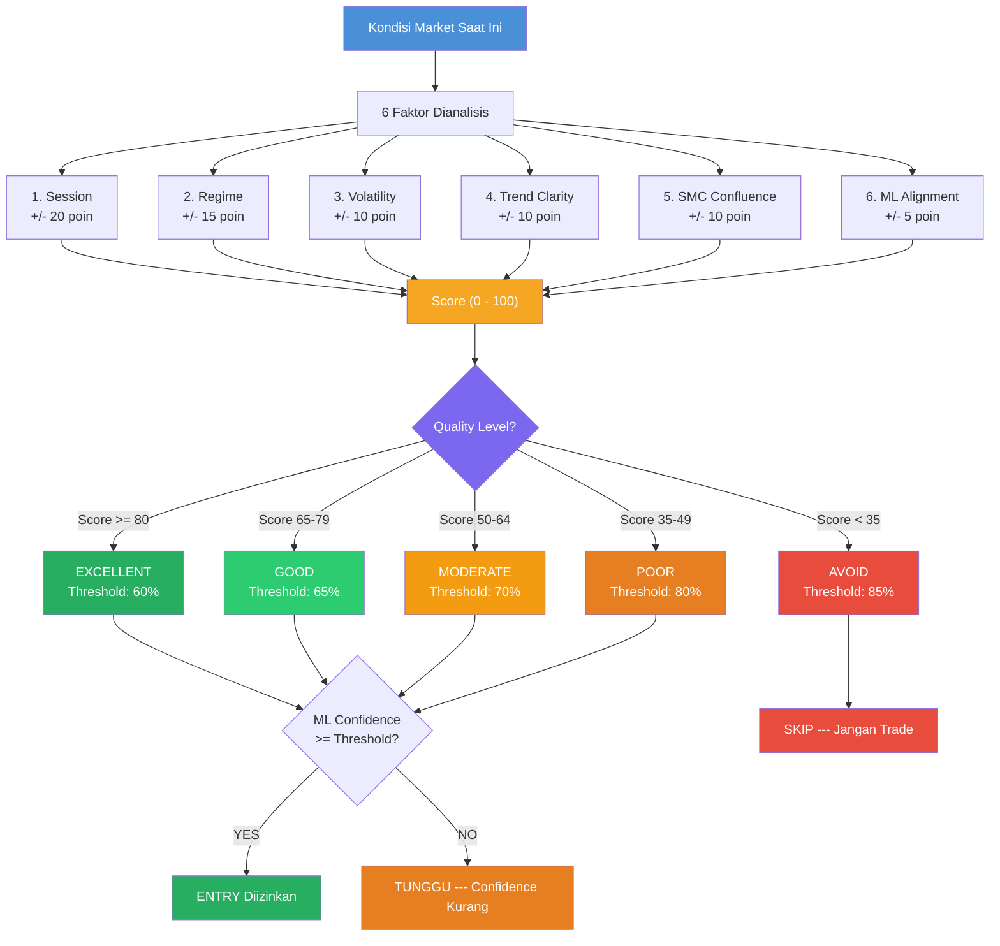

# *Dynamic Confidence* --- Penyesuaian *Threshold* Otomatis

> **File:** `src/dynamic_confidence.py`
> **Class:** `DynamicConfidenceManager`
> **Digunakan di:** `main_live.py`, `backtest_live_sync.py`

---

## Apa Itu *Dynamic Confidence*?

*Dynamic Confidence* adalah sistem yang **menyesuaikan confidence *threshold* ML secara otomatis** berdasarkan kondisi pasar saat ini. Saat kondisi ideal, *threshold* diturunkan agar lebih banyak peluang. Saat kondisi buruk, *threshold* dinaikkan untuk lebih selektif.

**Analogi:** *Dynamic Confidence* seperti **termometer yang mengatur AC otomatis** --- saat cuaca panas (pasar bagus), AC diset dingin (*threshold* rendah, lebih banyak trade). Saat cuaca dingin (pasar buruk), AC dimatikan (*threshold* tinggi, kurangi trade).

---

## Flowchart



---

## Prinsip Dasar

```
Market BAGUS (trending, session bagus)  --> Threshold RENDAH (60%)  --> Lebih banyak trade
Market BIASA (normal)                   --> Threshold SEDANG (70%)  --> Trade normal
Market JELEK (choppy, low liquidity)    --> Threshold TINGGI (80%)  --> Sangat selektif
Market BERBAHAYA (crisis, weekend)      --> Threshold MAXIMUM (85%) --> Hindari trading
```

---

## Konfigurasi

```python
DynamicConfidenceManager(
    base_threshold=0.70,   # Default threshold 70%
    min_threshold=0.60,    # Minimum (kondisi terbaik): 60%
    max_threshold=0.85,    # Maximum (kondisi terburuk): 85%
)
```

---

## 6 Faktor Penilaian

Score dimulai dari **50** (tengah), lalu disesuaikan oleh 6 faktor:

### Faktor 1: *Session* (+/- 20 poin)

| *Session* | Poin | Alasan |
|---------|------|--------|
| London-NY Overlap / Golden | **+20** | Likuiditas tertinggi, spread rendah |
| London | **+15** | Volume tinggi |
| New York | **+10** | Volume tinggi |
| Asia/Tokyo | **+0** | *Volatility* rendah |
| Market Closed/Weekend | **-30** | Tidak ada likuiditas |
| Lainnya | **+5** | Default |

### Faktor 2: *Regime* (+/- 15 poin)

| *Regime* | Poin | Alasan |
|--------|------|--------|
| Medium *Volatility* | **+15** | Kondisi ideal untuk trading |
| Low *Volatility* | **+5** | Hati-hati *ranging* |
| High *Volatility* | **-5** | Perlu lot kecil |
| Crisis | **-25** | Hindari trading |

### Faktor 3: *Volatility* (+/- 10 poin)

| *Volatility* | Poin | Alasan |
|-----------|------|--------|
| Medium | **+10** | Pergerakan cukup, bisa diprediksi |
| Low | **+0** | Pergerakan terlalu kecil |
| High | **-5** | Sulit diprediksi |
| Extreme | **-10** | Sangat berbahaya |

### Faktor 4: Trend Clarity (+/- 10 poin)

| Trend | Poin | Alasan |
|-------|------|--------|
| Uptrend / Downtrend (*trending*) | **+10** | Arah jelas, sinyal lebih akurat |
| Neutral / *Ranging* | **-5** | Sinyal sering whipsaw |

### Faktor 5: SMC *Confluence* (+/- 10 poin)

| Kondisi | Poin | Alasan |
|---------|------|--------|
| Ada sinyal SMC (OB/FVG/BOS) | **+10** | Konfirmasi tambahan |
| Tidak ada sinyal | **+0** | Tanpa konfirmasi |

### Faktor 6: ML Alignment (+/- 5 poin)

| ML Confidence | Poin | Alasan |
|--------------|------|--------|
| >= 70% | **+5** | ML sangat yakin |
| >= 60% | **+2** | ML cukup yakin |
| < 60% | **+0** | ML kurang yakin |

---

## Pemetaan Score ke *Market Quality*

Score dihitung (0--100), lalu dipetakan ke **5 level kualitas**:

```
Score:  0    10    20    30    35    50    65    80    100
        |-----|-----|-----|-----|-----|-----|-----|-----|
        |     AVOID      |POOR |  MODERATE  |GOOD | EXCELLENT
        |    (< 35)      |     | (50-64)    |     | (80+)
        |  thresh: 85%   |80%  |   70%      |65%  |  60%
```

| Score | Quality | *Threshold* | Aksi |
|-------|---------|-----------|------|
| **80+** | EXCELLENT | 60% | Trade dengan percaya diri |
| **65-79** | GOOD | 65% | Trade normal |
| **50-64** | MODERATE | 70% | Trade hati-hati |
| **35-49** | POOR | 80% | Sangat selektif |
| **< 35** | AVOID | 85% | Jangan trade |

---

## Contoh Perhitungan

### Contoh 1: Kondisi Ideal (Score: 95)

```
Base score:                        50

[+20] Session: London-NY Overlap   --> 70
[+15] Regime: Medium Volatility    --> 85
[+10] Volatility: Medium           --> 95
[+10] Trend: UPTREND               --> 105 --> cap 100
[+10] SMC: Ada FVG + BOS           --> 100
[+5]  ML: 72% confidence           --> 100

Score: 100 --> EXCELLENT --> Threshold: 60%
```

**Artinya:** ML cukup confidence 60% saja untuk entry. Lebih banyak trade opportunity.

### Contoh 2: Kondisi Jelek (Score: 50)

```
Base score:                        50

[+0]  Session: Asia                --> 50
[+5]  Regime: Low Volatility       --> 55
[+0]  Volatility: Low              --> 55
[-5]  Trend: RANGING               --> 50
[+0]  SMC: Tidak ada signal        --> 50
[+0]  ML: 58% confidence           --> 50

Score: 50 --> MODERATE --> Threshold: 70%
```

**Artinya:** ML harus confidence 70% untuk entry. Lebih selektif.

### Contoh 3: Kondisi Berbahaya (Score: 0)

```
Base score:                        50

[-30] Session: Weekend             --> 20
[-25] Regime: Crisis               --> -5 --> cap 0
[-10] Volatility: Extreme          --> 0
[-5]  Trend: Ranging               --> 0
[+0]  SMC: Tidak ada               --> 0
[+0]  ML: 55%                      --> 0

Score: 0 --> AVOID --> Threshold: 85% (praktis tidak trade)
```

---

## Integrasi di Entry Flow

```python
# main_live.py --- Step 6 dari 11 filter entry

# 1. Analisis kondisi market
market_analysis = dynamic_confidence.analyze_market(
    session=session_name,           # "London-NY Overlap"
    regime=regime_name,             # "medium_volatility"
    volatility=volatility_level,    # "medium"
    trend_direction=trend,          # "UPTREND"
    has_smc_signal=True,            # Ada SMC signal
    ml_signal=ml_pred.signal,       # "BUY"
    ml_confidence=ml_pred.confidence, # 0.68
)

# 2. Cek quality
if market_analysis.quality == MarketQuality.AVOID:
    return  # SKIP --- market tidak layak

# 3. Cek apakah ML confidence memenuhi threshold dinamis
can_entry, reason = dynamic_confidence.get_entry_decision(
    ml_confidence=0.68,
    analysis=market_analysis,
)

# can_entry = True (0.68 >= 0.60 threshold untuk EXCELLENT)
# reason = "Entry OK: ML 68% >= threshold 60% (score=95)"
```

---

## Integrasi di Backtest

```python
# backtest_live_sync.py --- identik dengan live

market_analysis = self.dynamic_confidence.analyze_market(
    session=session_name,
    regime=regime,
    volatility="medium",
    trend_direction=regime,
    has_smc_signal=True,
    ml_signal=ml_pred.signal,
    ml_confidence=ml_pred.confidence,
)

if market_analysis.quality == MarketQuality.AVOID:
    continue  # Skip bar ini
```

---

## Method `get_entry_decision()`

```python
def get_entry_decision(ml_confidence, analysis) -> (bool, str):
    """
    Keputusan final entry berdasarkan analisis.

    1. Quality == AVOID? --> False (jangan trade)
    2. ML confidence >= threshold? --> True (entry OK)
    3. ML confidence < threshold? --> False (tunggu)
    """

    # Contoh output:
    # True,  "Entry OK: ML 68% >= threshold 60% (score=95)"
    # False, "Wait: ML 55% < threshold 70% (need +15%)"
    # False, "Market quality: AVOID (score=20)"
```

---

## Logging

```python
def get_threshold_summary(analysis) -> str:
    """
    Output: "Market: EXCELLENT (score=95) --> Threshold: 60%"
    """
```

Contoh log di main_live.py:

```
[14:30] Market: EXCELLENT (score=95) --> Threshold: 60%
[14:35] Entry OK: ML 68% >= threshold 60% (score=95)
[15:00] Market: MODERATE (score=55) --> Threshold: 70%
[15:05] Wait: ML 62% < threshold 70% (need +8%)
[04:00] Market: AVOID (score=15) --> Threshold: 85%
```

---

## Ringkasan Visual

```
Kondisi Market Saat Ini
    |
    v
6 Faktor Dianalisis:
+-- Session     +/- 20 poin
+-- Regime      +/- 15 poin
+-- Volatility  +/- 10 poin
+-- Trend       +/- 10 poin
+-- SMC         +/- 10 poin
+-- ML          +/- 5 poin
    |
    v
Score (0-100)
    |
    v
Quality Level:
+-- EXCELLENT (80+)  --> Threshold 60%
+-- GOOD (65-79)     --> Threshold 65%
+-- MODERATE (50-64) --> Threshold 70%
+-- POOR (35-49)     --> Threshold 80%
+-- AVOID (<35)      --> Threshold 85% / SKIP
    |
    v
ML Confidence >= Threshold?
+-- YES --> ENTRY diizinkan
+-- NO  --> TUNGGU
```
