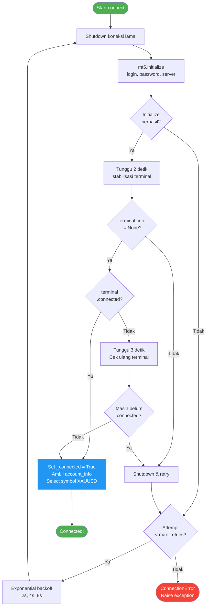
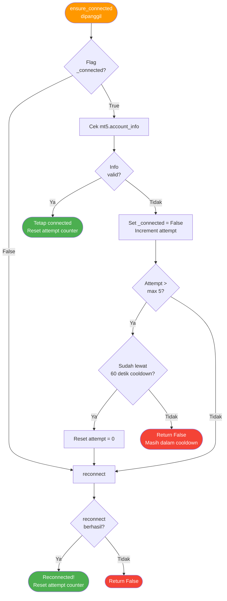
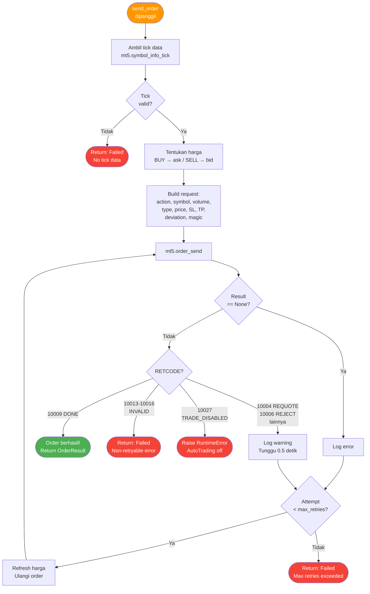

# *MT5 Connector* — Jembatan ke *MetaTrader* 5

> **File:** `src/mt5_connector.py`
> **Class:** `MT5Connector`, `MT5SimulationConnector`
> **Library:** MetaTrader5 (Python API)

---

## Apa Itu *MT5 Connector*?

*MT5 Connector* adalah **jembatan komunikasi** antara bot AI dan terminal *MetaTrader* 5. Semua interaksi dengan broker — ambil data harga, kirim order, cek posisi — dilakukan melalui modul ini.

**Analogi:** *MT5 Connector* seperti **penerjemah di bandara** — menerjemahkan perintah bot (Python) ke bahasa yang dipahami broker (MT5 API), dan sebaliknya.

---

## Fungsi Utama

| Method | Fungsi | Return |
|--------|--------|--------|
| `connect()` | Koneksi ke MT5 terminal | `bool` |
| `disconnect()` | Putus koneksi | - |
| `reconnect()` | Reconnect otomatis | `bool` |
| `ensure_connected()` | Cek & *auto-reconnect* | `bool` |
| `get_market_data()` | Ambil data OHLCV | `pl.DataFrame` |
| `get_tick()` | Ambil harga real-time | `TickData` |
| `send_order()` | Kirim order BUY/SELL | `OrderResult` |
| `close_position()` | Tutup posisi | `OrderResult` |
| `get_open_positions()` | Cek posisi terbuka | `pl.DataFrame` |
| `get_symbol_info()` | Info simbol (spread, dll) | `Dict` |
| `get_multi_timeframe_data()` | Ambil data multi-timeframe | `Dict[str, pl.DataFrame]` |

---

## Koneksi & *Auto-Reconnect*

### Connection Flow



### Mekanisme *Auto-Reconnect*



**Detail *Auto-Reconnect*:**

```python
ensure_connected():
    """
    Dipanggil sebelum setiap operasi penting.

    1. Cek flag _connected
    2. Coba mt5.account_info()
    3. Gagal? → reconnect()
    4. Max 5 attempts, lalu cooldown 60 detik
    """
```

Mekanisme *exponential backoff* memastikan bot tidak membombardir server broker dengan request berulang. Setiap kali koneksi gagal, waktu tunggu berlipat ganda (2s, 4s, 8s). Setelah 5 kali gagal berturut-turut, bot masuk fase *cooldown* selama 60 detik sebelum mencoba lagi.

---

## Data Fetching (Polars Native)

```python
get_market_data(symbol="XAUUSD", timeframe="M15", count=1000, max_retries=3)
```

**Proses:**

```
MT5 Terminal
    |
    v
ensure_connected() → auto-reconnect jika putus
    |
    v
mt5.symbol_select() → pastikan simbol aktif di Market Watch
    |
    v
mt5.copy_rates_from_pos() → numpy structured array
    |
    v
LANGSUNG ke Polars DataFrame (TANPA Pandas)
    |
    v
Cast types:
├── time: Unix timestamp → Datetime
├── open/high/low/close: Float64
├── tick_volume → volume (Int64)
└── spread, real_volume: Int64
    |
    v
Return pl.DataFrame
```

> **Catatan penting:** Data dikonversi langsung dari NumPy structured array ke Polars DataFrame. Tidak ada konversi perantara via Pandas. Ini adalah optimisasi kritis untuk performa — menjaga target **< 50ms per loop**.

**Kolom output:**

| Kolom | Tipe | Keterangan |
|-------|------|------------|
| `time` | Datetime | Waktu candle |
| `open` | Float64 | Harga buka |
| `high` | Float64 | Harga tertinggi |
| `low` | Float64 | Harga terendah |
| `close` | Float64 | Harga tutup |
| `volume` | Int64 | Tick volume |
| `spread` | Int64 | Spread |
| `real_volume` | Int64 | Real volume |

---

## Order Execution

```python
send_order(
    symbol="XAUUSD",
    order_type="BUY",     # atau "SELL"
    volume=0.01,          # Lot size
    sl=4937.00,           # Stop Loss
    tp=4976.00,           # Take Profit
    deviation=20,         # Max slippage (points)
    magic=123456,         # Bot ID
    comment="AI Bot",
    max_retries=3,
)
```

### Order Execution Flow dengan *Retry* Logic



Parameter `deviation` mengontrol toleransi *slippage* maksimum dalam poin. Jika harga bergeser melebihi batas ini saat eksekusi, broker akan menolak order (REQUOTE) dan bot akan melakukan *retry* otomatis dengan harga terbaru.

**Close Position** juga menggunakan logika *retry* yang sama — setiap attempt mengambil ulang harga terbaru untuk memastikan akurasi.

---

## Timeframe Mapping

| String | MT5 Constant | Penggunaan |
|--------|-------------|------------|
| `M1` | TIMEFRAME_M1 | 1 menit |
| `M5` | TIMEFRAME_M5 | 5 menit |
| `M15` | TIMEFRAME_M15 | **Utama** (execution) |
| `M30` | TIMEFRAME_M30 | 30 menit |
| `H1` | TIMEFRAME_H1 | 1 jam (EMA20 filter) |
| `H4` | TIMEFRAME_H4 | Trend analysis |
| `D1` | TIMEFRAME_D1 | 1 hari |
| `W1` | TIMEFRAME_W1 | 1 minggu |

---

## Error Codes

| Code | Nama | Aksi |
|------|------|------|
| 10009 | DONE | Order berhasil |
| 10004 | REQUOTE | *Retry* — harga berubah |
| 10006 | REJECT | *Retry* — ditolak server |
| 10013 | INVALID | Stop, order salah |
| 10014 | INVALID_VOLUME | Stop, lot salah |
| 10015 | INVALID_PRICE | Stop, harga salah |
| 10016 | INVALID_STOPS | Stop, SL/TP salah |
| 10027 | TRADE_DISABLED | AutoTrading off |
| -10001 | COMMON_ERROR | Reconnect |
| -10002 | INVALID_PARAMS | Reconnect |
| -10003 | NO_CONNECTION | Reconnect |
| -10004 | NO_IPC | Reconnect |
| -1 | TERMINAL_CALL_FAILED | Reconnect |

Error code -10003, -10004, -10001, -10002, dan -1 termasuk dalam `CONNECTION_ERRORS` dan secara otomatis memicu mekanisme *auto-reconnect*.

---

## *Simulation Mode*

```python
class MT5SimulationConnector(MT5Connector):
    """
    Untuk testing tanpa MT5 terminal.

    - connect() selalu berhasil
    - get_market_data() generate data sintetis (random walk)
    - Base price XAUUSD: $2000
    - Berguna untuk development & unit testing
    """
```

*Simulation mode* memungkinkan pengembangan dan testing tanpa perlu koneksi ke terminal *MetaTrader* yang sebenarnya. Connector ini menghasilkan data OHLCV sintetis menggunakan random walk dari harga dasar $2000.

> **Catatan:** *Simulation mode* secara otomatis aktif jika library MetaTrader5 tidak terinstal di environment.

---

## Konfigurasi Koneksi

```python
MT5Connector(
    login=12345678,                    # Dari .env MT5_LOGIN
    password="password123",            # Dari .env MT5_PASSWORD
    server="BrokerServer-Live",        # Dari .env MT5_SERVER
    path="C:/Program Files/MT5/...",   # Dari .env MT5_PATH (opsional)
    timeout=60000,                     # 60 detik timeout
)
```

### Context Manager Support

*MT5 Connector* mendukung penggunaan sebagai context manager:

```python
with MT5Connector(login, password, server) as mt5_conn:
    data = mt5_conn.get_market_data("XAUUSD", "M15")
    # Otomatis disconnect saat keluar blok
```

---

## Catatan Teknis

- **Polars, bukan Pandas:** Semua konversi data dari MT5 menggunakan Polars secara langsung. Tidak ada *connection pooling* atau konversi via Pandas.
- **Thread Safety:** *MT5 Connector* berjalan di satu thread utama. Library MT5 Python API tidak thread-safe, jadi semua operasi dilakukan secara sekuensial.
- **Password Security:** Password disimpan dengan prefix `_` (`self._password`) sebagai konvensi private attribute.
- **Symbol Pre-selection:** Setelah koneksi berhasil, simbol XAUUSD otomatis di-select di Market Watch untuk memastikan data siap diambil.
