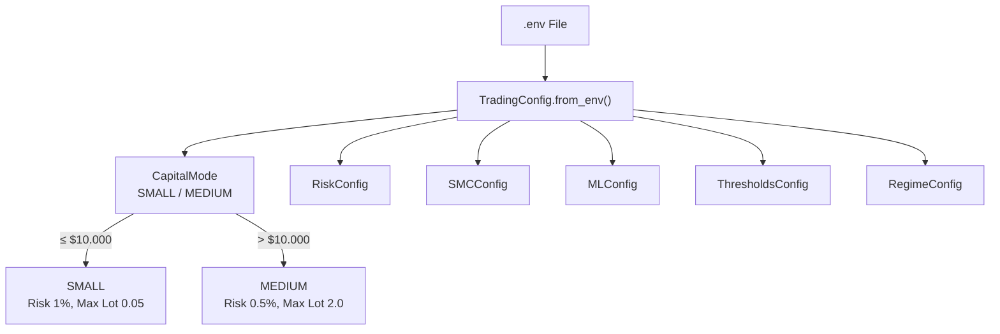

# Konfigurasi — Pusat Pengaturan Bot

> **File:** `src/config.py`
> **Class:** `TradingConfig`, `RiskConfig`, `SMCConfig`, `MLConfig`, `ThresholdsConfig`, `RegimeConfig`
> **Sumber:** *Environment variables* (`.env`)

---

## Struktur Konfigurasi



---

## 2 Mode Kapital

### Mode SMALL (≤ $10.000) — *Growth Mode*

| Parameter | Nilai | Keterangan |
|-----------|-------|------------|
| `risk_per_trade` | **1.0%** | $50 risiko per *trade* (akun $5.000) |
| `max_daily_loss` | **3.0%** | Batas kerugian harian $150 |
| `max_leverage` | **1:100** | *Leverage* tinggi untuk akun kecil |
| `max_positions` | **3** | Maksimal 3 posisi bersamaan |
| `max_lot_size` | **0.05** | Batas atas *lot* per *trade* |
| `min_lot_size` | **0.01** | *Lot* minimum |
| `execution_timeframe` | **M15** | *Scalping* / *day trading* |

### Mode MEDIUM (> $10.000) — *Preservation Mode*

| Parameter | Nilai | Keterangan |
|-----------|-------|------------|
| `risk_per_trade` | **0.5%** | $250 risiko per *trade* (akun $50.000) |
| `max_daily_loss` | **2.0%** | Batas kerugian harian $1.000 |
| `max_leverage` | **1:30** | *Leverage* konservatif |
| `max_positions` | **5** | Lebih banyak diversifikasi |
| `max_lot_size` | **2.0** | Batas atas *lot* |
| `execution_timeframe` | **H1** | *Swing trading* |
| `trend_timeframe` | **H4** | Analisis *trend* jangka menengah |

---

## *Thresholds* (Ambang Batas)

### *ML Confidence*

| Parameter | Nilai | Fungsi |
|-----------|-------|--------|
| `ml_min_confidence` | **0.65** | Minimum *confidence* untuk pertimbangkan sinyal |
| `ml_entry_confidence` | **0.70** | *Default confidence* untuk *entry* |
| `ml_high_confidence` | **0.75** | *High confidence* — sinyal kuat |
| `ml_very_high_confidence` | **0.80** | Sangat yakin — *lot multiplier* aktif |

### *Dynamic Threshold*

| Parameter | Nilai | Kondisi |
|-----------|-------|---------|
| `dynamic_threshold_aggressive` | **0.65** | Pasar *trending* kuat |
| `dynamic_threshold_moderate` | **0.70** | Kondisi normal |
| `dynamic_threshold_conservative` | **0.75** | Pasar bergejolak |

### *Profit/Loss* ($)

| Parameter | Nilai | Keterangan |
|-----------|-------|------------|
| `min_profit_to_secure` | **$15** | Mulai pertimbangkan *take profit* |
| `good_profit_level` | **$25** | Level profit bagus |
| `great_profit_level` | **$40** | *Hard take profit* — ambil profit |

### *Trading Timing*

| Parameter | Nilai | Keterangan |
|-----------|-------|------------|
| `trade_cooldown_seconds` | **300** | 5 menit antar *trade* |
| `loop_interval_seconds` | **30** | Interval *main loop* |
| `sydney_lot_multiplier` | **0.5** | *Lot* dikurangi 50% saat Sydney |

---

## *Environment Variables* (`.env`)

```env
# MetaTrader 5 — WAJIB
MT5_LOGIN=12345678
MT5_PASSWORD=your_password
MT5_SERVER=YourBroker-Server
MT5_PATH=C:/Program Files/MetaTrader 5/terminal64.exe

# Telegram — OPSIONAL
TELEGRAM_BOT_TOKEN=bot123:ABC-DEF
TELEGRAM_CHAT_ID=123456789

# Trading
CAPITAL=5000              # Menentukan mode (SMALL/MEDIUM)
SYMBOL=XAUUSD             # Pair yang diperdagangkan

# Override (opsional)
RISK_PER_TRADE=1.0        # Override risk per trade (%)
MAX_DAILY_LOSS_PERCENT=3.0
MAX_POSITION_SIZE=0.05
AI_CONFIDENCE_THRESHOLD=0.65
FLASH_CRASH_THRESHOLD=2.5
```

---

## Kalkulasi *Position Sizing*

Bot menggunakan **metode *Half-Kelly Criterion*** untuk menghitung ukuran *lot*:

```python
def calculate_position_size(self, entry_price, stop_loss_price, account_balance=None):
    # 1. Hitung jumlah risiko dalam $
    risk_amount = balance * (risk_per_trade / 100)

    # 2. Hitung jarak SL dalam pips
    sl_distance = abs(entry_price - stop_loss_price)
    sl_pips = sl_distance / 0.1  # XAUUSD: 1 pip = $0.1

    # 3. Hitung lot size
    lot_size = risk_amount / (sl_pips * pip_value_per_lot)

    # 4. Apply Half-Kelly (keamanan)
    lot_size *= 0.5

    # 5. Round dan batasi
    lot_size = round(lot_size / lot_step) * lot_step
    lot_size = max(min_lot, min(lot_size, max_lot))
```

**Contoh:** Akun $5.000, SL 50 *pips*, risiko 1%:
- Risiko = $50
- *Lot* = $50 / (50 × $1) = 0.01 *lot* (setelah *Half-Kelly*)

---

## Validasi Konfigurasi

```python
def _validate_required_settings(self):
    """Validasi environment variables wajib saat startup."""
    # MT5_LOGIN harus ada dan > 0
    # MT5_PASSWORD harus ada dan tidak kosong
    # MT5_SERVER harus ada dan tidak kosong
    # CAPITAL harus > 0
    # Jika ada yang hilang → ValueError dengan pesan jelas
```

Bot **tidak bisa berjalan** tanpa kredensial MT5 yang valid.
