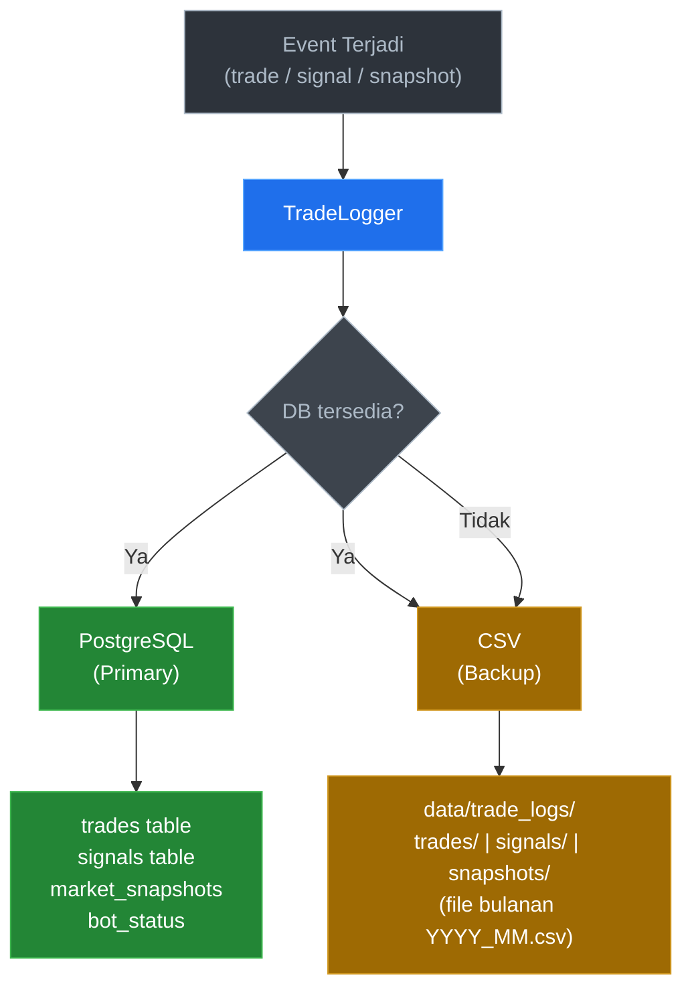
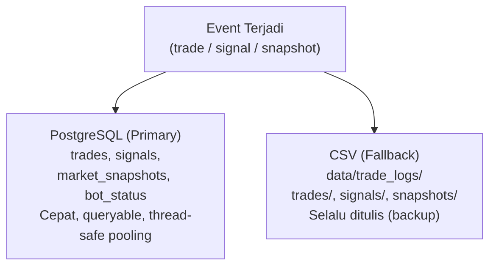
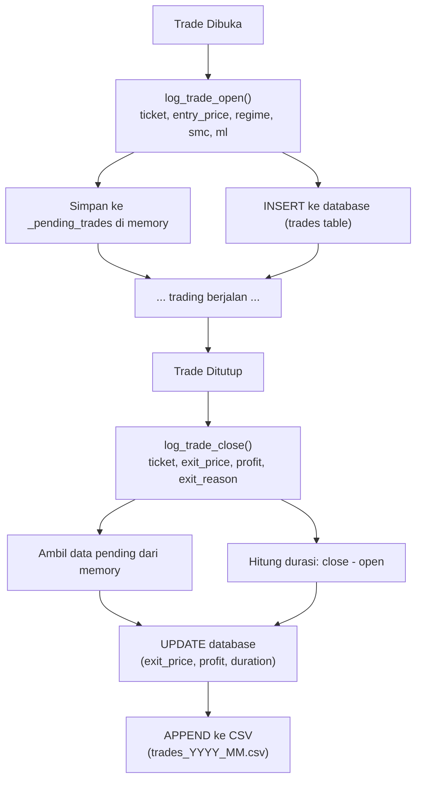

# Trade Logger — Pencatat Trade Otomatis

> **File:** `src/trade_logger.py`
> **Class:** `TradeLogger`
> **Storage:** PostgreSQL (primary) + CSV (*fallback*)

---

## Apa Itu *Trade Logger*?

*Trade Logger* mencatat **setiap trade, sinyal, dan kondisi pasar** secara otomatis ke database dan file CSV. Data ini digunakan untuk analisis performa, retraining ML model, dan debugging.

**Analogi:** *Trade Logger* seperti ***black box* di pesawat** — merekam semua yang terjadi untuk analisis setelah penerbangan (trading).

---

## Alur *Dual Storage*



**Prinsip *dual storage*:**

- **DB tersedia?** — Tulis ke PostgreSQL **DAN** CSV (double safety)
- **DB tidak tersedia?** — CSV saja (*graceful degradation*)
- CSV **selalu** ditulis sebagai *fallback*, tidak peduli status DB

---

## 3 Tipe Data yang Dicatat

### 1. Trade Record (Per Trade)

Setiap trade dibuka/ditutup dicatat lengkap:

| Kategori | Field |
|----------|-------|
| **Identitas** | ticket, symbol |
| **Trade** | direction, lot_size, entry_price, exit_price, SL, TP |
| **Hasil** | profit_usd, profit_pips, duration_seconds |
| **Waktu** | open_time, close_time |
| **Market** | regime, volatility, session, spread, ATR |
| **SMC** | *signal*, confidence, reason, FVG/OB/BOS/CHoCH flags |
| **ML** | *signal*, confidence |
| **Dynamic** | market_quality, market_score, threshold |
| **Exit** | exit_reason, exit_regime, exit_ml_signal |
| **Balance** | balance_before, balance_after, equity_at_entry |
| **Features** | JSON *snapshot* fitur saat entry & exit |

### 2. *Signal* Record (Per Sinyal)

Setiap sinyal yang dihasilkan (termasuk yang **tidak** dieksekusi):

```
timestamp, symbol, price
signal_type, signal_source, confidence
smc_*, ml_*
regime, session, volatility, market_score
trade_executed (bool)
execution_reason ("executed" / "below_threshold" / "max_positions" / ...)
```

### 3. Market *Snapshot* (Periodik)

*Snapshot* kondisi pasar secara berkala:

```
timestamp, symbol, price, OHLC
regime, volatility, session, ATR, spread
ml_signal, ml_confidence
smc_signal, smc_confidence
open_positions, floating_pnl
features (JSON)
```

---

## *Dual Storage*



- **DB tidak tersedia?** → CSV saja (*graceful degradation*)
- **DB tersedia?** → Tulis ke DB **DAN** CSV (double safety)

---

## Proses Log Trade



Data *pending* disimpan dalam dictionary `_pending_trades[ticket]` selama trade masih terbuka. Ketika trade ditutup, data entry digabung dengan data exit menjadi satu `TradeRecord` lengkap sebelum ditulis ke CSV.

---

## Analisis Helper

| Method | Fungsi |
|--------|--------|
| `get_recent_trades(10)` | 10 trade terakhir |
| `get_win_rate(30)` | Win rate 30 hari |
| `get_smc_performance(30)` | Performa per pattern SMC |
| `get_trades_for_training(30)` | Data untuk ML retraining |
| `get_stats()` | Statistik logger |

Setiap helper method mencoba query dari PostgreSQL terlebih dahulu. Jika DB tidak tersedia, otomatis *fallback* ke pembacaan file CSV — konsisten dengan prinsip *graceful degradation*.

---

## *Thread Safety*

```python
self._lock = threading.Lock()

# Setiap operasi CSV dilindungi lock
with self._lock:
    # Write to CSV
```

Semua operasi tulis ke file CSV dilindungi oleh `threading.Lock()` untuk menjamin *thread safety*. Ini mencegah korupsi data ketika multiple thread mencoba menulis ke file yang sama secara bersamaan (misalnya log trade close dan log *signal* terjadi hampir bersamaan).

---

## File CSV (Terorganisir per Bulan)

```
data/trade_logs/
├── trades/
│   ├── trades_2025_01.csv
│   └── trades_2025_02.csv
├── signals/
│   ├── signals_2025_01.csv
│   └── signals_2025_02.csv
└── snapshots/
    ├── snapshots_2025_01.csv
    └── snapshots_2025_02.csv
```
