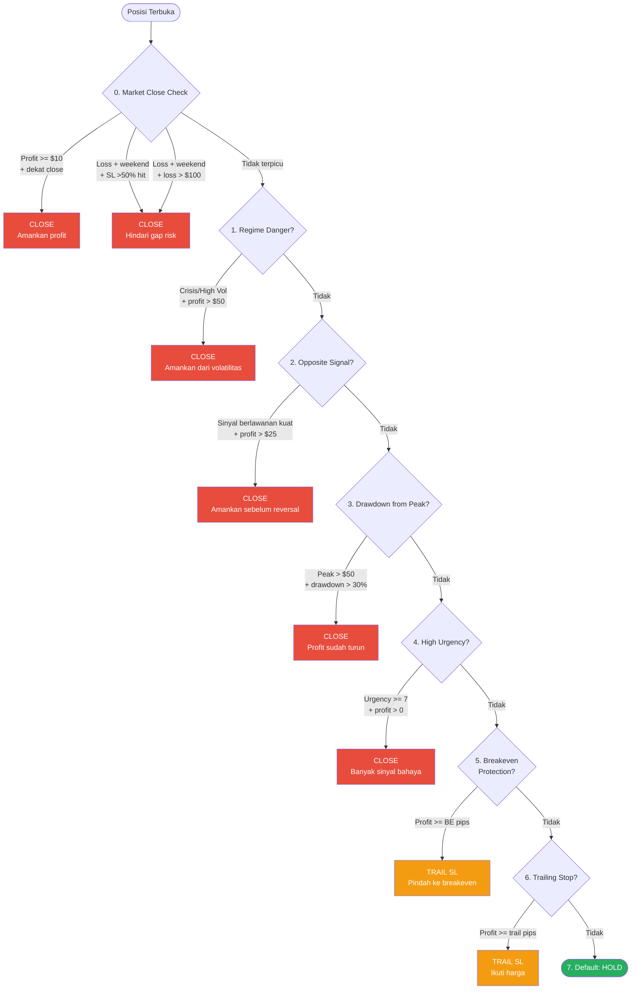
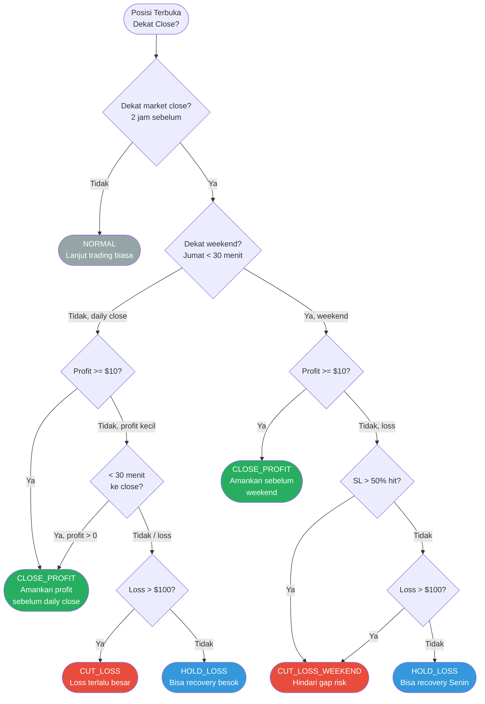

# Position Manager — Manajemen Posisi Cerdas

> **File:** `src/position_manager.py`
> **Class:** `SmartPositionManager`, `SmartMarketCloseHandler`
> **Fitur:** *Trailing Stop*, Profit Protection, *Market Close Handler*

---

## Apa Itu *Position Manager*?

*Position Manager* mengelola posisi terbuka secara **aktif dan cerdas** — *trailing stop* loss, proteksi profit, dan keputusan otomatis saat market mendekati penutupan.

**Analogi:** *Position Manager* seperti **co-pilot yang mengawasi perjalanan** — mengamankan keuntungan saat angin baik, dan mengambil tindakan darurat saat cuaca memburuk.

---

## 2 Komponen Utama

### A. SmartPositionManager

Mengelola posisi aktif: *trailing stop*, *breakeven*, profit protection.

### B. SmartMarketCloseHandler

Keputusan cerdas saat market mendekati penutupan (harian/weekend) — *market close handler*.

---

## SmartPositionManager — 7 Kondisi Aksi

Untuk setiap posisi terbuka, dicek berurutan berdasarkan prioritas:



### 0. Market Close Check (Prioritas Tertinggi)

```
Dekat market close?
├── Profit >= $10 + dekat close → CLOSE (amankan profit)
├── Loss + dekat weekend + SL >50% hit → CLOSE (gap risk)
├── Loss + dekat weekend + loss > $100 → CLOSE (gap risk)
└── Loss kecil + dekat weekend → HOLD (bisa recovery Senin)
```

### 1. Regime Danger

```
Regime CRISIS atau HIGH_VOLATILITY + profit > $50:
  → CLOSE (amankan profit dari volatilitas)
```

### 2. Opposite Signal

```
Posisi BUY + sinyal bearish kuat + profit > $25:
  → CLOSE (amankan sebelum reversal)

Posisi SELL + sinyal bullish kuat + profit > $25:
  → CLOSE (amankan sebelum reversal)
```

### 3. *Drawdown* from Peak

```
Peak profit > $50 DAN drawdown > 30% dari peak:
  → CLOSE (profit sudah turun terlalu banyak)

Contoh: Peak $80, sekarang $50 → drawdown 37.5% → CLOSE
```

### 4. High Urgency

```
Urgency score >= 7 (dari 10) DAN profit > 0:
  → CLOSE (banyak sinyal bahaya bersamaan)
```

### 5. *Breakeven* Protection

```
Profit >= BE pips (ATR * 2.0, fallback 15 pips):
  → Pindah SL ke breakeven + 0.5*ATR buffer
  (tidak bisa rugi lagi)
```

### 6. *Trailing Stop*

```
Profit >= trail start pips (ATR * 4.0, fallback 25 pips):
  → SL mengikuti harga dengan jarak ATR * 3.0 (fallback 10 pips)
  (kunci profit sambil biarkan profit berjalan)

Impulse candle (range > 1.5x ATR):
  → Trail diperketat ke 1.5x ATR
```

### 7. Default: HOLD

```
Tidak ada kondisi terpenuhi → HOLD posisi
```

---

## SmartMarketCloseHandler

*Market close handler* menentukan aksi cerdas saat market mendekati penutupan harian atau weekend.

### Market Hours (XAUUSD)

```
Minggu 17:00 EST (Senin 05:00 WIB) → Jumat 17:00 EST (Sabtu 05:00 WIB)
24 jam, 5 hari seminggu

Daily close:  05:00 WIB (= 17:00 EST hari sebelumnya)
Weekend close: Sabtu 05:00 WIB (= Jumat 17:00 EST)
```

### Diagram Keputusan



### Konfigurasi

```python
SmartMarketCloseHandler(
    daily_close_hour_wib=5,          # 05:00 WIB
    hours_before_close=2.0,          # "Dekat close" = 2 jam sebelumnya
    min_profit_to_take=10.0,         # Ambil profit >= $10 sebelum close
    max_loss_to_hold=100.0,          # Hold loss sampai $100
    weekend_loss_cut_percent=50.0,   # Cut jika SL >50% hit sebelum weekend
)
```

### 4 Rekomendasi

| Rekomendasi | Kondisi | Aksi |
|-------------|---------|------|
| **CLOSE_PROFIT** | Profit + dekat close | Tutup, amankan profit |
| **CUT_LOSS_WEEKEND** | Loss besar + dekat weekend | Tutup, hindari *gap risk* |
| **HOLD_LOSS** | Loss kecil + dekat close | Hold, bisa recovery |
| **NORMAL** | Belum dekat close | Lanjut normal |

---

## Market Analysis (*Urgency Score*)

*Urgency score* menghitung tingkat bahaya pasar pada skala 0-10. Skor tinggi memicu exit otomatis.

```
Score dimulai dari 0, lalu ditambah:

Regime crisis/high_vol:     +3
ML opposite >75% confidence: +2
RSI >75 (overbought):       +2
RSI <25 (oversold):         +2
Trend + momentum berlawanan: +3

Total max: ~10
Score >= 7 = HIGH URGENCY → tutup jika ada profit
```

| Komponen | Skor | Kondisi |
|----------|------|---------|
| Regime berbahaya | +3 | Crisis atau high volatility |
| ML sinyal berlawanan | +2 | Confidence > 75% + arah berlawanan posisi |
| RSI *overbought* | +2 | RSI > 75 (bahaya untuk posisi BUY) |
| RSI *oversold* | +2 | RSI < 25 (bahaya untuk posisi SELL) |
| Trend + momentum berlawanan | +3 | Trend dan momentum searah melawan posisi |
| **Threshold** | **>= 7** | **Tutup posisi jika ada profit** |

---

## Konfigurasi SmartPositionManager

```python
SmartPositionManager(
    # Fallback jika ATR tidak tersedia
    breakeven_pips=15.0,             # Breakeven setelah 15 pips profit
    trail_start_pips=25.0,           # Mulai trailing setelah 25 pips
    trail_step_pips=10.0,            # Trail distance: 10 pips

    # ATR-adaptive exit multipliers (#24B)
    atr_be_mult=2.0,                 # Breakeven = ATR * 2.0
    atr_trail_start_mult=4.0,        # Trail start = ATR * 4.0
    atr_trail_step_mult=3.0,         # Trail step = ATR * 3.0

    # Proteksi profit
    min_profit_to_protect=50.0,      # Min $50 untuk proteksi profit
    max_drawdown_from_peak=30.0,     # Max 30% drawdown dari peak

    # Market close handler
    enable_market_close_handler=True, # Aktifkan market close handler
    min_profit_before_close=10.0,    # Take profit $10+ sebelum close
    max_loss_to_hold=100.0,          # Hold loss sampai $100
)
```
