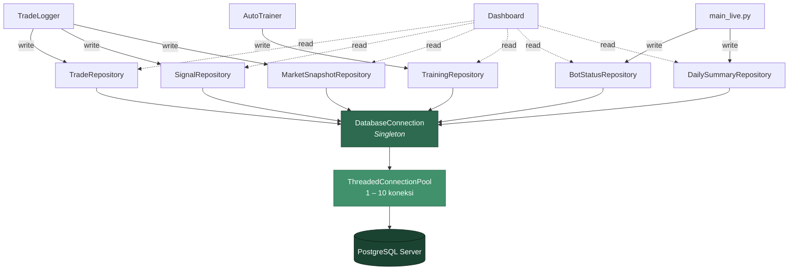
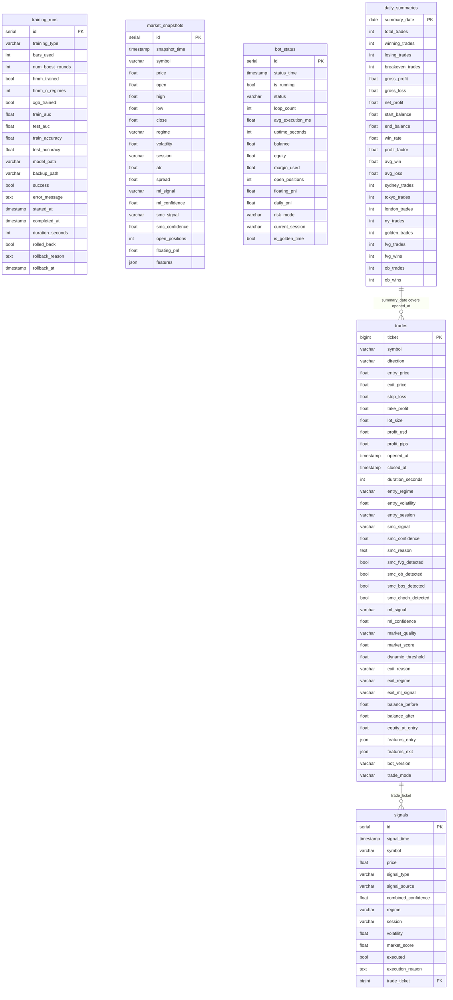

# *Database Module* — *PostgreSQL* Integration

> **File:** `src/db/connection.py`, `src/db/repository.py`
> **Database:** *PostgreSQL*
> **Library:** psycopg2 (*connection pooling*)

---

## Apa Itu *Database Module*?

*Database Module* menyediakan **penyimpanan persisten** untuk semua data trading — trade history, training log, sinyal, snapshot pasar, dan status bot. Menggunakan *PostgreSQL* dengan *connection pooling* untuk performa tinggi.

**Analogi:** *Database Module* seperti **arsip perpustakaan** — menyimpan semua catatan trading secara terorganisir, bisa dicari kapan saja, dan tidak hilang meski bot di-restart.

---

## Arsitektur



---

## Connection (*Singleton* + Pooling)

```python
class DatabaseConnection:
    """
    Thread-safe singleton dengan connection pooling.

    - Hanya 1 instance (singleton pattern)
    - Pool: 1-10 koneksi (ThreadedConnectionPool)
    - Auto-reconnect jika putus
    - Context manager support
    """
```

`DatabaseConnection` menerapkan pola *singleton* yang *thread-safe* — hanya satu instance yang pernah dibuat selama proses berjalan. Akses ke database dilakukan melalui *context manager* (`with db.get_cursor() as cur`) sehingga koneksi selalu dikembalikan ke pool setelah selesai.

### Konfigurasi

```
DB_HOST=localhost
DB_PORT=5432
DB_NAME=trading_db
DB_USER=trading_bot
DB_PASSWORD=trading_bot_2026
```

### Penggunaan

```python
from src.db import get_db, init_db

# Initialize
if init_db():
    db = get_db()

    # Query dengan context manager
    with db.get_cursor() as cur:
        cur.execute("SELECT * FROM trades WHERE profit_usd > 0")
        rows = cur.fetchall()

    # Simple execute
    result = db.execute("SELECT count(*) FROM trades", fetch=True)
```

---

## 6 *Repository*

Setiap *repository* bertanggung jawab atas satu tabel dan menyediakan method khusus untuk operasi CRUD.

### 1. TradeRepository

| Method | Fungsi |
|--------|--------|
| `insert_trade()` | Insert trade baru (saat open) |
| `update_trade_close()` | Update exit data (saat close) |
| `get_trade_by_ticket()` | Cari trade per ticket |
| `get_open_trades()` | Trade yang belum ditutup |
| `get_recent_trades(100)` | 100 trade terakhir |
| `get_trades_for_training(30)` | Trade 30 hari untuk ML |
| `get_daily_stats(date)` | Statistik per hari |
| `get_session_stats("London", 30)` | Statistik per sesi |
| `get_smc_pattern_stats(30)` | Performa per pola SMC |

### 2. TrainingRepository

| Method | Fungsi |
|--------|--------|
| `insert_training_run()` | Catat mulai training |
| `update_training_complete()` | Update hasil training |
| `mark_rollback()` | Tandai model di-rollback |
| `get_latest_successful()` | Training sukses terakhir |
| `get_training_history(20)` | 20 training terakhir |

### 3. SignalRepository

| Method | Fungsi |
|--------|--------|
| `insert_signal()` | Catat sinyal yang dihasilkan |
| `mark_executed()` | Tandai sinyal yang dieksekusi |
| `get_recent_signals(100)` | 100 sinyal terakhir |
| `get_signal_stats(24)` | Statistik 24 jam |

### 4. MarketSnapshotRepository

| Method | Fungsi |
|--------|--------|
| `insert_snapshot()` | Simpan snapshot pasar |
| `get_recent_snapshots(60)` | Snapshot 60 menit terakhir |

### 5. BotStatusRepository

| Method | Fungsi |
|--------|--------|
| `insert_status()` | Catat status bot |
| `get_latest_status()` | Status terbaru |

### 6. DailySummaryRepository

| Method | Fungsi |
|--------|--------|
| `upsert_summary()` | Insert/update ringkasan harian |
| `get_summary(date)` | Ringkasan per tanggal |
| `get_recent_summaries(30)` | 30 hari terakhir |

---

## Tabel Database

### Entity-Relationship Diagram



### trades

```sql
├── ticket, symbol, direction
├── entry_price, exit_price, stop_loss, take_profit
├── lot_size, profit_usd, profit_pips
├── opened_at, closed_at, duration_seconds
├── entry_regime, entry_volatility, entry_session
├── smc_signal, smc_confidence, smc_reason
├── smc_fvg_detected, smc_ob_detected, smc_bos_detected, smc_choch_detected
├── ml_signal, ml_confidence
├── market_quality, market_score, dynamic_threshold
├── exit_reason, exit_regime, exit_ml_signal
├── balance_before, balance_after, equity_at_entry
├── features_entry (JSON), features_exit (JSON)
└── bot_version, trade_mode
```

### training_runs

```sql
├── training_type, bars_used, num_boost_rounds
├── hmm_trained, hmm_n_regimes
├── xgb_trained, train_auc, test_auc
├── train_accuracy, test_accuracy
├── model_path, backup_path
├── success, error_message
├── started_at, completed_at, duration_seconds
└── rolled_back, rollback_reason, rollback_at
```

### signals

```sql
├── signal_time, symbol, price
├── signal_type, signal_source, combined_confidence
├── smc_*, ml_*
├── regime, session, volatility, market_score
└── executed, execution_reason, trade_ticket
```

### market_snapshots

```sql
├── snapshot_time, symbol, price, OHLC
├── regime, volatility, session, ATR, spread
├── ml_signal, ml_confidence, smc_signal, smc_confidence
└── open_positions, floating_pnl, features (JSON)
```

### bot_status

```sql
├── status_time, is_running, status
├── loop_count, avg_execution_ms, uptime_seconds
├── balance, equity, margin_used
├── open_positions, floating_pnl, daily_pnl
└── risk_mode, current_session, is_golden_time
```

### daily_summaries

```sql
├── summary_date
├── total/winning/losing/breakeven_trades
├── gross_profit, gross_loss, net_profit
├── start_balance, end_balance
├── win_rate, profit_factor, avg win/loss
├── trades per session (sydney/tokyo/london/ny/golden)
└── SMC pattern stats (fvg/ob trades & wins)
```

---

## *Graceful Degradation*

```
PostgreSQL tersedia?
├── Ya → Gunakan DB + CSV backup
└── Tidak → CSV saja (semua tetap berjalan)

Bot TIDAK pernah crash karena database.
```

*Graceful degradation* memastikan bot tetap beroperasi penuh meskipun *PostgreSQL* tidak tersedia. Semua operasi database dibungkus dengan `try/except` — jika koneksi gagal, data ditulis ke CSV sebagai fallback. Saat database kembali online, bot otomatis menggunakan koneksi pool kembali tanpa restart.
