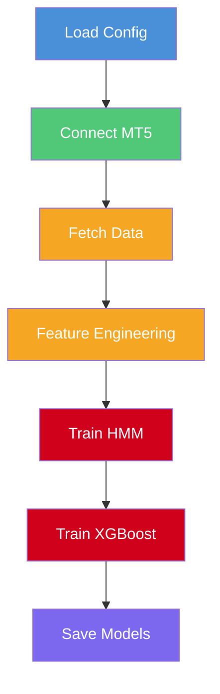

# Train Models — Script Training Awal

> **File:** `train_models.py`
> **Tipe:** Script CLI (bukan modul)
> **Output:** `models/xgboost_model.pkl`, `models/hmm_regime.pkl`

---

## Apa Itu *Train Models*?

*Train Models* adalah script **pelatihan awal** yang dijalankan sekali sebelum bot mulai trading. Mengambil data historis dari MT5, melatih HMM dan XGBoost, lalu menyimpan model ke file `.pkl`.

**Analogi:** *Train Models* seperti **sekolah penerbangan** — melatih pilot (model AI) sebelum terbang pertama kali. Setelah itu, pelatihan rutin dilakukan oleh Auto Trainer (13).

---

## Cara Penggunaan

```bash
python train_models.py
```

---

## Pipeline Training



```
1. LOAD CONFIG
   ├── get_config() dari .env
   └── Symbol, capital, mode

2. CONNECT MT5
   ├── Login, password, server
   └── Verifikasi: balance, equity

3. FETCH DATA
   ├── 10.000 bar XAUUSD M15
   └── ~104 hari data historis

4. FEATURE ENGINEERING
   ├── FeatureEngineer.calculate_all()  → 40+ fitur teknikal
   ├── SMCAnalyzer.calculate_all()      → Struktur pasar
   └── create_target(lookahead=1)       → Label UP/DOWN

5. SAVE DATA
   └── data/training_data.parquet

6. TRAIN HMM
   ├── MarketRegimeDetector(n_regimes=3, lookback=500)
   ├── fit(df)
   ├── Log: distribusi regime, transition matrix
   └── Save → models/hmm_regime.pkl

7. TRAIN XGBOOST
   ├── TradingModel(confidence_threshold=0.60)
   ├── fit(train_ratio=0.7, boost_rounds=50, early_stop=5)
   ├── Log: top 10 *feature importance*
   ├── *Walk-forward* validation (train=500, test=50, step=50)
   ├── Log: avg train/test *AUC*, overfitting ratio
   └── Save → models/xgboost_model.pkl

8. DISCONNECT
```

---

## Parameter Training

| Parameter | Nilai | Keterangan |
|-----------|-------|------------|
| Data | 10.000 bar M15 | ~104 hari |
| Train/Test Split | 70% / 30% | Lebih banyak test data |
| XGBoost Rounds | 50 | *Anti-overfitting* |
| *Early Stopping* | 5 rounds | Stop lebih awal |
| HMM Regimes | 3 | Low/Medium/High volatility |
| HMM Lookback | 500 bar | Window training |
| *Walk-forward* Window | 500 train / 50 test | Validasi robustness |

---

## Output

```
models/
├── xgboost_model.pkl    # Model XGBoost (*binary classifier*)
└── hmm_regime.pkl       # Model HMM (regime detector)

data/
└── training_data.parquet  # Data training (untuk referensi)

logs/
└── training_YYYY-MM-DD.log  # Log training detail
```

---

## Contoh Output Log

```
[08:00] ============================================================
[08:00] SMART TRADING BOT - MODEL TRAINING
[08:00] ============================================================
[08:00] Symbol: XAUUSD
[08:00] Capital: $5,000.00
[08:00] Mode: small
[08:00] Connecting to MT5...
[08:00] MT5 connected successfully!
[08:00] Account Balance: $5,094.68
[08:00] Fetching 10000 bars of XAUUSD M15 data...
[08:01] Received 10000 bars
[08:01] Date range: 2024-10-25 to 2025-02-06
[08:01] Applying feature engineering...
[08:01] Total features created: 52
[08:01] ============================================================
[08:01] Training HMM Regime Model
[08:01] ============================================================
[08:01] Regime Distribution:
[08:01]   low_volatility: 3200 bars
[08:01]   medium_volatility: 4500 bars
[08:01]   high_volatility: 2300 bars
[08:02] ============================================================
[08:02] Training XGBoost Model (Anti-Overfit Config)
[08:02] ============================================================
[08:02] Available features: 37/40
[08:02] Top 10 Feature Importance:
[08:02]   rsi: 0.0842
[08:02]   macd_histogram: 0.0756
[08:02]   atr: 0.0689
[08:02]   ...
[08:03] Walk-forward Results:
[08:03]   Avg Train AUC: 0.7234
[08:03]   Avg Test AUC: 0.6891
[08:03]   Overfitting ratio: 1.05
[08:03] ============================================================
[08:03] TRAINING COMPLETE
[08:03] ============================================================
[08:03] HMM Model: SAVED
[08:03] XGBoost Model: SAVED
```

---

## Kapan Dijalankan?

| Situasi | Script |
|---------|--------|
| **Pertama kali setup** | `train_models.py` (wajib) |
| **Setelah update kode** | `train_models.py` (opsional) |
| **Rutin harian** | Auto Trainer (otomatis) |
| **Model buruk** | `train_models.py` (manual retrain) |

---

## Perbedaan dengan Auto Trainer

| Aspek | train_models.py | Auto Trainer |
|-------|-----------------|-------------|
| **Kapan** | Manual, 1x | Otomatis, harian |
| **Data** | 10K bar | 8K (daily) / 15K (weekend) |
| **Backup** | Tidak | Ya (5 terakhir) |
| **Rollback** | Tidak | Ya (*AUC* < 0.60) |
| **Database** | Tidak | Ya (PostgreSQL) |
| *Walk-forward* | Ya | Tidak |
| **Tujuan** | Setup awal | Maintenance rutin |
