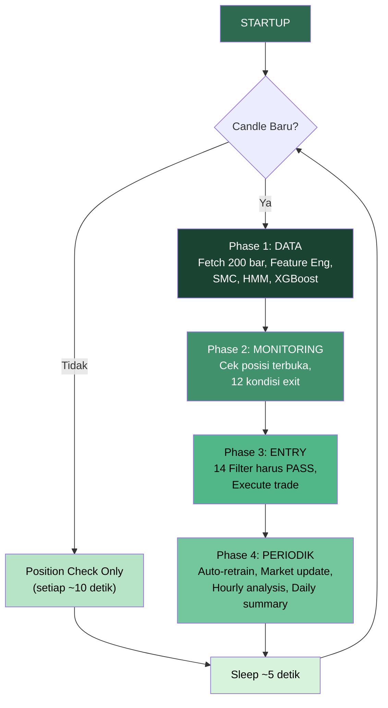
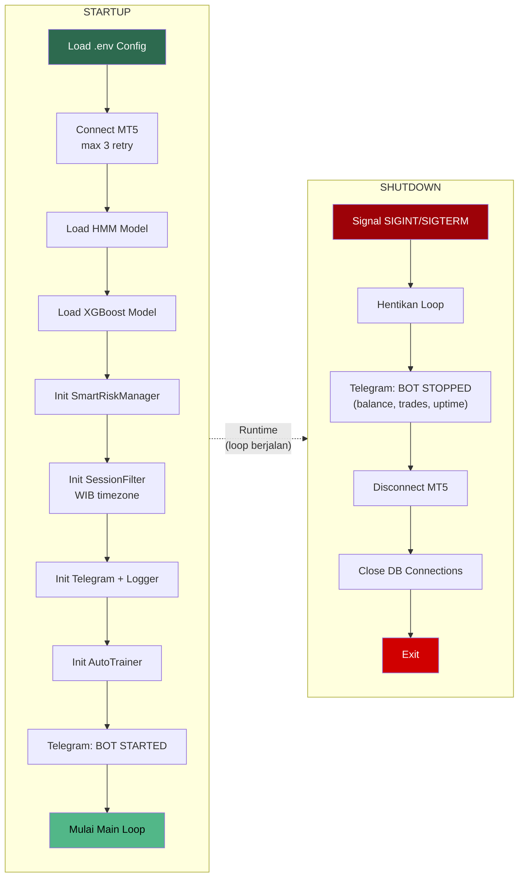
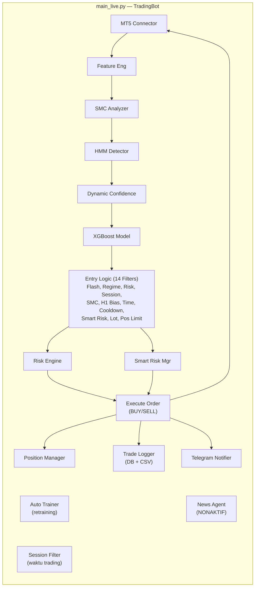

# Main Live — *Orchestrator* Utama

> **File:** `main_live.py`
> **Class:** `TradingBot`
> **Runtime:** *Async event loop* (asyncio)
> **Mode:** *Candle-based* (analisis penuh hanya saat candle baru M15)
> **Target:** < 0.05 detik per iterasi analisis

---

## Apa Itu Main Live?

Main Live adalah **otak pusat** yang mengorkestrasi semua komponen bot. Menjalankan loop *candle-based* — analisis penuh hanya dijalankan saat candle M15 baru terbentuk, dengan pengecekan posisi setiap 10 detik di antara candle. Mengkoordinasikan 15+ komponen dari data fetching hingga order execution.

**Analogi:** Main Live seperti **konduktor orkestra** — tidak memainkan alat musik sendiri, tapi mengarahkan semua pemain (komponen) agar bermain harmonis pada waktu yang tepat.

---

## Diagram Alur Main Loop



---

## Diagram *Startup* / *Shutdown*



---

## Komponen yang Dimuat

```python
class TradingBot:
    def __init__(self):
        # Koneksi
        self.mt5 = MT5Connector(...)              # Jembatan ke broker
        self.telegram = TelegramNotifier(...)       # Notifikasi

        # AI Models
        self.ml_model = TradingModel(...)           # XGBoost predictor
        self.regime_detector = MarketRegimeDetector(...) # HMM regime
        self.smc = SMCAnalyzer(...)                 # Smart Money Concepts

        # Analisis
        self.features = FeatureEngineer()           # 40+ fitur
        self.dynamic_confidence = DynamicConfidenceManager(...) # Threshold
        self.session_filter = SessionFilter(...)     # Waktu trading
        # self.news_agent = NewsAgent(...)           # NONAKTIF (line 64)
        #   -> Dikomentari karena backtest membuktikan
        #      News Agent merugikan $178 profit.
        #      ML model sudah menangani volatilitas.

        # Risiko
        self.smart_risk = SmartRiskManager(...)     # Risk management
        self.risk_engine = RiskEngine(...)          # Kelly criterion
        self.position_manager = SmartPositionManager(...) # Position mgmt

        # Logging & Training
        self.trade_logger = TradeLogger(...)        # Pencatat trade
        self.auto_trainer = AutoTrainer(...)        # Retraining otomatis

        # State
        self.flash_crash_detector = FlashCrashDetector(...) # Proteksi
```

> **Catatan:** `NewsAgent` **NONAKTIF** — import dikomentari di `main_live.py` line 64 (`# DISABLED`). Backtest membuktikan News Agent justru mengurangi profit sebesar $178 karena ML model sudah cukup menangani volatilitas pasar. Variabel `self.news_agent` di-set `None` (line 165).

---

## Main Loop (*Candle-Based*)

```
STARTUP:
  Load models -> Connect MT5 -> Send Telegram startup
    |
    v
LOOP UTAMA (cek setiap ~5 detik, analisis pada candle baru):
    |
    +-- Fetch 2 bar terakhir -> cek apakah candle baru terbentuk
    |
    |===[CANDLE BARU? YA -> FULL ANALYSIS]=================
    |
    |  |===[PHASE 1: DATA]================================
    |  |
    |  +-- Fetch 200 bar M15 XAUUSD dari MT5
    |  +-- Feature Engineering (40+ fitur)
    |  +-- SMC Analysis (Swing, FVG, OB, BOS, CHoCH)
    |  +-- HMM Regime Detection
    |  +-- XGBoost Prediction
    |  |
    |  |===[PHASE 2: MONITORING]===========================
    |  |
    |  +-- Cek posisi terbuka
    |  |   +-- Untuk setiap posisi:
    |  |       +-- Update profit & momentum
    |  |       +-- 12 kondisi exit (smart_risk.evaluate_position)
    |  |       +-- Jika should_close -> tutup -> log -> Telegram
    |  |
    |  +-- Position Manager (trailing SL, breakeven)
    |  |   +-- Smart Market Close Handler
    |  |
    |  |===[PHASE 3: ENTRY]================================
    |  |
    |  +-- [1]  Flash Crash Guard -> tidak ada crash?
    |  +-- [2]  Regime Filter -> bukan SLEEP / CRISIS?
    |  +-- [3]  Risk Check -> equity & drawdown aman?
    |  +-- [4]  Session Filter -> boleh trading (WIB)?
    |  +-- [5]  SMC Signal -> ada setup?
    |  +-- [6]  Signal Combination -> sinyal valid (quality != AVOID)?
    |  +-- [7]  H1 Bias (#31B) -> H1 EMA20 selaras?
    |  +-- [8]  Time Filter (#34A) -> bukan jam 9/21 WIB?
    |  +-- [9]  Trade Cooldown -> cukup jeda sejak trade terakhir?
    |  +-- [10] Smart Risk Gate -> mode bukan STOPPED?
    |  +-- [11] Lot Size -> > 0 setelah kalkulasi?
    |  +-- [12] Position Limit -> < 2 posisi terbuka?
    |  +-- [13] Slippage Validation -> harga aktual vs expected
    |  +-- [14] Partial Fill Check -> volume aktual vs requested
    |  +-- SEMUA PASS -> Execute trade
    |  +-- Register position (harga & volume AKTUAL) -> Log -> Telegram
    |  |
    |  |===[PHASE 4: PERIODIK]=============================
    |  |
    |  +-- Setiap 20 candle (~5 jam M15): Cek auto-retrain
    |  +-- Setiap 30 menit: Market update (Telegram)
    |  +-- Setiap 1 jam: Hourly analysis (Telegram)
    |  +-- Pergantian hari: Daily summary + reset
    |
    |===[CANDLE BARU? TIDAK -> POSITION CHECK ONLY]========
    |
    +-- Setiap 10 detik: cek posisi terbuka saja
    |   +-- Fetch 50 bar (minimal data)
    |   +-- Hitung fitur untuk ML check
    |   +-- Evaluasi exit conditions per posisi
    |
    v
    Tunggu ~5 detik -> Loop lagi
```

---

## Detail 14 *Entry* Filter

| # | Filter | Deskripsi | Sumber |
|---|--------|-----------|--------|
| 1 | Flash Crash Guard | Deteksi pergerakan harga ekstrem (>X%) dalam 5 bar terakhir | `FlashCrashDetector` |
| 2 | Regime Filter | Blok *entry* jika HMM regime = SLEEP atau CRISIS | `regime_detector` |
| 3 | Risk Check | Validasi equity, drawdown, dan balance aman | `risk_engine` |
| 4 | Session Filter | Hanya trading di sesi aktif (Sydney/London/NY, WIB) | `session_filter` |
| 5 | SMC Signal | Harus ada setup SMC (Order Block, FVG, BOS, CHoCH) | `smc.generate_signal()` |
| 6 | Signal Combination | Gabung SMC + ML, blok jika market quality AVOID | `_combine_signals()` |
| 7 | H1 Bias (#31B) | BUY hanya jika H1 BULLISH, SELL hanya jika H1 BEARISH | `_get_h1_bias()` |
| 8 | Time Filter (#34A) | Skip jam 9 dan 21 WIB (likuiditas rendah / whipsaw) | Hardcoded WIB check |
| 9 | Trade Cooldown | Jeda minimum antar trade (mencegah overtrade) | `_last_trade_time` |
| 10 | Smart Risk Gate | Cek mode risk (NORMAL/CAUTIOUS/STOPPED) | `smart_risk` |
| 11 | Lot Size > 0 | Pastikan kalkulasi lot menghasilkan size > 0 | `smart_risk.calculate_lot_size()` |
| 12 | Position Limit | Maksimal 2 posisi terbuka bersamaan | `smart_risk.can_open_position()` |
| 13 | Slippage Validation | Cek harga eksekusi aktual vs harga yang diharapkan | Post-execution check |
| 14 | Partial Fill Check | Cek volume aktual yang terisi vs volume yang diminta | Post-execution check |

---

## *Startup* Sequence

```
1.  Load konfigurasi dari .env
2.  Connect ke MT5 (max 3 retry)
3.  Load model HMM dari models/hmm_regime.pkl
4.  Load model XGBoost dari models/xgboost_model.pkl
5.  Initialize SmartRiskManager (set balance, limits)
6.  Initialize SessionFilter (WIB timezone)
7.  Initialize TelegramNotifier
8.  Initialize TradeLogger
9.  Initialize AutoTrainer
10. Send Telegram: "BOT STARTED" (config, balance, risk settings)
11. Mulai main loop
```

> **Note:** NewsAgent **tidak** diinisialisasi saat *startup* — import dan inisialisasi dikomentari sejak backtest membuktikan kerugian $178.

---

## *Shutdown* Sequence

```
1. Signal SIGINT/SIGTERM diterima
2. Hentikan loop utama
3. Kirim Telegram: "BOT STOPPED" (balance, trades, uptime)
4. Disconnect MT5
5. Close database connections
6. Exit
```

---

## Error Handling (*Fault Tolerance*)

```
Setiap iterasi loop dibungkus try-except:

try:
    # Fetch data, analyze, trade
except ConnectionError:
    # MT5 disconnected -> reconnect()
except Exception as e:
    # Log error -> lanjut loop berikutnya
    # Bot TIDAK crash dari error tunggal

Prinsip: NEVER STOP TRADING karena error non-kritis
```

Bot dirancang dengan prinsip *fault tolerance* — satu error tidak menghentikan seluruh sistem. Setiap iterasi loop dibungkus `try-except` sehingga error pada satu candle tidak mempengaruhi candle berikutnya. Koneksi MT5 yang putus akan otomatis di-reconnect.

---

## Timer *Periodik*

| Event | Interval | Aksi |
|-------|----------|------|
| Full analysis + *entry* | Setiap candle baru M15 | Saat candle terbentuk |
| Position *monitoring* | ~10 detik | Di antara candle |
| Performance logging | 4 candle (~1 jam) | `loop_count % 4` |
| Auto-retrain check | 20 candle (~5 jam) | `loop_count % 20` |
| Market update Telegram | 30 menit | Timer |
| Hourly analysis Telegram | 1 jam | Timer |
| Daily summary | Pergantian hari | Date check |

---

## Performa Target

```
Target: < 0.05 detik per iterasi analisis (50ms)

Full Analysis (saat candle baru):
+-- MT5 data fetch:      ~10ms  (200 bar)
+-- Feature engineering:  ~5ms  (Polars, vectorized)
+-- SMC analysis:         ~5ms  (Polars native)
+-- HMM predict:          ~2ms
+-- XGBoost predict:      ~3ms
+-- Position monitoring:  ~5ms
+-- Entry logic:          ~5ms
+-- Overhead:             ~15ms
                          ------
                          ~50ms total

Position Check Only (di antara candle):
+-- MT5 data fetch:      ~5ms   (50 bar saja)
+-- Feature engineering:  ~3ms
+-- ML prediction:        ~3ms
+-- Position evaluation:  ~5ms
+-- Overhead:             ~5ms
                          ------
                          ~21ms total
```

---

## Hubungan Semua Komponen


