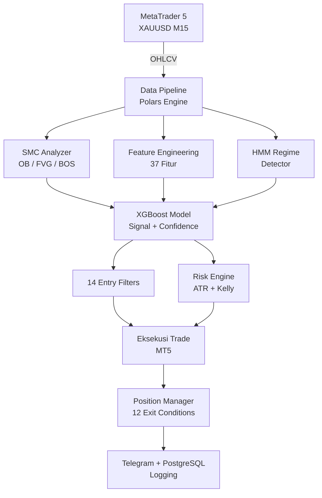

# Dokumentasi Arsitektur — XAUBot AI

> Panduan lengkap arsitektur dan komponen sistem *trading bot* otomatis XAUUSD.

---

## Daftar Dokumen

| # | Dokumen | Deskripsi |
|---|---------|-----------|
| 00 | **Arsitektur Lengkap** | Gambaran besar seluruh sistem — *data flow*, komponen, dan interaksi |
| 01 | **HMM *Regime Detector*** | Deteksi kondisi pasar menggunakan *Hidden Markov Model* 3 *state* |
| 02 | **XGBoost *Signal Predictor*** | Model *machine learning* untuk prediksi BUY/SELL/HOLD |
| 03 | **SMC *Analyzer*** | Analisis *Smart Money Concepts* — *Order Block*, FVG, BOS, CHoCH |
| 04 | ***Feature Engineering*** | 37 fitur teknikal — RSI, ATR, MACD, *Bollinger*, dll |
| 05 | **Manajemen Risiko** | Sistem manajemen risiko dinamis dengan mode kapital |
| 06 | **Filter Sesi** | Filter sesi perdagangan — Sydney, London, New York (WIB) |
| 07 | ***Stop Loss*** | Proteksi SL berbasis ATR dan *broker-level* |
| 08 | ***Take Profit*** | Target TP multi-level dengan ATR dan struktur pasar |
| 09 | ***Entry Trade*** | 14 filter *entry* dan logika eksekusi perdagangan |
| 10 | ***Exit Trade*** | 12 kondisi *exit* termasuk *trailing* SL, batas waktu, perubahan *regime* |
| 11 | ***News Agent*** | Filter berita ekonomi dan penilaian dampak *(saat ini nonaktif)* |
| 12 | **Notifikasi Telegram** | Notifikasi *trade* dan ringkasan harian via Telegram |
| 13 | ***Auto Trainer*** | *Pipeline retraining* otomatis saat kondisi pasar berubah |
| 14 | ***Backtest*** | *Framework backtesting* yang disinkronkan dengan logika *live* |
| 15 | ***Dynamic Confidence*** | Ambang batas *confidence* adaptif berdasarkan kondisi pasar |
| 16 | **Konektor MT5** | Lapisan koneksi *MetaTrader 5* dan eksekusi *order* |
| 17 | **Konfigurasi** | Konfigurasi *trading*, mode kapital, dan pengaturan *environment* |
| 18 | ***Trade Logger*** | Pencatatan *trade* ke *database* PostgreSQL |
| 19 | ***Position Manager*** | Pelacakan dan manajemen posisi terbuka |
| 20 | ***Risk Engine*** | Perhitungan risiko, *Kelly criterion*, dan *position sizing* |
| 21 | ***Database*** | Skema PostgreSQL dan penyimpanan data perdagangan |
| 22 | ***Train Models*** | *Pipeline* pelatihan model dan optimasi *hyperparameter* |
| 23 | **Orkestrator Utama** | *Async main loop* — inti dari *trading bot* |

---

## Diagram Arsitektur

## Status Komponen (Terkini)

| Komponen | Status | Catatan |
|----------|--------|---------|
| SMC *Analyzer* | **Aktif** | *Order Block*, FVG, BOS, CHoCH |
| XGBoost *Model* | **Aktif** | 37 fitur, *confidence calibrated* |
| HMM *Regime* | **Aktif** | 3 *state* — *low/medium/high volatility* |
| *Session Filter* | **Aktif** | WIB, Tokyo-London *overlap* diblokir |
| *Smart Risk Manager* | **Aktif** | Mode NORMAL/PROTECTED/RECOVERY/COOLDOWN |
| *Dynamic Confidence* | **Aktif** | *Threshold* adaptif per kondisi pasar |
| *Auto Trainer* | **Aktif** | *Retrain* otomatis tiap 7 hari |
| *News Agent* | **Nonaktif** | Dikomentari di `main_live.py` baris 64 |
| Telegram | **Aktif** | Notifikasi *entry/exit* + ringkasan harian |
| *Trade Logger* | **Aktif** | *Logging* ke PostgreSQL |
